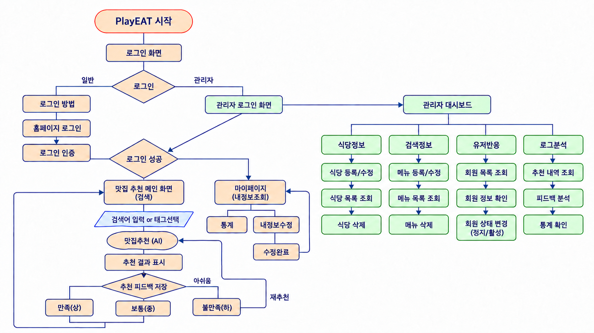
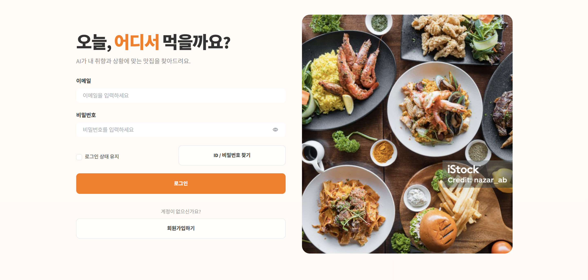
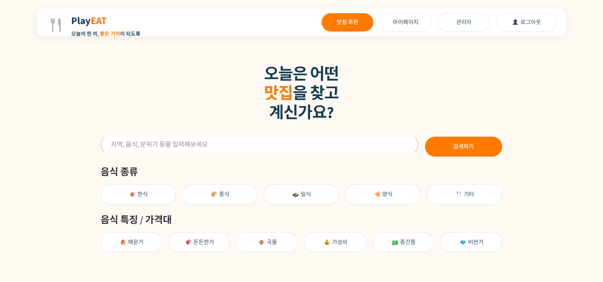
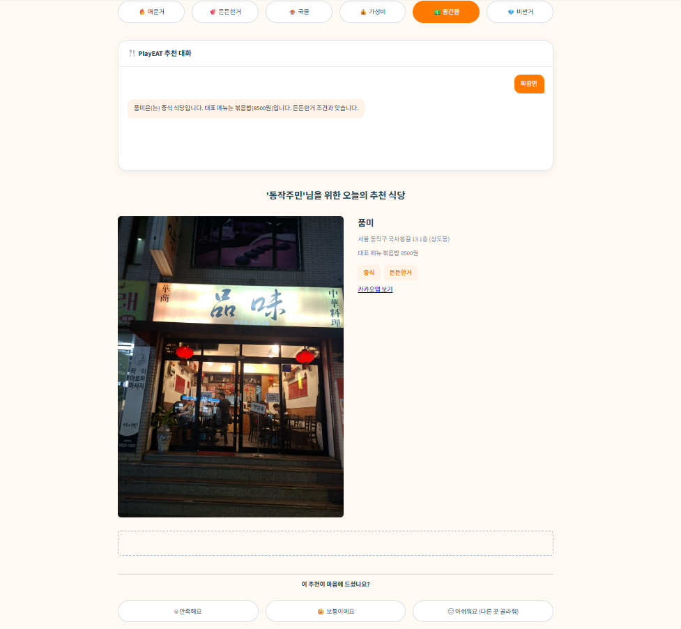
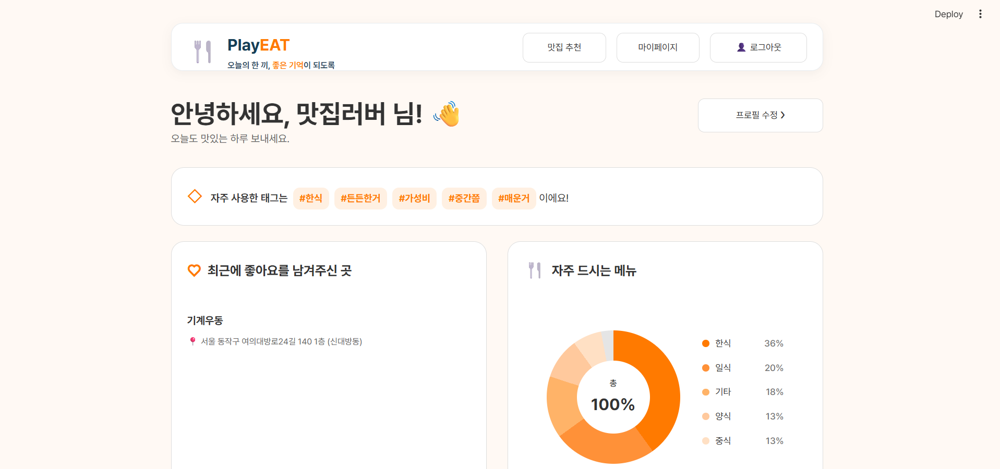
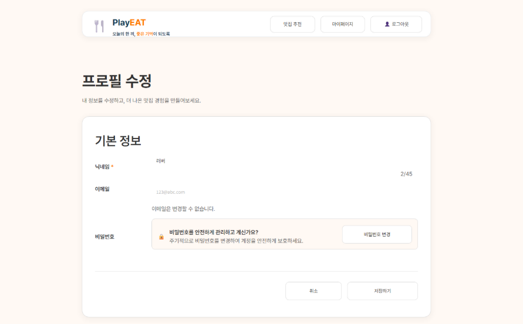
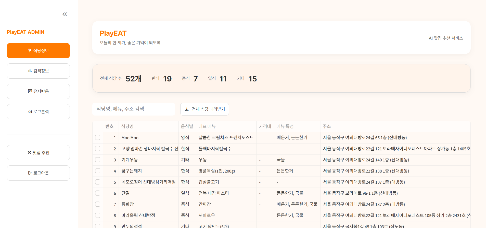
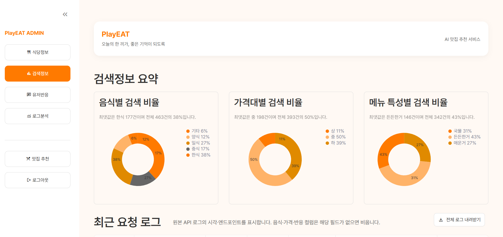
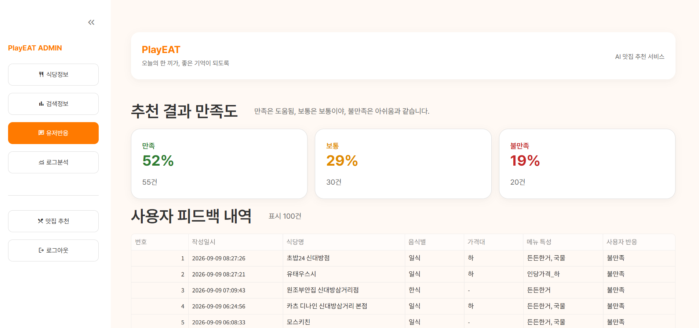
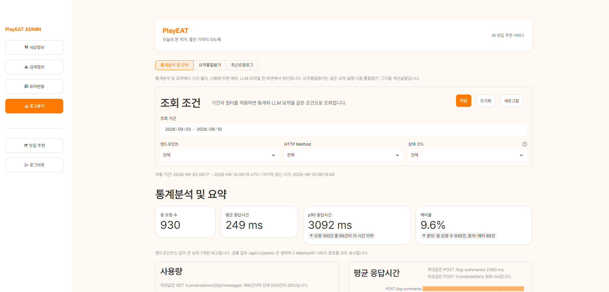

# 🍴 PlayEAT

> **오늘의 한 끼, 좋은 기억이 되도록**

PlayEAT는 사용자의 감정, 상황, 선호도와 예산을 바탕으로  
**신대방 주변 음식점을 추천하는 AI 맛집 추천 서비스**입니다.

기존 맛집 서비스에서 충분히 제공하지 못했던 **가격대, 음식 특징, 감정·상황 정보**를 태그화하고, 자연어 기반 AI 추천을 결합하여 사용자에게 더 개인화된 점심 메뉴를 제안합니다.

---

## 📌 프로젝트 소개

PlayEAT는 사용자가 자연어로 원하는 식사 상황을 입력하거나 음식 종류, 음식 특징, 가격대 등의 조건을 선택하면 식당 데이터와 AI 분석 결과를 결합하여 적합한 음식점을 추천하는 서비스입니다.

추천 결과에 대한 사용자의 피드백과 서비스 이용 로그를 수집하고, 관리자는 대시보드를 통해 검색 현황, 사용자 반응, 서비스 로그 등을 확인할 수 있도록 설계했습니다.

### 주요 목표

- 사용자의 상황과 조건에 맞는 음식점 추천
- 자연어 기반 AI 추천 경험 제공
- 음식점·메뉴·가격·태그 정보를 활용한 추천
- 사용자 피드백을 활용한 추천 품질 개선
- 서비스 이용 로그 수집 및 분석
- 관리자 대시보드를 통한 서비스 운영 현황 확인

---

## ✨ 주요 기능

- 회원가입 및 로그인
- 감정·상황·가격대·음식 특징 기반 맛집 추천
- AI 추천 챗봇을 통한 자연어 검색 및 대화
- 추천 음식점과 메뉴 정보 조회
- 추천 결과 피드백 및 재추천
- 대화 기록 관리
- 개인 프로필 및 마이페이지
- 회원 정보 및 비밀번호 수정
- 관리자용 서비스 운영 대시보드
- 사용자 행동 및 AI 서비스 로그 분석

---

## 🛠 기술 스택

| 영역 | 기술 |
| --- | --- |
| Language | Python |
| Frontend | Streamlit |
| Backend | FastAPI |
| Database | Supabase PostgreSQL |
| Authentication | Supabase Auth |
| Cache / Session | Redis |
| AI | Google Gemini |
| Package Manager | uv |
| Collaboration | GitHub, Figma, Notion, Google Sheets |

---

## 🔗 프로젝트 산출물

| 구분 | 링크 |
| --- | --- |
| 깃허브 저장소 주소 | [https://github.com/encore-ai-campus/aio-02-p1-team1](https://github.com/encore-ai-campus/aio-02-p1-team1) |
| API 설계 문서 | [https://encore-ai-campus.github.io/aio-02-p1-team1/api/](https://encore-ai-campus.github.io/aio-02-p1-team1/api/) |
| 화면 설계서 | [https://encore-ai-campus.github.io/aio-02-p1-team1/design/](https://encore-ai-campus.github.io/aio-02-p1-team1/design/) |
| 데이터베이스 설계서 | [https://encore-ai-campus.github.io/aio-02-p1-team1/](https://encore-ai-campus.github.io/aio-02-p1-team1/) |
| 대시보드 구현 결과물 | [PlayEAT 발표 스크린샷 포함 최종본 PDF](https://github.com/encore-ai-campus/aio-02-p1-team1/blob/main/docs/PlayEAT_%EB%B0%9C%ED%91%9C_%EC%8A%A4%ED%81%AC%EB%A6%B0%EC%83%B7%ED%8F%AC%ED%95%A8_%EC%B5%9C%EC%A2%85%EB%B3%B8.pdf) |

---

## 🔄 서비스 플로우

<p align="center">
  
</p>

사용자는 로그인 후 자연어 검색 또는 음식 종류, 음식 특징, 가격대 등의 조건을 입력합니다.

시스템은 식당·메뉴·태그 데이터와 AI 분석 결과를 바탕으로 추천 후보를 선정하고, Gemini를 이용해 추천 이유를 자연스럽게 생성합니다.

추천 결과에 대한 사용자 피드백과 서비스 이용 로그는 DB에 저장되며, 관리자는 대시보드에서 서비스 현황과 로그 분석 결과를 확인할 수 있습니다.

---

# 🖥 주요 화면

## 🔐 로그인

<p align="center">
  
</p>

사용자가 이메일과 비밀번호를 이용하여 PlayEAT 서비스에 로그인합니다.

---

## 📝 회원가입

<p align="center">
  
</p>

신규 사용자는 이메일, 비밀번호, 닉네임 및 약관 동의를 통해 계정을 생성할 수 있습니다.

---

## 🍴 맛집 추천 메인

<p align="center">
  
</p>

자연어 검색과 음식 종류, 음식 특징, 가격대 등의 조건을 선택하여 원하는 음식점을 검색할 수 있습니다.

---

## 🤖 AI 추천 결과

<p align="center">
  
</p>

선택한 조건과 자연어 입력을 기반으로 식당과 메뉴를 추천하고, 추천 이유를 함께 제공합니다.

---

## 👤 마이페이지

<p align="center">
  
</p>

사용자의 프로필과 서비스 이용 정보를 확인할 수 있습니다.

- 자주 사용한 태그
- 최근 좋아요를 남긴 식당
- 선호 음식 카테고리
- 프로필 수정

---

## ✏️ 회원 정보 수정

<p align="center">
  
</p>

마이페이지에서 사용자의 닉네임 등 회원 정보를 수정할 수 있습니다.

---

# 📊 관리자 Dashboard

## 🍽 식당 정보

<p align="center">
  
</p>

전체 식당 및 메뉴 데이터를 조회하고 관리할 수 있습니다.

---

## 🔎 검색 정보

<p align="center">
  
</p>

사용자의 음식 종류, 가격대, 메뉴 특성별 검색 현황을 확인할 수 있습니다.

---

## 👍 사용자 반응

<p align="center">
  
</p>

추천 결과에 대한 사용자의 만족도와 피드백을 확인할 수 있습니다.

---

## 📈 사용자 로그 분석

<p align="center">
  
</p>

서비스 이용 로그를 기반으로 주요 통계 정보를 확인할 수 있습니다.

추가 관리자 화면:

- `admin_user_log.png`
- `admin_user_log_recent.png`
- `admin_user_log_statistics.png`

---

## 🎨 UI / UX 디자인

PlayEAT의 화면 구조와 UI 디자인은 Figma를 기반으로 설계했습니다.

### Figma

[👉 PlayEAT Figma 디자인 보기](https://www.figma.com/design/qWQHYXV8U8urintGWyRDj6/%EB%82%98%EB%A7%8C%EC%9D%98%EB%A7%9B%EC%A7%91%EB%B9%84%EC%84%9C?node-id=0-1)

### 주요 설계 화면

- 로그인
- 회원가입
- 맛집 추천 챗봇
- AI 추천 결과
- 마이페이지
- 회원 정보 수정
- 관리자 식당 정보
- 관리자 검색 정보
- 사용자 반응
- 사용자 로그 분석

상세한 화면 구성과 기능, 사용자 액션, 시스템 반응은 아래 화면설계서에서 확인할 수 있습니다.

[👉 PlayEAT 화면설계서](https://encore-ai-campus.github.io/aio-02-p1-team1/design/)

---

## 🤝 협업 및 정보 공유

프로젝트 진행 과정에서 팀원 간 개발 현황과 데이터를 효율적으로 공유하기 위해 다양한 협업 도구를 사용했습니다.

### GitHub

- 프로젝트 소스 코드 관리
- 개인 Branch 기반 기능 개발
- `dev` Branch를 통한 기능 통합
- Pull Request를 활용한 코드 병합
- Commit History를 통한 변경 이력 관리

### Figma

- 서비스 화면 기획
- UI/UX 디자인 공유
- 화면별 디자인 기준 통일
- 개발 전 화면 구조 및 사용자 흐름 확인

### Google Sheets

프로젝트에서 사용하는 식당·메뉴 데이터와 진행 정보를 팀원들이 공동으로 확인하고 관리하기 위해 Google Sheets를 활용했습니다.

[👉 PlayEAT 프로젝트 공유 Google Sheets](https://docs.google.com/spreadsheets/d/1OemleNo7ULmUQ5gd9e-iSl7byxi1yw6mrEJtMZnUFws/edit?usp=sharing)

이를 통해 각 팀원이 동일한 데이터를 기준으로 Frontend, Backend, Database 기능을 개발할 수 있도록 관리했습니다.

---

## 📚 프로젝트 문서

| 문서 | 설명 |
| --- | --- |
| [PRD](https://github.com/encore-ai-campus/aio-02-p1-team1/blob/main/docs/PlayEAT_PRD.md) | 프로젝트 배경, 목표, 서비스 및 기능 요구사항 |
| [WBS](https://github.com/encore-ai-campus/aio-02-p1-team1/blob/main/docs/PlayEAT_WBS.md) | 프로젝트 일정, 작업 항목 및 역할 분담 |
| [API 설계서](https://encore-ai-campus.github.io/aio-02-p1-team1/api/) | Backend API Endpoint 및 Request / Response 정의 |
| [DB 정의서](https://encore-ai-campus.github.io/aio-02-p1-team1/) | 데이터베이스 테이블 및 컬럼 정의 |
| [논리·물리 ERD](https://github.com/encore-ai-campus/aio-02-p1-team1/blob/main/docs/PlayEAT_%EB%85%BC%EB%A6%AC%EB%AC%BC%EB%A6%ACERD.md) | 서비스 데이터 모델과 테이블 관계 |
| [화면설계서](https://encore-ai-campus.github.io/aio-02-p1-team1/design/) | 사용자·관리자 화면 구성 및 동작 정의 |
| [코드 컨벤션](https://github.com/encore-ai-campus/aio-02-p1-team1/blob/main/docs/PlayEAT_%EC%BD%94%EB%93%9C%EC%BB%A8%EB%B2%A4%EC%85%98.md) | 코드 작성 및 Git 협업 규칙 |
| [Google Sheets](https://docs.google.com/spreadsheets/d/1OemleNo7ULmUQ5gd9e-iSl7byxi1yw6mrEJtMZnUFws/edit?usp=sharing) | 식당·메뉴 데이터 및 팀 프로젝트 공유 자료 |

---

## 👥 팀 역할

| 팀원 | 역할 | 담당 |
| --- | --- | --- |
| 배소정 | 팀장 · Backend | 챗봇, Backend 총괄 |
| 윤수영 | Frontend | 디자인, 로그인, 회원 정보 수정 |
| 조권식 | Frontend | 마이페이지 |
| 백승주 | Frontend | 회원가입 |
| 김윤한 | Dashboard | 관리자 화면 및 Dashboard |

---

## 📂 프로젝트 구조

```text
aio-02-p1-team1/
│
├── backend/
│   ├── .venv/
│   ├── app/
│   ├── .env
│   ├── .env.example
│   ├── .gitignore
│   ├── .python-version
│   ├── pyproject.toml
│   └── uv.lock
│
├── docs/
│   ├── image/
│   │   ├── admin/
│   │   │   ├── admin_restaurant.png
│   │   │   ├── admin_search.png
│   │   │   ├── admin_user_log_recent.png
│   │   │   ├── admin_user_log_statistics.png
│   │   │   ├── admin_user_log.png
│   │   │   └── admin_user_reaction.png
│   │   │
│   │   ├── user/
│   │   │   ├── login.png
│   │   │   ├── main_result.png
│   │   │   ├── main.png
│   │   │   ├── mypage.png
│   │   │   ├── profile_update.png
│   │   │   └── signn.png
│   │   │
│   │   └── 01_FLOWCHART.png
│   │
│   ├── PlayEAT_API설계서.md
│   ├── PlayEAT_db정의서.md
│   ├── PlayEAT_PRD.md
│   ├── PlayEAT_WBS.md
│   ├── PlayEAT_논리물리ERD.md
│   ├── PlayEAT_최종_화면설계서.md
│   └── PlayEAT_코드컨벤션.md
│
├── frontend/
│   ├── .streamlit/
│   ├── .venv/
│   ├── assets/
│   │
│   ├── src/
│   │   ├── common/
│   │   ├── components/
│   │   │
│   │   ├── styles/
│   │   │   ├── home.css
│   │   │   ├── login.css
│   │   │   ├── mypage.css
│   │   │   ├── profile_edit.css
│   │   │   ├── signup.css
│   │   │   └── style.css
│   │   │
│   │   └── views/
│   │       ├── admin_analytics.py
│   │       ├── admin_common.py
│   │       ├── admin_feedback.py
│   │       ├── admin_logs.py
│   │       ├── admin_restaurants.py
│   │       ├── admin.py
│   │       ├── home.py
│   │       ├── login.py
│   │       ├── mypage.py
│   │       ├── profile_edit.py
│   │       └── signup.py
│   │
│   ├── .gitignore
│   ├── .python-version
│   ├── common.py
│   ├── pyproject.toml
│   ├── streamlit_app.py
│   └── uv.lock
│
└── README.md
