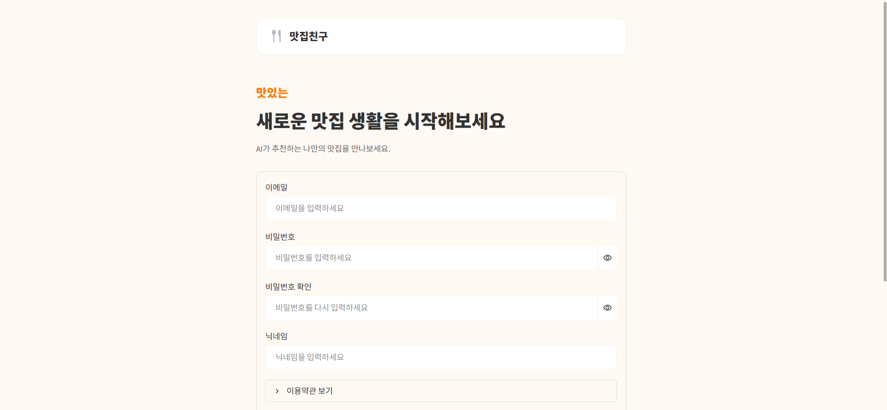

# 🍴 PlayEAT

> **오늘의 한 끼, 좋은 기억이 되도록**

PlayEAT는 사용자의 감정, 상황, 선호도와 예산을 바탕으로  
**신대방 주변 음식점을 추천하는 AI 맛집 추천 서비스**입니다.

사용자에게는 자연어와 조건 선택을 결합한 맞춤형 맛집 추천을 제공하고,  
운영자에게는 API 로그와 추천 품질을 분석하는 관리자 대시보드를 제공하는 통합 서비스입니다.

기존 맛집 서비스에서 충분히 제공하지 못했던 **가격대, 음식 특징, 감정·상황 정보**를 태그화하고, 자연어 기반 AI 추천을 결합하여 사용자에게 더 개인화된 점심 메뉴를 제안합니다.

---

## 📑 목차

- [프로젝트 소개](#-프로젝트-소개)
- [프로젝트 배경 및 목표](#-프로젝트-배경-및-목표)
- [핵심 기능](#-핵심-기능)
- [대시보드 기능](#-대시보드-기능)
- [기술 스택](#-기술-스택)
- [프로젝트 산출물](#-프로젝트-산출물)
- [서비스 플로우](#-서비스-플로우)
- [시스템 아키텍처](#-시스템-아키텍처)
- [데이터베이스 설계](#-데이터베이스-설계)
- [주요 화면](#-주요-화면)
- [UI / UX 디자인](#-ui--ux-디자인)
- [협업 및 정보 공유](#-협업-및-정보-공유)
- [프로젝트 문서](#-프로젝트-문서)
- [팀 구성](#-팀-구성)
- [프로젝트 구조](#-프로젝트-구조)
- [설치 및 실행 방법](#-설치-및-실행-방법)
- [환경 변수](#-환경-변수)
- [기대 효과](#-기대-효과)
- [License](#-license)

---

## 📌 프로젝트 소개

PlayEAT는 사용자가 자연어로 원하는 식사 상황을 입력하거나 음식 종류, 음식 특징, 가격대 등의 조건을 선택하면 식당 데이터와 AI 분석 결과를 결합하여 적합한 음식점을 추천하는 서비스입니다.

추천 결과에 대한 사용자의 피드백과 서비스 이용 로그를 수집하고, 관리자는 대시보드를 통해 검색 현황, 사용자 반응, API 로그, 추천 품질 등을 확인할 수 있도록 설계했습니다.

---

## 🎯 프로젝트 배경 및 목표

점심시간마다 가격대·메뉴·상황(혼밥/회식 등)을 고려해 여러 식당을 일일이 비교하는 데 많은 시간이 드는 문제에서 출발했습니다.

동시에 서비스를 운영하는 입장에서는 실제 API가 어떻게 쓰이고 있는지, 추천 품질이 실제로 괜찮은지를 정량적으로 확인할 방법이 마땅치 않다는 문제도 있습니다.

PlayEAT은 이 두 문제를 하나의 프로젝트에서 함께 다룹니다.

1. 사용자에게는 자연어 + 조건 선택을 결합한 맛집 추천을 제공한다.
2. 모든 API 요청/응답을 로그로 남기고, 이를 정제·집계해 운영 대시보드로 시각화한다.
3. LLM 기반 로그 요약과 정량 품질 평가를 통해 추천 개선 사이클을 실제로 한 번 수행한다.

추천 근거는 DB에 실제로 존재하는 식당·메뉴 정보만 사용하며,  
**존재하지 않는 메뉴나 가격을 생성하지 않는 것을 핵심 원칙**으로 합니다.

### 주요 목표

- 사용자의 상황과 조건에 맞는 음식점 추천
- 자연어 기반 AI 추천 경험 제공
- 음식점·메뉴·가격·태그 정보를 활용한 추천
- 52개 검증된 신대방 지역 식당 데이터를 활용한 추천
- 사용자 피드백을 활용한 추천 품질 개선
- 서비스 이용 로그 수집 및 분석
- API 요청량, 응답 시간, 에러율 등 운영 지표 확인
- LLM 기반 로그 요약 및 품질 평가
- 관리자 대시보드를 통한 서비스 운영 현황 확인

---

## ✨ 핵심 기능

### 👤 사용자 기능

- 이메일 / 카카오 로그인
- 역할 기반 접근 제어
- 조건 선택 기반 맛집 추천
  - 음식 카테고리
  - 가격대
  - 음식 특징
  - 상황 태그
- 자연어 입력 + 조건 선택을 결합한 Gemini 기반 맛집 추천
- 52개 검증된 신대방 지역 식당 데이터 기반 추천
- 추천 음식점과 대표 메뉴 정보 조회
- 추천 이유 제공
- 추천 결과 재추천
- 추천 결과에 대한 3단계 피드백
  - 불만족
  - 보통
  - 만족
- 대화 및 추천 세션 이력 관리
- 마이페이지
- 프로필 수정
- 회원 정보 및 비밀번호 수정

### 🛠 관리자 기능

- 모든 API 요청/응답 로그 PostgreSQL 적재
- API 로그 정제
- 요청량 통계 산출
- 평균 응답 시간 분석
- 에러율 분석
- 근거 로그를 함께 제시하는 LLM 기반 로그 요약
- 사전 정의된 테스트 케이스 기반 요약 품질 정량 평가
- 개선 전/후 비교 실험
- 사용자 추천 피드백 조회
- 식당 및 메뉴 데이터 조회·관리
- 검색 조건 및 상황 태그 분석

---

## 📊 대시보드 기능

Streamlit 관리자 화면(`frontend/src/views/admin_*.py`)은 다음 영역으로 구성됩니다.

| 화면 | 내용 |
| --- | --- |
| 검색·이용 분석 (`admin_analytics`) | 카테고리별 검색 분석, 상황 태그 분석 |
| 로그 분석 (`admin_logs`) | API 요청량·응답시간·에러율 통계, LLM 로그 요약 및 품질 평가 결과 |
| 사용자 피드백 (`admin_feedback`) | 추천 결과에 대한 사용자 반응 및 코멘트 |
| 식당 관리 (`admin_restaurants`) | 식당·메뉴 데이터 조회 |

---

## 🛠 기술 스택

| 영역 | 기술 |
| --- | --- |
| Language | Python |
| Frontend | Streamlit |
| Backend | FastAPI |
| Database | Supabase PostgreSQL |
| Authentication | Supabase Auth, Kakao Login |
| Cache / Session | Redis |
| AI | Google Gemini |
| Package Manager | uv |
| Collaboration | GitHub, Figma, Notion, Google Sheets |

---

## 🔗 프로젝트 산출물

| 구분 | 링크 |
| --- | --- |
| 깃허브 저장소 주소 | [https://github.com/encore-ai-campus/aio-02-p1-team1](https://github.com/encore-ai-campus/aio-02-p1-team1) |
| API 설계 문서 | [https://encore-ai-campus.github.io/aio-02-p1-team1/api/](https://encore-ai-campus.github.io/aio-02-p1-team1/api/) |
| 화면 설계서 | [https://encore-ai-campus.github.io/aio-02-p1-team1/design/](https://encore-ai-campus.github.io/aio-02-p1-team1/design/) |
| 데이터베이스 설계서 | [https://encore-ai-campus.github.io/aio-02-p1-team1/](https://encore-ai-campus.github.io/aio-02-p1-team1/) |
| 대시보드 구현 결과물 | [PlayEAT 발표 스크린샷 포함 최종본 PDF](https://github.com/encore-ai-campus/aio-02-p1-team1/blob/main/docs/PlayEAT_%EB%B0%9C%ED%91%9C_%EC%8A%A4%ED%81%AC%EB%A6%B0%EC%83%B7%ED%8F%AC%ED%95%A8_%EC%B5%9C%EC%A2%85%EB%B3%B8.pdf) |

---

## 🔄 서비스 플로우

<p align="center">
  
</p>

사용자는 로그인 후 자연어 검색 또는 음식 종류, 음식 특징, 가격대 등의 조건을 입력합니다.

시스템은 식당·메뉴·태그 데이터와 AI 분석 결과를 바탕으로 추천 후보를 선정하고, Gemini를 이용해 추천 이유를 자연스럽게 생성합니다.

추천 결과에 대한 사용자 피드백과 서비스 이용 로그는 DB에 저장되며, 관리자는 대시보드에서 서비스 현황과 로그 분석 결과를 확인할 수 있습니다.

---

## 🏗 시스템 아키텍처

```text
[사용자]
   │
   ▼
Streamlit Frontend
   │
   ▼
FastAPI Backend
   │
   ├──────────────▶ Supabase PostgreSQL
   │                     │
   │                     ├── 사용자 / 식당 / 메뉴 데이터
   │                     ├── 추천 결과 / 피드백
   │                     └── API 요청 / 응답 로그
   │
   ├──────────────▶ Redis
   │
   └──────────────▶ Gemini API
                         │
                         ├── 맛집 추천
                         └── 로그 요약

API 요청
   │
   ▼
request_log Middleware
   │
   ▼
로그 적재
   │
   ▼
로그 정제
   │
   ▼
통계 / LLM 요약 / 품질 평가
   │
   ▼
관리자 Dashboard

주요 서비스 모듈은 다음과 같습니다.
- api_statistics.py
  - API 요청량
  - 응답 시간
  - 에러율 분석
- log_cleaning.py
  - 로그 정제 및 분석용 데이터 생성
- log_summary.py
  - Gemini 기반 로그 요약
- summary_evaluation.py
  - 요약 품질 정량 평가
- improvement_experiments.py
  - 개선 전/후 비교 실험
비밀번호, 인증 토큰, API Key 등 민감 정보는 로그에 남기지 않는 것을 원칙으로 합니다.
🗄 데이터베이스 설계
PlayEAT는 Supabase PostgreSQL을 사용하며, 사용자·추천·식당·태그·피드백·서비스 로그 데이터를 관리합니다.
주요 식당 관련 테이블
테이블	설명
restaurant_categories	음식 카테고리 관리
restaurants	식당 기본 정보
menus	식당별 대표 메뉴 및 가격
tag_categories	태그 카테고리
restaurant_tags	추천 조건에 사용하는 태그
restaurant_tag_map	식당과 태그 간 매핑


음식 카테고리는 다음과 같이 구분합니다.
- 한식
- 중식
- 일식
- 양식
- 기타
식당은 52개 검증된 신대방 지역 식당을 기반으로 구성했으며, 각 식당에는 대표 메뉴를 등록합니다.
가격대는 식당별 1인당 평균 가격을 기준으로 다음 3단계로 분류합니다.
가격대	기준
하	10,000원 이하
중	10,000원 초과 ~ 20,000원 이하
상	20,000원 이상


추천 시 가격대뿐 아니라 음식 특성과 상황 태그를 함께 활용합니다.
사용자 및 추천 관련 데이터
- 사용자 프로필
- 대화 세션
- 대화 메시지
- 추천 결과
- 사용자 피드백
- 검색 조건
- 사용자 선호 태그
로그 및 운영 데이터
API 요청과 응답에 대한 로그를 저장하고 다음 분석에 활용합니다.
- API 요청량
- 요청 Endpoint
- 응답 상태
- 응답 시간
- 에러 발생 여부
- 사용자 검색 패턴
- 추천 피드백
- LLM 로그 요약
- 요약 품질 평가
상세 ERD와 테이블 정의는 아래 문서에서 확인할 수 있습니다.
- DB 정의서
- 논리·물리 ERD
🖥 주요 화면
🔐 로그인
<p align="center">
  
</p>

사용자가 이메일과 비밀번호를 이용하여 PlayEAT 서비스에 로그인합니다.
📝 회원가입
<p align="center">
  
</p>

신규 사용자는 이메일, 비밀번호, 닉네임 및 약관 동의를 통해 계정을 생성할 수 있습니다.
🍴 맛집 추천 메인
<p align="center">
  
</p>

자연어 검색과 음식 종류, 음식 특징, 가격대 등의 조건을 선택하여 원하는 음식점을 검색할 수 있습니다.
🤖 AI 추천 결과
<p align="center">
  
</p>

선택한 조건과 자연어 입력을 기반으로 식당과 메뉴를 추천하고, 추천 이유를 함께 제공합니다.
👤 마이페이지
<p align="center">
  
</p>

사용자의 프로필과 서비스 이용 정보를 확인할 수 있습니다.
- 자주 사용한 태그
- 최근 좋아요를 남긴 식당
- 선호 음식 카테고리
- 프로필 수정
✏️ 회원 정보 수정
<p align="center">
  
</p>

마이페이지에서 사용자의 닉네임 등 회원 정보를 수정할 수 있습니다.
📊 관리자 Dashboard
🍽 식당 정보
<p align="center">
  
</p>

전체 식당 및 메뉴 데이터를 조회하고 관리할 수 있습니다.
🔎 검색 정보
<p align="center">
  
</p>

사용자의 음식 종류, 가격대, 메뉴 특성별 검색 현황을 확인할 수 있습니다.
👍 사용자 반응
<p align="center">
  
</p>

추천 결과에 대한 사용자의 만족도와 피드백을 확인할 수 있습니다.
📈 사용자 로그 분석
<p align="center">
  
</p>

서비스 이용 로그를 기반으로 주요 통계 정보를 확인할 수 있습니다.
추가 관리자 화면:
- admin_user_log.png
- admin_user_log_recent.png
- admin_user_log_statistics.png
🎨 UI / UX 디자인
PlayEAT의 화면 구조와 UI 디자인은 Figma를 기반으로 설계했습니다.
Figma
👉 PlayEAT Figma 디자인 보기
주요 설계 화면
- 로그인
- 회원가입
- 맛집 추천 챗봇
- AI 추천 결과
- 마이페이지
- 회원 정보 수정
- 관리자 식당 정보
- 관리자 검색 정보
- 사용자 반응
- 사용자 로그 분석
상세한 화면 구성과 기능, 사용자 액션, 시스템 반응은 아래 화면설계서에서 확인할 수 있습니다.
👉 PlayEAT 화면설계서
🤝 협업 및 정보 공유
프로젝트 진행 과정에서 팀원 간 개발 현황과 데이터를 효율적으로 공유하기 위해 다양한 협업 도구를 사용했습니다.
GitHub
- 프로젝트 소스 코드 관리
- 개인 Branch 기반 기능 개발
- dev Branch를 통한 기능 통합
- Pull Request를 활용한 코드 병합
- Commit History를 통한 변경 이력 관리
Figma
- 서비스 화면 기획
- UI/UX 디자인 공유
- 화면별 디자인 기준 통일
- 개발 전 화면 구조 및 사용자 흐름 확인
Google Sheets
프로젝트에서 사용하는 식당·메뉴 데이터와 진행 정보를 팀원들이 공동으로 확인하고 관리하기 위해 Google Sheets를 활용했습니다.
👉 PlayEAT 프로젝트 공유 Google Sheets
이를 통해 각 팀원이 동일한 데이터를 기준으로 Frontend, Backend, Database 기능을 개발할 수 있도록 관리했습니다.
📚 프로젝트 문서
문서	설명
PRD	프로젝트 배경, 목표, 서비스 및 기능 요구사항
WBS	프로젝트 일정, 작업 항목 및 역할 분담
API 설계서	Backend API Endpoint 및 Request / Response 정의
DB 정의서	데이터베이스 테이블 및 컬럼 정의
논리·물리 ERD	서비스 데이터 모델과 테이블 관계
화면설계서	사용자·관리자 화면 구성 및 동작 정의
코드 컨벤션	코드 작성 및 Git 협업 규칙
Google Sheets	식당·메뉴 데이터 및 팀 프로젝트 공유 자료


👥 팀 구성
팀원	역할	담당 영역
배소정	팀장 · Backend	초기 세팅, 브랜치 전략, 코드 컨벤션, DB 설계 총괄, 메인 화면, 챗봇, Backend 총괄
윤수영	Frontend · Design	전체 화면 디자인, 로그인, 회원 정보 수정
조권식	Frontend	마이페이지
백승주	Frontend	회원가입
김윤한	Dashboard · DB · 일정관리	관리자 대시보드, DB 정의서, 식당 자료조사, 일정 및 산출물 관리, 팀 발표


팀원별 상세 개발 내역은 GitHub Commit 및 Pull Request 이력을 통해 확인할 수 있습니다.
📂 프로젝트 구조
aio-02-p1-team1/
│
├── backend/
│   └── app/
│       ├── main.py
│       ├── db.py
│       ├── cache.py
│       │
│       ├── middleware/
│       │   └── request_log.py
│       │
│       ├── routers/
│       │   ├── auth.py
│       │   ├── users.py
│       │   ├── chat.py
│       │   ├── conversations.py
│       │   ├── recommendations.py
│       │   ├── feedback.py
│       │   ├── restaurants.py
│       │   ├── search_stats.py
│       │   └── admin_logs.py
│       │
│       ├── schemas/
│       │
│       └── services/
│           ├── api_statistics.py
│           ├── log_cleaning.py
│           ├── log_summary.py
│           ├── summary_evaluation.py
│           └── improvement_experiments.py
│
├── frontend/
│   ├── streamlit_app.py
│   │
│   └── src/
│       ├── common/
│       ├── components/
│       ├── styles/
│       │   ├── home.css
│       │   ├── login.css
│       │   ├── mypage.css
│       │   ├── profile_edit.css
│       │   ├── signup.css
│       │   └── style.css
│       │
│       └── views/
│           ├── admin_analytics.py
│           ├── admin_common.py
│           ├── admin_feedback.py
│           ├── admin_logs.py
│           ├── admin_restaurants.py
│           ├── admin.py
│           ├── home.py
│           ├── login.py
│           ├── mypage.py
│           ├── profile_edit.py
│           └── signup.py
│
├── docs/
│   ├── image/
│   │   ├── admin/
│   │   │   ├── admin_restaurant.png
│   │   │   ├── admin_search.png
│   │   │   ├── admin_user_log_recent.png
│   │   │   ├── admin_user_log_statistics.png
│   │   │   ├── admin_user_log.png
│   │   │   └── admin_user_reaction.png
│   │   │
│   │   ├── user/
│   │   │   ├── login.png
│   │   │   ├── main_result.png
│   │   │   ├── main.png
│   │   │   ├── mypage.png
│   │   │   ├── profile_update.png
│   │   │   └── singn.png
│   │   │
│   │   └── 01_FLOWCHART.png
│   │
│   ├── PlayEAT_API설계서.md
│   ├── PlayEAT_db정의서.md
│   ├── PlayEAT_PRD.md
│   ├── PlayEAT_WBS.md
│   ├── PlayEAT_논리물리ERD.md
│   ├── PlayEAT_최종_화면설계서.md
│   └── PlayEAT_코드컨벤션.md
│
└── README.md
🚀 설치 및 실행 방법
사전 요구사항
- Python
  - 버전은 backend/.python-version, frontend/.python-version 참고
- uv 패키지 매니저
- Supabase 프로젝트
- PostgreSQL
- Redis 인스턴스
- Google Gemini API Key
1. Repository Clone
git clone https://github.com/encore-ai-campus/aio-02-p1-team1.git
cd aio-02-p1-team1
2. 환경 변수 설정
backend/.env.example을 복사하여 backend/.env 파일을 생성합니다.
cp backend/.env.example backend/.env
Windows PowerShell에서는 다음과 같이 사용할 수 있습니다.
Copy-Item backend/.env.example backend/.env
환경 변수 예시:
SUPABASE_URL=
SUPABASE_PUBLISHABLE_KEY=
SUPABASE_SERVICE_ROLE_KEY=

REDIS_HOST=
REDIS_PORT=
REDIS_PASSWORD=

GEMINI_API_KEY=
.env 파일에는 API Key 및 인증 정보가 포함되므로 GitHub Repository에 업로드하지 않습니다.
3. Backend 실행
cd backend
uv sync
uv run uvicorn app.main:app --reload
Backend Server:
http://127.0.0.1:8000
FastAPI Swagger:
http://127.0.0.1:8000/docs
4. Frontend 실행
새 Terminal을 열고 실행합니다.
cd frontend
uv sync
uv run streamlit run streamlit_app.py
Streamlit:
http://localhost:8501
🔐 환경 변수
Backend 실행 전 .env.example을 참고하여 .env 파일을 설정해야 합니다.
backend/
├── .env
└── .env.example
주요 환경 변수:
SUPABASE_URL=
SUPABASE_PUBLISHABLE_KEY=
SUPABASE_SERVICE_ROLE_KEY=
REDIS_HOST=
REDIS_PORT=
REDIS_PASSWORD=
GEMINI_API_KEY=
.env 파일에는 Supabase, Redis, Gemini 등의 API Key 및 인증 정보가 포함될 수 있으므로 GitHub Repository에 업로드하지 않습니다.
📊 기대 효과
- 사용자의 상황에 맞는 개인화된 맛집 탐색 시간 단축
- 자연어와 조건 선택을 결합한 직관적인 음식점 탐색 경험 제공
- 정형화하기 어려운 감정·상황 정보를 활용한 추천
- 가격과 음식 특징을 활용한 현실적인 음식점 추천
- 실제 DB 데이터만을 기반으로 한 신뢰성 있는 추천
- AI를 활용한 자연스러운 추천 이유 제공
- 추천 결과와 사용자 피드백을 활용한 서비스 개선
- 사용자 검색 및 행동 로그를 활용한 서비스 분석
- API 요청량, 응답 시간, 에러율을 활용한 서비스 운영 상태 확인
- LLM 기반 로그 요약을 통한 운영 데이터 분석 효율 향상
- 정량 품질 평가를 통한 AI 개선 사이클 구축
- 관리자 대시보드를 통한 서비스 운영 및 의사결정 지원
- Google Sheets를 활용한 팀원 간 데이터 공유 및 협업 효율 향상
