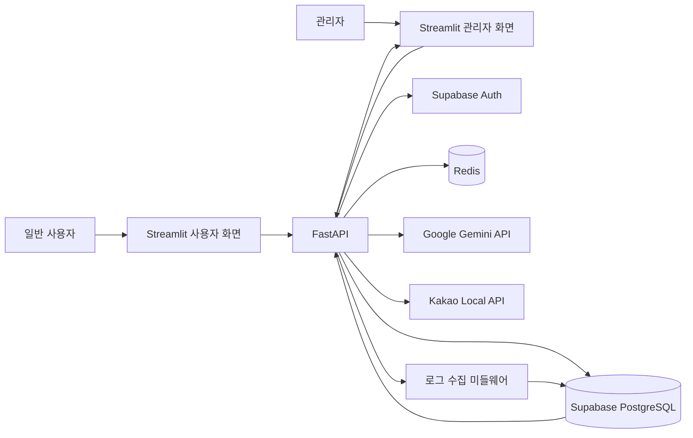
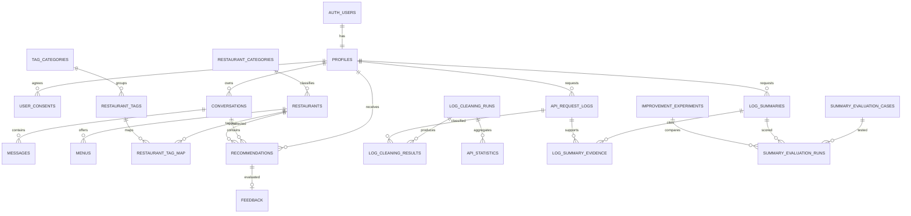

# PlayEAT 제품 요구사항 정의서

> 문서 상태: **구현 기준선 확정 (`PRD-BASELINE-1.0`)**  
> 구현 대상: Streamlit 프런트엔드, FastAPI 백엔드, Supabase PostgreSQL, Redis, Google Gemini API  
> 공통 UI 기준: [`design.md`](./design.md)
> 결정사항 기록: [`PRD_결정사항.md`](./PRD_결정사항.md)
> API 설계 기준: [`API_설계서.md`](./API_설계서.md)

추가 기능 결정은 중단한다. 이후에는 평가기준 위반, 구현 불가능, 치명적 보안 문제 또는 문서 간 명백한 충돌을 수정할 때만 변경 이력과 함께 개정한다.

## 문서 적용 원칙

이 문서는 Codex, Claude 등 구현 에이전트가 `design.md`와 함께 읽고 기능을 구현할 수 있도록 작성한다. 기능, 데이터, API, 업무 규칙과 검증 가능한 완료 조건은 이 PRD에서 정의하고, 공통 색상·폰트·간격·컴포넌트·상태 표현은 `design.md`를 따른다.

요구사항이 서로 충돌할 때는 다음 순서로 적용한다.

1. 교과목 1 공식 평가기준 P1-1~P1-4
2. 필수과제 M0~M9
3. `encore_project.xlsx`의 `정의서_new` 탭과 확정된 DB 변경사항
4. 팀 함수명 코드 컨벤션과 GitHub 운영 규칙
5. 이 PRD의 기능·데이터·API·업무 규칙
6. `design.md`의 공통 UI 구현 규칙

PRD와 `design.md`는 담당 범위가 다르다. 기능 요구사항과 디자인 요구사항이 충돌하는 경우 임의로 선택하지 않고 충돌 항목을 기록한 뒤 공통 기준을 수정한다.

---

## 1. 프로젝트 개요

### 1.1 프로젝트명

**PlayEAT: 신대방 점심 맛집 추천 및 AI 서비스 로그 분석 대시보드**

### 1.2 프로젝트 주제

PlayEAT는 신대방 인근 52개 식당의 메뉴·가격·음식 카테고리·상황 태그 데이터를 기반으로 사용자의 자연어 식사 조건을 분석해 점심 식당을 추천하는 AI 서비스다.

사용자는 가격대, 음식 카테고리, 식사 상황을 선택하고 자연어로 추가 조건을 입력한다. 시스템은 Google Gemini API로 입력을 구조화하고, Supabase PostgreSQL에 저장된 식당 데이터와 대조하여 조건에 맞는 식당과 추천 이유를 제공한다. 추천 사실 정보는 데이터베이스에 저장된 정보만 사용하며, 존재하지 않는 메뉴나 가격을 생성하지 않는다.

서비스는 추천 기능과 함께 FastAPI에서 발생하는 API 요청·응답 로그를 수집한다. FastAPI 미들웨어는 최소한 요청 시각, HTTP Method, 엔드포인트, 응답 상태 코드, 응답시간, 사용자 ID를 동일한 스키마로 기록하고 Supabase PostgreSQL에 적재한다. 수집된 로그는 정제·통계 분석·LLM 요약·품질평가·개선 실험에 사용하며, 관리자는 Streamlit 대시보드에서 기간과 조건을 지정해 통계와 LLM 요약을 함께 조회한다.

프로젝트는 다음 두 기능 축을 하나의 배포 서비스로 구현한다.

1. **사용자 서비스:** 로그인, 자연어 조건 분석, 식당 추천, 평가, 다른 식당 재추천, 마이페이지
2. **운영·평가 서비스:** API 로그 수집, 정제, 통계 분석, LLM 로그 요약, 요약 품질평가, 개선 실험, 관리자 대시보드

### 1.3 해결하려는 문제

사용자는 점심시간에 여러 식당의 메뉴·가격·상황 적합성을 직접 비교해야 한다. PlayEAT는 자연어와 선택 조건을 구조화하여 이 결정 과정을 줄인다.

운영자는 추천 결과만으로 서비스 품질을 설명하기 어렵다. PlayEAT는 API 사용량, 응답시간, 에러율과 사용자 평가 데이터를 함께 분석하여 어떤 기능이 사용되었고 어디에서 오류나 지연이 발생했는지 확인할 수 있게 한다. LLM 요약은 지정된 기간의 실제 로그를 근거로 이상 징후와 주요 이슈를 설명하며, 근거가 없는 사실을 생성하지 않는다.

### 1.4 프로젝트 목표

- 신대방 인근 지정 식당 52개의 검증된 데이터를 구축한다.
- 사용자의 선택 조건과 자연어 입력을 구조화하여 적합한 식당을 추천한다.
- 추천 이유는 DB에 저장된 사실만 근거로 생성한다.
- 추천 평가를 저장하고, 다른 식당 요청 시 같은 대화의 이전 추천을 제외한다.
- FastAPI 요청·응답 로그를 미들웨어에서 수집하여 Supabase PostgreSQL에 누적한다.
- 로그 정제 기준을 적용하고 사용량·응답시간·에러율을 포함한 통계 API를 3종 이상 제공한다.
- 지정 기간의 로그를 근거와 함께 자연어로 요약하는 LLM API를 제공한다.
- 정답 사례를 이용해 요약 품질을 점수로 측정하고, 개선 실험 1회를 같은 기준으로 전후 비교한다.
- 배포 환경의 Streamlit 관리자 대시보드에서 로그 수집·조회·시각화와 LLM 요약을 시연한다.

### 1.5 프로젝트 완료 조건

다음 조건을 모두 만족해야 프로젝트 완료로 판단한다.

- 사용자 입력부터 추천·평가·재추천까지의 핵심 흐름이 배포 환경에서 동작한다.
- FastAPI 요청이 발생하면 동일한 스키마의 로그가 Supabase PostgreSQL에 적재된다.
- 정제된 로그를 기반으로 사용량·응답시간·에러율 통계를 조회할 수 있다.
- 통계 조회 API가 3종 이상 동작한다.
- LLM 로그 요약 결과에서 근거가 된 원본 로그를 확인할 수 있다.
- 사전에 정의한 평가 사례로 LLM 요약 품질 점수를 계산할 수 있다.
- 동일한 평가 기준으로 개선 전후 결과를 비교할 수 있다.
- Streamlit 대시보드 한 화면에서 기간·필터 조건에 따른 통계와 LLM 요약을 확인할 수 있다.
- API 설계 문서, 화면 설계서, 데이터베이스 설계서가 실제 구현과 일치한다.
- 팀원 전원이 담당 구간을 설명하고 배포 환경에서 핵심 기능을 시연할 수 있다.

### 1.6 범위 제한

- 식당 추천 범위는 신대방 인근에서 팀이 확정한 52개 식당으로 제한한다.
- 추천 사실 정보는 Kakao Local API와 팀이 직접 조사해 출처·확인일을 기록한 데이터만 사용한다.
- 사용자 취향 장기 학습, 일행 합의 추천, 무제한 지역 확장은 이번 필수 범위에서 제외한다.
- 방문자 수, 피크 시간대, 시간대별 통계와 `Dashboard_Daily_Stat`은 확정된 DB 기준에 따라 추가하지 않는다.
- PRD 또는 확정 UI에 없는 화면·버튼·기능을 구현 에이전트가 임의로 추가하지 않는다.

---

## 2. 프로젝트 배경 및 문제 정의

### 2.1 사용자 문제

신대방 인근에서 점심 식당을 고르는 사용자는 지도 서비스에서 식당·메뉴·가격 정보를 각각 확인하고 여러 후보를 직접 비교해야 한다. 특히 가격, 음식 종류, 맵기, 국물 여부, 혼밥 가능 여부처럼 여러 조건을 동시에 고려하면 검색보다 결정 과정에 시간이 더 많이 든다.

PlayEAT는 선택형 조건과 자연어 요청을 하나의 구조화된 검색 조건으로 변환하고, 검증된 52개 식당 데이터 안에서 적합한 후보를 찾아 추천 이유와 함께 제시한다. 사용자가 다른 식당을 요청하면 같은 조건을 유지하고 같은 대화의 이전 추천을 제외하여 다음 후보를 제안한다.

### 2.2 운영자 문제

추천 결과와 사용자 만족도만으로는 서비스가 안정적으로 동작하는지 판단할 수 없다. 운영자는 다음 질문에 답할 수 있어야 한다.

- 어떤 API가 얼마나 호출되었는가?
- 어느 API의 응답이 느린가?
- 어떤 엔드포인트와 상태 코드에서 오류가 자주 발생하는가?
- 지정 기간에 발생한 주요 이상 징후와 반복 이슈는 무엇인가?
- LLM이 생성한 로그 요약이 실제 원본 로그와 일치하는가?
- 한 번의 개선 실험으로 품질 점수가 실제로 향상되었는가?

추천 횟수·만족률은 제품 사용 지표로 유지한다. API 사용량·응답시간·에러율은 운영 지표로 별도 관리하고, LLM 로그 요약 품질은 사전에 정답을 정한 평가 사례로 별도 측정한다.

### 2.3 핵심 문제 정의

| 문제 ID | 대상 | 현재 문제 | 목표 상태 | 검증 방법 |
| --- | --- | --- | --- | --- |
| `PROB-USER-001` | 일반 사용자 | 여러 식당 정보를 직접 비교해야 함 | 자연어와 선택 조건을 한 번에 반영한 추천 결과 제공 | 지정 조건에 맞는 식당·메뉴·가격·추천 이유 표시 확인 |
| `PROB-USER-002` | 일반 사용자 | 마음에 들지 않는 추천을 처음부터 다시 검색해야 함 | 이전 추천을 제외한 재추천 제공 | 같은 대화에서 다음 후보 확인 |
| `PROB-OPS-001` | 관리자 | API 사용량과 장애 위치를 정량적으로 확인하기 어려움 | 사용량·응답시간·에러율을 기간·필터 기준으로 조회 | 통계 API 3종 이상과 대시보드 결과 대조 |
| `PROB-OPS-002` | 관리자 | 많은 로그에서 주요 이슈를 사람이 직접 찾아야 함 | 실제 로그를 근거로 한 LLM 요약 제공 | 요약 문장과 근거 로그 연결 확인 |
| `PROB-QUALITY-001` | 팀 | LLM 요약 품질을 객관적으로 설명하기 어려움 | 정답 사례와 점수 기준으로 품질 측정 | 평가 사례별 점수 및 전체 점수 계산 확인 |
| `PROB-QUALITY-002` | 팀 | 개선 효과를 같은 기준으로 비교하기 어려움 | 개선 전후 결과를 동일 사례·동일 지표로 비교 | 개선 실험 결과와 전후 점수 확인 |

### 2.4 성공 판단 원칙

- 추천 성공은 사용자의 긍정 평가만으로 판단하지 않는다. 입력 조건과 표시된 식당 정보가 DB 사실과 일치하는지도 확인한다.
- 운영 통계는 원본 API 로그에서 재현할 수 있어야 한다.
- LLM 로그 요약의 각 핵심 주장에는 해당 주장을 뒷받침하는 원본 로그가 있어야 한다.
- 데이터가 없거나 근거가 부족하면 LLM은 추측하지 않고 확인 불가 또는 데이터 부족으로 표현한다.
- 개선 실험은 프롬프트 또는 처리 로직 중 하나의 원인을 선택하고, 다른 평가 조건을 유지한 채 전후 결과를 비교한다.

---

## 3. 핵심 서비스 범위

### 3.1 범위 결정 원칙

이번 프로젝트의 필수 범위는 사용자용 맛집 추천 서비스와 교과목 평가에 필요한 로그 분석·운영 기능이다. 구현 일정이 부족할 경우 부가 추천 기능보다 P1-1~P1-4와 M0~M9를 먼저 완성한다.

### 3.2 필수 구현 범위

#### 사용자 서비스

| 요구사항 ID | 기능 | 필수 결과 |
| --- | --- | --- |
| `SVC-AUTH-001` | 일반 회원가입·로그인 | Supabase Auth에서 인증하고 FastAPI가 Access Token을 검증 |
| `SVC-AUTH-002` | 카카오 로그인 | Kakao OAuth와 Supabase Auth 연계 후 서비스 사용자 식별 |
| `SVC-REC-001` | 추천 조건 입력 | 가격대·음식 카테고리·상황 선택과 자연어 추가 조건 입력 |
| `SVC-REC-002` | 자연어 조건 분석 | Gemini 결과를 정의된 조건 스키마로 변환하고 유효성 검증 |
| `SVC-REC-003` | 식당 추천 | 확정된 52개 식당 데이터 안에서 조건에 맞는 결과와 근거 제공 |
| `SVC-REC-004` | 추천 평가 | 좋아요·보통·싫어요의 3단계 평가 저장 |
| `SVC-REC-005` | 다른 식당 재추천 | 같은 조건을 유지하고 이전 추천을 제외해 다음 식당 추천 |
| `SVC-MYPAGE-001` | 마이페이지 | 프로필 조회·수정과 확정된 이용 통계 표시 |

#### 식당 데이터

| 요구사항 ID | 기능 | 필수 결과 |
| --- | --- | --- |
| `DATA-REST-001` | Kakao Local API 수집 | 식당 기본 정보 중 실제 API가 제공하는 필드를 수집하고 출처 기록 |
| `DATA-REST-002` | 직접 조사 데이터 | 메뉴·가격·태그 등 직접 조사한 정보에 출처와 최종 확인일 기록 |
| `DATA-REST-003` | 데이터 정확성 | DB에 없는 메뉴·가격·식당 정보를 추천 이유에 사용하지 않음 |
| `DATA-REST-004` | 데이터 품질 | 필수 정보의 결측·중복·형식 오류를 확인할 수 있는 기준 제공 |

#### 로그 분석·운영 서비스

| 요구사항 ID | 기능 | 필수 결과 |
| --- | --- | --- |
| `OPS-LOG-001` | 로그 범위 확정 | 대상 API와 요청 시각·Method·엔드포인트·상태 코드·응답시간·사용자 ID 등 필수 필드 정의 |
| `OPS-LOG-002` | 로그 수집 | FastAPI 미들웨어가 요청·응답 로그를 동일한 스키마로 Supabase에 적재 |
| `OPS-CLEAN-001` | 로그 정제 | 결측 필드·중복 로그·테스트 트래픽 제거와 엔드포인트·에러 코드 표기 통일 |
| `OPS-STAT-001` | 통계 분석 | 사용량·응답시간·에러율을 기술 통계로 계산하고 통계 API 3종 이상 제공 |
| `OPS-SUM-001` | LLM 로그 요약 | 지정 기간의 실제 로그를 기반으로 이상 징후·주요 이슈와 근거 로그 제공 |
| `OPS-EVAL-001` | 요약 품질평가 | 정답이 정의된 로그·요약 사례로 실제 로그 일치도를 점수화 |
| `OPS-EXP-001` | 개선 실험 | 낮은 점수의 원인 하나를 개선하고 동일 기준으로 전후 비교 |
| `OPS-DASH-001` | Streamlit 대시보드 | 기간·필터에 따른 통계와 LLM 요약을 한 화면에서 조회 |
| `OPS-DEMO-001` | 배포 시연·회고 | 로그 발생부터 적재·조회·시각화까지 시연하고 문제·해결 과정 정리 |

### 3.3 시스템 경계와 호출 원칙



- 사용자 화면과 관리자 화면의 핵심 데이터 요청은 FastAPI를 통과해야 한다.
- Streamlit이 서비스·통계 데이터를 Supabase에서 직접 조회하여 FastAPI 로그 수집을 우회하지 않는다.
- Supabase Auth가 비밀번호와 인증 공급자 정보를 관리하며 애플리케이션 테이블에 비밀번호를 저장하지 않는다.
- Redis는 세션 관련 캐시와 최근 대화 등 재생성 가능한 임시 데이터에만 사용한다.
- PostgreSQL은 프로필·식당·메뉴·태그·대화·메시지·추천·평가·API 로그·통계·요약·평가·실험 결과의 영구 기준 저장소다.
- Gemini가 생성한 조건과 설명은 서버에서 정의된 스키마와 DB 사실을 기준으로 검증한다.
- 로그에는 비밀번호, Access Token, OAuth 인증 코드, API Key 등 인증 비밀을 저장하지 않는다.
- 사용자 ID는 인증된 사용자를 추적할 때만 기록하고, 화면과 요약에서 불필요한 개인정보를 노출하지 않는다.

### 3.4 로그 종류 구분

| 로그 종류 | 목적 | 대표 데이터 | 사용처 |
| --- | --- | --- | --- |
| API 요청·응답 로그 | 성능·오류·사용량 분석 | Method, 엔드포인트, 상태 코드, 응답시간, 사용자 ID | M0~M8, 운영 대시보드 |
| 추천 기록 | 추천 결과 재현과 편향 분석 | 대화, 추천 식당, 적용 조건, 추천 시각 | 추천 분석, 재추천 |
| 사용자 피드백 | 추천 반응 분석 | 3단계 평가, 식당, 대화, 평가 시각 | 만족도 분석 |
| LLM 요약 평가 기록 | 요약 품질 검증 | 평가 사례, 정답, 생성 요약, 점수 | M6, M7 |

추천 기록과 사용자 피드백을 API 요청·응답 로그 대신 사용하지 않는다. 각 로그는 목적에 맞는 구조로 저장하고 공통 식별자를 통해 필요한 범위에서 연결한다.

### 3.5 범위 제외

- 신대방 인근 확정 식당 52개 밖의 전국 단위 추천
- 사용자 취향의 장기 자동 학습과 완전 개인화 추천
- 여러 사용자의 투표를 이용한 일행 합의 추천
- 배달·예약·결제 기능
- 실시간 혼잡도와 좌석 정보
- 방문자 수, 피크 시간대, 시간대별 통계
- 요구사항과 컬럼 정의가 없는 `Dashboard_personal`
- 평가기준 충족에 필요하지 않은 복잡한 프런트엔드 애니메이션과 불안정한 드래그 기능

---

## 4. 사용자 유형과 권한

### 4.1 일반 사용자

일반 사용자는 자신의 계정과 대화·추천·평가 데이터만 이용한다.

| 요구사항 ID | 허용 기능 | 접근 범위 |
| --- | --- | --- |
| `ROLE-USER-001` | 일반·카카오 로그인과 로그아웃 | 본인 인증 세션 |
| `ROLE-USER-002` | 프로필 조회·수정과 비밀번호 변경 | 본인 프로필. 비밀번호는 Supabase Auth에서 처리 |
| `ROLE-USER-003` | 추천 조건 입력과 추천·재추천 요청 | 본인의 현재 대화와 추천 결과 |
| `ROLE-USER-004` | 추천 평가와 다른 식당 요청 | 본인이 받은 추천 결과 |
| `ROLE-USER-005` | 마이페이지 이용 통계 조회 | 본인 데이터로 계산한 확정 항목 |

일반 사용자는 다른 사용자의 프로필·대화·추천·평가 데이터와 관리자 통계·로그 원문에 접근할 수 없다.

### 4.2 관리자

관리자는 인증된 계정의 `profiles.profile_type = '0'`인 경우에만 관리자 기능을 사용할 수 있다.

| 요구사항 ID | 허용 기능 | 접근 범위 |
| --- | --- | --- |
| `ROLE-ADMIN-001` | 운영 통계 조회 | 허용된 기간·엔드포인트·상태 코드 집계 |
| `ROLE-ADMIN-002` | 로그 목록·상세 조회 | 운영 분석에 필요한 필드. 인증 비밀과 불필요한 개인정보 제외 |
| `ROLE-ADMIN-003` | LLM 로그 요약 실행·조회 | 선택 기간·필터에 해당하는 로그와 요약 근거 |
| `ROLE-ADMIN-004` | 요약 품질평가·개선 결과 조회 | 평가 사례와 전후 점수 |
| `ROLE-ADMIN-005` | 추천·사용자 반응 분석 | 집계된 추천·평가 데이터 |
| `ROLE-ADMIN-006` | 식당 정보 관리 | 확정된 식당·메뉴·카테고리·태그 데이터 |

관리자 권한은 Streamlit 메뉴 표시만으로 판단하지 않는다. FastAPI가 인증 토큰과 `profile_type`을 검증하고 권한이 없으면 표준 에러 응답으로 거부한다.

### 4.3 비로그인 사용자

비로그인 사용자는 로그인·회원가입·OAuth 진입과 확정된 공개 안내만 이용할 수 있다. 추천·마이페이지·관리자 API 요청은 인증 전 사용할 수 없다.

### 4.4 외부 시스템과 시스템 행위자

| 시스템 | 역할 | 제한 |
| --- | --- | --- |
| Supabase Auth | 이메일·비밀번호·OAuth 인증과 토큰 발급 | 비밀번호를 서비스 DB에 복제하지 않음 |
| Supabase PostgreSQL | 영구 데이터 저장 | 확정 스키마와 제약조건 적용 |
| Redis | 세션 관련·최근 대화 캐시 | 영구 기준 데이터로 사용하지 않음 |
| Google Gemini API | 조건 추출·추천 이유·로그 요약 생성 | DB·로그에 없는 사실 생성 금지 |
| Kakao Local API | 식당 기본 정보 수집 | 실제 제공 필드만 사용하고 출처 기록 |

### 4.5 권한 검증 완료 조건

- 비로그인 사용자가 보호 API를 호출하면 `401` 표준 에러 응답을 받는다.
- 일반 사용자가 관리자 API를 호출하면 `403` 표준 에러 응답을 받는다.
- 일반 사용자는 다른 사용자의 리소스를 조회·수정할 수 없다.
- 관리자 화면을 직접 URL로 열어도 백엔드 권한 검증을 통과하지 못하면 데이터가 표시되지 않는다.
- 로그와 에러 응답에 비밀번호·토큰·API Key가 포함되지 않는다.
- 권한 실패 요청도 민감정보를 제외한 API 로그 수집 범위에 포함한다.

---

## 5. 화면 구성과 정보 구조

### 5.1 화면 구현 공통 원칙

- 모든 화면은 [`design.md`](./design.md)의 토큰·레이아웃·Navbar·공통 컴포넌트·상태 표현을 사용한다.
- 화면은 기능 결과를 표시하며 인증·권한·추천·통계 계산을 화면 코드에 중복 구현하지 않는다.
- 페이지에서 색상 HEX, 폰트, 버튼·입력 높이, radius, shadow를 새로 정의하지 않는다.
- 핵심 데이터 요청은 FastAPI를 통해 실행하고, Streamlit이 Supabase를 직접 조회하지 않는다.
- 각 요청은 `default`, `loading`, `success`, `empty`, `error` 상태를 구분한다.
- 연속 클릭과 Streamlit 재실행으로 같은 요청이 중복 실행되지 않도록 고유 위젯 key와 요청 상태를 관리한다.
- 오류가 발생하면 사용자가 이해할 수 있는 메시지와 가능한 다음 행동을 표시한다. 내부 예외·SQL·스택 트레이스는 화면에 노출하지 않는다.

### 5.2 전체 IA

```text
비로그인
├─ 로그인
├─ 회원가입
├─ 회원가입 완료
└─ 인증·서버 오류

일반 사용자
├─ 맛집 추천
│  ├─ 조건 입력
│  ├─ 추천 결과
│  └─ 평가·다른 식당 재추천
└─ 마이페이지
   ├─ 회원정보 조회
   ├─ 프로필 수정
   └─ 비밀번호 변경

관리자
├─ 검색정보분석
│  ├─ API 운영 통계·LLM 로그 요약
│  └─ 로그 목록·상세
├─ 식당정보
└─ 사용자피드백
```

### 5.3 화면 목록

| 화면 ID | 화면 | 유형 | 접근 권한 | 주요 목적 | 구현 기준 |
| --- | --- | --- | --- | --- | --- |
| `PAGE-AUTH-LOGIN` | 로그인 | 입력 | 비로그인 | 이메일·카카오 인증 진입 | `--content-login`, 로그인 전 Navbar |
| `PAGE-AUTH-SIGNUP` | 회원가입 | 입력 | 비로그인 | 이메일 계정과 프로필 생성 | `--content-signup`, 공통 입력·버튼 |
| `PAGE-AUTH-RESULT` | 회원가입 결과 | 상태 | 비로그인 | 완료·실패와 다음 행동 표시 | 공통 상태 카드 |
| `PAGE-REC-MAIN` | 맛집 추천 | 메인·입력 | 일반 사용자 | 조건 입력과 추천 실행 | `--content-main`, 맛집 추천 메뉴 활성 |
| `PAGE-REC-RESULT` | 추천 결과 | 상세 | 일반 사용자 | 추천 근거·메뉴·가격·외부 지도 링크 표시 | 공통 카드·상태 표현 |
| `PAGE-MYPAGE` | 마이페이지 | 메인 | 일반 사용자 | 프로필과 확정된 개인 이용 통계 조회 | `--content-mypage` |
| `PAGE-PROFILE-EDIT` | 프로필 수정 | 설정·입력 | 일반 사용자 | 닉네임 등 허용된 프로필 수정 | 공통 입력·버튼 |
| `PAGE-PASSWORD` | 비밀번호 변경 | 설정·입력 | 일반 사용자 | Supabase Auth 비밀번호 변경 | 공통 입력·오류 표현 |
| `PAGE-ADMIN-ANALYTICS` | 검색정보분석 | 관리자 메인 | 관리자 | API 통계·LLM 요약·로그 조회 | `--content-dashboard`, 관리자 사이드바 |
| `PAGE-ADMIN-LOG-DETAIL` | 로그 상세 | 상세 | 관리자 | 선택 로그와 요약 근거 확인 | 공통 상세 카드 또는 패널 |
| `PAGE-ADMIN-RESTAURANTS` | 식당정보 | 관리자 설정 | 관리자 | 식당·메뉴·카테고리·태그 관리 | 공통 표·입력·확인 UI |
| `PAGE-ADMIN-FEEDBACK` | 사용자피드백 | 관리자 메인 | 관리자 | 추천 평가 분석 | 공통 KPI·표·차트 |
| `PAGE-ERROR` | 오류 | 에러 | 전체 | 401·403·404·500·외부 서비스 오류 안내 | 공통 Error 상태 |

`PAGE-REC-RESULT`는 메인 추천 화면 안의 결과 영역으로 구현할 수 있다. 그러나 입력 전·로딩·결과·빈 결과·오류·평가 완료 상태가 각각 구분되어야 한다. `PAGE-ADMIN-LOG-DETAIL`도 별도 페이지 또는 동일 화면의 상세 패널로 구현할 수 있으나, URL·선택 상태·닫기 후 목록 조건 보존 방식을 화면 설계서에서 명시한다.

### 5.4 공통 사용자 액션과 시스템 반응

| 사용자 액션 | 시스템 반응 | 실패 시 반응 |
| --- | --- | --- |
| 버튼 클릭 | 즉시 loading 표시, 해당 동작 중복 실행 차단 | 버튼 복구, 오류 설명과 재시도 제공 |
| 입력 focus | `design.md`의 공통 focus 표시 | 해당 없음 |
| 입력 검증 실패 | 해당 입력 아래 구체적인 오류 표시 | 입력값 유지 |
| 필터 적용 | 적용된 조건 표시 후 결과 영역만 갱신 | 기존 조건 유지, 조회 오류 표시 |
| 필터 초기화 | 정의된 기본값으로 복원 후 조회 | 초기화 실패가 없도록 로컬 상태와 서버 요청 분리 |
| 정렬 | 현재 정렬 컬럼·방향 표시 | 기존 정렬과 결과 유지 |
| 스크롤 | Navbar·표 헤더 등 화면별 고정 요소 규칙 유지 | 페이지 전체 가로 넘침 방지 |
| 새로고침 | 갱신 영역 loading, 완료 후 마지막 갱신 시각 표시 | 기존 결과 유지 여부를 화면별로 명시하고 재시도 제공 |
| 상세 열기 | 선택 항목 표시, 목록의 필터·정렬·페이지 상태 보존 | 상세 오류와 목록 복귀 제공 |
| 외부 링크 클릭 | 새 탭 또는 명확한 외부 이동으로 지도 열기 | 유효한 URL이 없으면 링크를 숨기고 안내 표시 |

### 5.5 공통 오류 화면 규칙

| 상황 | 화면 메시지 목적 | 가능한 다음 행동 |
| --- | --- | --- |
| `401` | 로그인이 필요하거나 세션이 만료됨 | 로그인으로 이동 |
| `403` | 현재 계정에 접근 권한이 없음 | 허용된 메인 화면으로 이동 |
| `404` | 요청한 화면 또는 리소스를 찾을 수 없음 | 이전 화면 또는 메인으로 이동 |
| `409` | 중복 아이디·닉네임 또는 상태 충돌 | 입력 수정 후 재시도 |
| `422` | 입력 형식 또는 필수값 오류 | 해당 입력을 표시하고 값 유지 |
| `429` | 요청 한도 초과 | 재시도 가능 시점 안내 |
| `500` | 서버 내부 처리 실패 | 재시도 또는 메인 이동 |
| `502`·`503` | Gemini·Kakao·Supabase 등 외부 서비스 일시 장애 | 잠시 후 재시도 |

---

## 6. 로그인과 회원가입

### 6.1 일반 로그인 방식

MVP 일반 로그인은 **이메일과 비밀번호**를 사용한다. Supabase Auth의 이메일을 인증 식별자로 사용하며, 별도의 문자열 로그인 아이디 입력은 받지 않는다. `profiles.profile_login_id`는 현재 선택 컬럼으로 유지하되 MVP 화면·인증 API에서는 사용하지 않는다.

### 6.2 로그인 화면 요구사항

| 요구사항 ID | 요구사항 | 완료 조건 |
| --- | --- | --- |
| `AUTH-LOGIN-001` | 이메일과 비밀번호 입력 제공 | 라벨이 입력 위에 있고 placeholder로 대체하지 않음 |
| `AUTH-LOGIN-002` | 일반 로그인 요청 | 성공 시 Access Token 기반 인증 상태 생성 후 사용자 메인으로 이동 |
| `AUTH-LOGIN-003` | 카카오 로그인 진입 | 카카오 공식 버튼 기준을 사용하고 OAuth 흐름 시작 |
| `AUTH-LOGIN-004` | 로그인 실패 처리 | 계정 존재 여부를 과도하게 노출하지 않는 오류 문구 표시 |
| `AUTH-LOGIN-005` | 세션 만료 처리 | 보호 API의 401 수신 시 인증 상태 제거 후 로그인 이동 안내 |
| `AUTH-LOGIN-006` | 관리자 이동 | 인증 후 `profile_type = '0'`이면 관리자 기본 화면으로 이동 |

비밀번호는 화면 상태·Redis·애플리케이션 DB·API 로그에 저장하지 않는다. 로그인 요청 본문은 로그 수집 시 마스킹 또는 본문 미저장 정책을 적용한다.

### 6.3 회원가입 입력

| 필드 | 필수 | 검증 | 저장 위치 |
| --- | --- | --- | --- |
| 이메일 | 필수 | 이메일 형식, Supabase Auth 중복 확인 | `auth.users.email` |
| 비밀번호 | 필수 | 8자 이상 | Supabase Auth |
| 비밀번호 확인 | 필수 | 비밀번호와 일치 | 저장하지 않음 |
| 닉네임 | 필수 | 공백 제거 후 비어 있지 않음, 45자 이하, 중복 금지 | `profiles.profile_nickname` |
| 이용약관 동의 | 필수 | 동의하지 않으면 제출 차단 | 약관 버전·동의 시각 저장 |
| 개인정보 수집·이용 동의 | 필수 | 동의하지 않으면 제출 차단 | 정책 버전·동의 시각 저장 |

가입 성공과 같은 처리 범위에서 `user_consents`에 약관 종류·버전·동의 여부·시각을 저장한다. 필수 약관의 현재 버전에 동의 기록이 없으면 가입을 완료하지 않는다.

시연용 약관의 운영자·버전·수집 항목과 문구는 [`약관.md`](./약관.md)를 따른다. 운영자는 `PlayEAT 프로젝트팀`, 버전은 `terms-v1.0`과 `privacy-v1.0`, 시행일은 프로젝트 배포일이다.

### 6.4 회원가입 처리 순서

1. 화면에서 필수값과 형식을 검증한다.
2. FastAPI가 동일한 검증을 다시 수행한다.
3. Supabase Auth에 이메일 사용자를 생성한다.
4. 생성된 `auth.users.id`와 동일한 UUID로 `profiles.id`를 생성한다.
5. 필수 약관의 현재 버전 동의 이력을 저장한다.
6. 프로필과 동의 이력 저장까지 성공하면 회원가입 완료 상태를 표시한다.
6. Auth 생성 후 프로필 생성이 실패하면 불완전 계정이 남지 않도록 보상 처리 또는 복구 가능한 상태를 기록한다.

### 6.5 회원가입 상태

| 상태 | 화면 반응 |
| --- | --- |
| Default | 빈 입력 폼과 필수 동의 표시 |
| Validation Error | 해당 입력 아래 오류, 기존 입력 유지, 비밀번호는 정책에 따라 재입력 |
| Loading | 제출 버튼 크기를 유지하고 `가입 처리 중…` 표시, 중복 제출 차단 |
| Success | 공통 결과 카드로 완료 표시, 로그인 이동 제공 |
| Conflict | 이메일 또는 닉네임 중복 항목 표시 |
| Server Error | 가입 미완료 안내와 재시도 제공, 내부 오류 미노출 |

### 6.6 인증 완료 조건

- 로그인 성공·실패·세션 만료·권한 부족을 각각 재현할 수 있다.
- 일반 사용자와 관리자 로그인 후 서로 다른 기본 화면으로 이동한다.
- 새 이메일 사용자 생성 시 `auth.users`와 `profiles`가 UUID로 연결된다.
- 중복 이메일·닉네임 요청에 일관된 409 응답을 제공한다.
- 입력 검증 실패에는 422 표준 에러 응답을 제공한다.
- 인증 관련 로그에서 비밀번호·토큰·OAuth 코드가 확인되지 않는다.

---

## 7. 메인 맛집 추천 화면

### 7.1 화면 목적

일반 사용자가 선택 조건과 자연어 추가 요청을 입력하고, 하나의 추천 결과를 근거와 함께 받은 뒤 평가하거나 재추천을 요청하는 핵심 화면이다.

### 7.2 추천 입력

| 입력 | 필수 | 값 | 처리 원칙 |
| --- | --- | --- | --- |
| 가격대 | 필수 | 저가·중가·고가 중 하나 선택, `가격 무관` 없음 | 화면 라벨과 DB 코드 매핑을 한 곳에서 관리 |
| 음식 카테고리 | 필수 | 한식·일식·중식·양식·기타 | `restaurant_categories` 기준으로 조회 |
| 메뉴·상황 태그 | 선택 | 국물·매운맛·안매운맛·든든함·혼밥 등 확정 태그 | `tag_categories`와 `restaurant_tags` 기준으로 조회 |
| 자연어 추가 조건 | 선택 | 사용자의 자유 입력 | Gemini가 정의된 조건 모델로 변환 |

‘매운 음식’, ‘국물’, ‘든든함’과 ‘혼밥’, ‘회식’ 같은 조건은 별도 `restaurant_situations` 테이블을 만들지 않고 `tag_categories`로 유형을 구분한 `restaurant_tags` 체계에서 관리한다. 태그 유형·코드·표시명은 DB 기준과 UI 매핑에서 동일하게 사용한다.

### 7.3 입력 우선순위와 충돌 처리

- 사용자가 화면에서 직접 선택한 가격대·음식 카테고리는 명시적 조건으로 우선한다.
- 포함 태그는 선택이며 최대 3개까지 선택할 수 있다.
- 자연어에서 추출한 값이 명시적 선택과 충돌하면 선택값을 임의로 덮어쓰지 않는다.
- 충돌이 추천에 영향을 주면 어떤 조건이 충돌했는지 표시하고 사용자가 수정할 수 있게 한다.
- 자연어 분석 결과가 스키마 검증에 실패하면 추천 검색을 실행하지 않고 입력 수정 또는 재분석을 안내한다.
- 선택하지 않은 조건을 Gemini가 추측하여 필수 조건으로 만들지 않는다.

### 7.4 추천 화면 상태

| 상태 | 표시 내용 | 허용 행동 |
| --- | --- | --- |
| Default | 조건 입력과 추천 실행 버튼 | 입력·추천 실행 |
| Analyzing | 자연어 분석 중 표시 | 중복 실행 차단 |
| Searching | 조건 분석 결과와 식당 검색 중 표시 | 중복 실행 차단 |
| Result | 추천 식당·대표 메뉴·가격·추천 이유·지도 링크 | 평가·재추천 |
| Empty | 충족하는 식당이 없다는 안내와 충돌·과도한 조건 표시 | 조건 수정 |
| Error | 실패 단계와 재시도 가능 행동 표시 | 재시도·입력 수정 |
| Feedback Saved | 평가 저장 완료 표시 | 현재 결과 유지 또는 새 추천 |

### 7.5 추천 결과 표시

추천 결과에는 최소한 다음 정보를 표시한다.

- 식당명
- 음식 카테고리
- 대표 메뉴와 가격
- 입력 조건과 일치한 태그
- DB 사실에 기반한 추천 이유
- 주소와 Kakao 장소 링크
- 유효한 경우 Kakao 지도 링크
- 추천 결과 식별자

정보가 DB에 없으면 빈 값을 그럴듯한 설명으로 채우지 않는다. 선택 필드가 없을 때는 해당 항목을 숨기거나 정보 없음으로 표시한다. 지도 URL이 없으면 링크를 생성하지 않는다.

### 7.6 메인 화면 완료 조건

- 선택 조건만 입력한 경우와 자연어를 함께 입력한 경우 모두 추천을 실행할 수 있다.
- 명시적 선택과 자연어 조건의 충돌을 재현하고 수정할 수 있다.
- 분석 중·검색 중·결과 없음·외부 API 오류를 서로 다른 상태로 표시한다.
- 추천 결과의 메뉴·가격·태그를 DB 원본과 대조할 수 있다.
- 연속 클릭 또는 Streamlit 재실행으로 추천 기록이 중복 저장되지 않는다.
- 모바일에서 입력·결과·버튼이 겹치거나 페이지 전체를 가로로 넘지 않는다.

---

## 8. 식당 추천 처리

### 8.1 처리 원칙

Gemini는 자연어 조건 추출과 DB 사실을 자연스럽게 설명하는 역할을 담당한다. 최종 후보 조회와 필터링은 FastAPI의 결정 가능한 추천 로직에서 수행한다. Gemini가 식당·메뉴·가격을 자체 지식으로 생성하거나 DB에 없는 후보를 추가하지 않는다.

### 8.2 추천 처리 순서

1. 인증 사용자와 대화 식별자를 확인한다.
2. 선택 조건과 자연어 입력을 검증한다.
3. 자연어 입력이 있으면 Gemini로 조건을 추출한다.
4. 추출 결과를 서버의 조건 스키마로 검증한다.
5. 명시적 선택값과 추출 조건을 병합하고 충돌을 검사한다.
6. `restaurants`, `restaurant_categories`, `menus`, `restaurant_tag_map`, `restaurant_tags`, `tag_categories`에서 후보를 조회한다.
7. 가격·카테고리·태그 조건을 적용한다.
8. 같은 대화에서 이미 추천한 식당을 제외한다.
9. 조건을 충족하는 후보 중 정의된 정렬 기준으로 하나를 선택한다.
10. 추천 결과와 적용 조건을 `recommendations`에 저장한다.
11. 저장된 DB 사실을 근거로 추천 이유를 생성하고 결과를 반환한다.

### 8.3 후보 없음 처리

- 시스템은 사용자가 선택한 조건을 알리지 않고 임의로 완화하지 않는다.
- 기본 조건에 맞는 후보가 없으면 충족하지 못한 조건을 표시하고 조건 수정을 안내한다.
- 이전 추천을 모두 제외해 후보가 없어진 경우 이전 식당을 조용히 반복 추천하지 않는다.
- 기본 후보가 있지만 모두 이전 추천으로 제외된 경우 가장 오래전에 추천한 식당부터 다시 포함한다.

### 8.4 추천 기록

추천 결과는 피드백과 재추천을 정확히 연결할 수 있도록 영구 저장한다. `recommendations`에는 최소한 다음 개념이 필요하다.

- 추천 결과 ID
- 사용자·대화 ID
- 추천 식당 ID
- 적용된 구조화 조건
- 추천 이유 또는 생성 결과. 1~3문장, 최대 300자
- 추천 시각
- 동일 요청의 중복 저장을 막는 요청 식별자

정확한 테이블·컬럼·타입·제약조건은 DB 개정 장에서 확정한다. 사용자 피드백은 식당과 대화뿐 아니라 특정 추천 결과를 식별할 수 있어야 한다.

### 8.5 실패 처리

| 실패 | 처리 | 사용자 화면 |
| --- | --- | --- |
| Gemini 타임아웃·오류 | 제한된 재시도 후 실패 응답 | 자연어 분석 실패와 재시도 안내 |
| 조건 스키마 불일치 | 추천 검색 중단 | 해석하지 못한 조건 안내 |
| DB 조회 실패 | 오류 기록 후 실패 응답 | 일시적 조회 실패 안내 |
| 후보 없음 | 정상적인 빈 결과 | 조건 수정 안내 |
| 추천 기록 저장 실패 | 성공으로 표시하지 않음 | 저장 실패·재시도 안내 |
| 추천 이유 생성 실패 | DB 카테고리·가격대·일치 태그로 최대 300자의 고정 형식 설명 제공 | 외부 모델 실패로 추천 전체를 중단하지 않음 |

### 8.6 추천 기능 완료 조건

- 동일 입력으로 사용한 필터와 후보 선정 근거를 재현할 수 있다.
- 결과 식당·메뉴·가격·태그가 DB에 존재한다.
- 같은 대화에서 이전 추천을 제외하고 재추천할 수 있다.
- 특정 추천 결과와 피드백을 연결할 수 있다.
- 후보 없음과 시스템 오류를 다른 응답·화면 상태로 처리한다.
- Gemini 장애가 DB에 없는 사실 생성이나 미완성 추천의 성공 처리로 이어지지 않는다.

---

## 9. 식당 기본 데이터와 Kakao Local API 수집

### 9.1 데이터 수집 원칙

- 식당 기본 정보는 Kakao Local API의 실제 응답 필드만 자동 수집한다.
- Kakao API가 제공하지 않는 사진·메뉴·가격·영업시간·브레이크타임·추천 태그는 직접 조사 데이터로 분류한다.
- API 원본값, 서비스에서 정규화한 값, 직접 조사값의 출처를 구분한다.
- 동일 Kakao 장소가 중복 식당으로 생성되지 않도록 Kakao 장소 ID를 고유 기준으로 사용한다.
- API 재수집 시 직접 조사값을 덮어쓰지 않는다.
- 수집 실패와 검색 결과 없음은 구분하여 기록한다.

공식 응답 필드 기준은 [Kakao Local API 개발 가이드](https://developers.kakao.com/docs/ko/local/dev-guide)를 따른다.

### 9.2 Kakao 수집 필드

| Kakao 응답 필드 | 의미 | 서비스 저장 요구 | 현재 DB 영향 |
| --- | --- | --- | --- |
| `id` | Kakao 장소 ID | 중복 방지용 고유값 | `restaurants` 신규 컬럼 필요 |
| `place_name` | 장소명 | `restaurants.name`으로 정규화 | 기존 컬럼 사용 |
| `category_name` | Kakao 전체 카테고리 문자열 | 원본값 보존, 서비스 카테고리와 별도 관리 | 원본 카테고리 컬럼 필요 |
| `category_group_code` | 카테고리 그룹 코드 | 수집 가능한 경우 원본 보존 | 신규 컬럼 검토 |
| `category_group_name` | 카테고리 그룹명 | 수집 가능한 경우 원본 보존 | 신규 컬럼 검토 |
| `phone` | 전화번호 | `restaurants.phone` | 기존 컬럼 사용 |
| `address_name` | 지번 주소 | 원본 보존 | 신규 컬럼 검토 |
| `road_address_name` | 도로명 주소 | 값이 있으면 `restaurants.address` 화면 표시값으로 사용 | 기존 컬럼 사용 |
| `x` | 경도 | 숫자형으로 변환해 저장 | 신규 컬럼 필요 |
| `y` | 위도 | 숫자형으로 변환해 저장 | 신규 컬럼 필요 |
| `place_url` | Kakao 장소 상세 URL | 지도 외부 링크로 사용 | 신규 컬럼 필요 |
화면 표시 주소는 `road_address_name`을 우선하고 값이 비어 있으면 `address_name`을 사용한다. 두 원본 주소는 별도 컬럼에 그대로 보존한다.

Kakao Local API 응답에 사진 경로는 없다. `restaurants.storage_path`는 팀이 별도로 확보한 이미지가 있을 때만 저장하고, 값이 없으면 공통 기본 이미지를 화면에서 사용한다.

### 9.3 수집·갱신 처리

| 요구사항 ID | 요구사항 | 완료 조건 |
| --- | --- | --- |
| `REST-COLLECT-001` | 확정된 52개 식당을 Kakao 장소 ID와 연결 | 모든 식당의 매핑 성공·실패 상태 확인 가능 |
| `REST-COLLECT-002` | Kakao 원본 필드 저장 | 장소명·주소·좌표·전화번호·URL을 원본 응답과 대조 가능 |
| `REST-COLLECT-003` | 중복 방지 | 동일 Kakao 장소 ID로 식당이 두 개 생성되지 않음 |
| `REST-COLLECT-004` | 갱신 보호 | API 재수집이 메뉴·가격·태그 등 직접 조사값을 삭제하거나 덮어쓰지 않음 |
| `REST-COLLECT-005` | 실패 기록 | 인증 실패·한도 초과·응답 오류·검색 결과 없음 구분 |

---

## 10. 직접 조사 데이터와 정확성 관리

### 10.1 직접 조사 대상

| 데이터 | 필수 여부 | 저장 단위 | 검증 원칙 |
| --- | --- | --- | --- |
| 대표 메뉴 | 식당별 1개 이상 | 메뉴 | 메뉴명과 식당 연결 확인 |
| 가격 | 메뉴별 필수 | 메뉴 | 0 이상의 정수, 원 단위 |
| 추천 태그 | 식당별 1개 이상 | 식당–태그 관계 | 확정 태그만 사용 |
| 영업시간 | 선택 | 식당 | 출처와 최종 확인일 기록 |
| 브레이크타임 | 선택 | 식당 | 없는 경우와 미확인을 구분 |
| 설명 | 선택 | 식당 | 사실 정보만 기록 |
| 이미지 | 선택 | 식당 | 사용 권한과 저장 경로 확인 |
| 데이터 출처 | 직접 조사값에 필수 | 식당 또는 메뉴 | 확인 가능한 출처 식별자 저장 |
| 최종 확인일 | 직접 조사값에 필수 | 식당 또는 메뉴 | 실제 확인 날짜 저장 |

### 10.2 데이터 상태 구분

- `확인 완료`: 출처와 최종 확인일이 있으며 필수 형식 검증을 통과했다.
- `일부 누락`: 추천에 필요한 메뉴·가격·태그 중 하나 이상이 없다.
- `확인 필요`: 최종 확인일이 팀이 정한 최신성 기준을 초과했다.
- `수집 실패`: 외부 API 또는 조사 등록 과정에서 오류가 발생했다.

직접 조사 데이터의 기본 최신성 기준은 마지막 확인일로부터 30일이다. 30일을 초과한 데이터도 별도 경고 없이 추천에 사용한다. 출처가 없거나 형식 검증에 실패한 값은 추천 근거로 사용하지 않는다. `last_verified_at`은 관리자 점검과 추후 정책 변경을 위해 계속 저장한다.

`dashboard_data_quality.complete_count`는 다음 조건을 모두 만족하는 식당 수로 계산한다.

1. 음식 카테고리가 연결되어 있다.
2. 가격이 0 이상인 메뉴가 1개 이상 연결되어 있다.
3. 추천에 사용할 태그가 1개 이상 연결되어 있다.

`incomplete_count`는 `total_restaurant - complete_count`로 계산한다. 두 값을 각각 독립 입력하거나 서로 다른 조건으로 계산하지 않는다.

### 10.3 정확성 완료 조건

- 52개 식당마다 Kakao API 데이터와 직접 조사 데이터의 출처를 구분할 수 있다.
- 메뉴 가격은 문자열이 아니라 원 단위 정수로 저장한다.
- 브레이크타임 없음과 미확인 상태를 구분한다.
- 추천 결과에서 사용한 메뉴·가격·태그의 원본 레코드를 찾을 수 있다.
- 오래된 데이터는 추천에서 조용히 제외하거나 그대로 사용하지 않고 정책에 따른 상태를 표시한다.
- 데이터 품질 집계값을 원본 식당·메뉴·태그 데이터로 재계산할 수 있다.

---

## 11. 식당 카테고리와 태그

### 11.1 분류 구조

- 음식 대분류는 `restaurant_categories`에서 관리한다.
- 추천 세부 조건은 `tag_categories`와 `restaurant_tags`에서 관리한다.
- 식당과 태그의 다대다 관계는 `restaurant_tag_map`으로 관리한다.
- 별도의 `restaurant_situations` 테이블은 만들지 않는다.

### 11.2 태그 카테고리 예시

| 태그 카테고리 코드 예시 | 역할 | 태그 예시 |
| --- | --- | --- |
| `PRICE_RANGE` | 가격대 | DB 태그 `하` 저가·`중` 중가·`상` 고가 |
| `MENU_FEATURE` | 메뉴 특성 | 국물·밥·면·고기·든든함 |
| `TASTE` | 맛·맵기 | 매운맛·안매운맛 |
| `DINING_PURPOSE` | 이용 상황 | 혼밥·직장인 점심·데이트·회식·단체식사 |
| `ATMOSPHERE` | 분위기 | 조용함 등 실제 조사된 태그 |

가격대는 요청 시 메뉴 가격으로 다시 계산하기보다 DB에 이미 저장된 `PRICE_RANGE` 판정값을 우선 사용한다. 화면·API·추천 로직은 동일한 DB 코드에 연결한다.

| DB 태그명 | 화면 표시 | 판정 기준 |
| --- | --- | --- |
| `하` | 저가 | 12,000원 이하 |
| `중` | 중가 | 12,001원 이상 20,000원 이하 |
| `상` | 고가 | 20,001원 이상 |

12,000원이 두 구간에 중복되지 않도록 중가는 12,001원부터 시작한다. 이 경계는 DB 판정값을 생성·검증할 때 사용한다. 가격대와 음식 카테고리는 모두 필수 단일 선택이며 `가격 무관`·`전체 음식` 선택지는 제공하지 않는다. 그 밖의 태그 코드와 표시명도 DB의 한 곳에서 관리한다.

서비스 음식 카테고리는 한식·일식·중식·양식·기타 5개다. 원본 데이터의 `분식`과 `카페` 값은 삭제하지 않고 보존하되 화면 표시·사용자 필터·추천 검색에서는 `기타`로 매핑한다. 관리자 데이터 화면에서는 원본 카테고리와 서비스 매핑 결과를 함께 확인할 수 있다.

### 11.3 태그 관리 규칙

- 같은 카테고리 안에서 동일한 태그명을 중복 생성하지 않는다.
- 자연어 동의어는 새로운 태그를 계속 만들지 않고 확정 태그로 매핑한다.
- 서로 모순되는 태그를 같은 식당에 연결할 수 있는지 검증 규칙을 둔다.
- 태그 삭제 시 식당 연결은 함께 제거하되 식당 자체는 삭제하지 않는다.
- 화면의 필터 값은 DB 태그 ID 또는 코드로 전달하고 표시 문자열로 직접 검색하지 않는다.
- Gemini 조건 추출 결과도 확정된 태그 코드로 변환한 후 검색한다.

### 11.4 태그 완료 조건

- 음식 대분류와 추천 세부 태그를 서로 다른 데이터 개념으로 관리한다.
- 혼밥·회식 등 상황 조건을 기존 태그 구조로 검색할 수 있다.
- 동일 의미의 태그가 띄어쓰기·표현 차이로 중복되지 않는다.
- UI 선택값·Gemini 추출값·DB 검색값이 동일 코드로 연결된다.

---

## 12. 추천 조건 모델

추천 조건은 화면 선택값과 자연어 추출값을 다음 논리 구조로 통합한다.

| 조건 | 데이터 형태 | 적용 방식 |
| --- | --- | --- |
| 음식 카테고리 | 단일 카테고리 ID | 명시적 선택 우선 |
| 가격대 | 단일 가격대 태그 ID | DB의 `PRICE_RANGE` 카테고리에 속한 `하`·`중`·`상` 태그와 일치 여부 확인 |
| 포함 태그 | 태그 ID 목록, 최대 3개 | 1개 이상 일치해야 후보가 되며 일치 개수가 많을수록 우선 |
| 제외 태그 | 태그 ID 목록 | 후보에서 제외 |
| 자연어 원문 | 문자열 | 감사·재현을 위한 저장 범위와 마스킹 정책 적용 |
| 추출 결과 | 구조화 객체 | 서버 모델 검증 후 사용 |

선택형 입력과 자연어 결과를 합친 최종 조건은 추천 기록에 저장하여 결과를 재현할 수 있어야 한다.

추천 후보는 다음 순서로 결정한다.

1. 활성 식당, 음식 카테고리, 가격, 제외 태그를 필수 조건으로 적용한다.
2. 포함 태그가 있으면 최소 1개가 일치하는 식당만 남긴다.
3. 포함 태그 일치 개수 내림차순으로 정렬한다. 일치 개수가 같으면 마지막 데이터 확인일 내림차순, 식당 ID 오름차순을 동점 기준으로 사용한다.
4. 같은 대화에서 이미 추천한 식당은 제외한다. 모든 후보가 소진되면 가장 오래전에 추천한 식당부터 다시 포함한다.
5. 태그 일치 개수가 가장 많은 최상위 후보 1곳을 추천한다. 무작위 선택은 MVP에서 사용하지 않는다.

---

## 13. 다른 식당 재추천

### 13.1 사용자 흐름

1. 사용자가 추천 결과에서 `다른 곳 골라줘`를 선택한다.
2. 시스템은 거절 이유를 묻거나 저장하지 않는다.
3. 현재 가격대·음식 카테고리·태그 조건을 유지한다.
4. 같은 대화에서 이미 추천한 식당을 제외하고 다음 후보를 검색한다.
5. 모든 후보가 소진되면 가장 오래전에 추천한 식당부터 자동으로 다시 포함한다.
6. 새 추천 결과를 별도 `recommendations` 행으로 저장한다.

### 13.2 재추천 완료 조건

- 재추천 결과가 같은 대화의 이전 식당과 중복되지 않는다.
- 거절 이유 입력·저장·통계 기능이 없어야 한다.
- 후보 소진 시 가장 오래된 추천부터 재포함한 사실을 안내한다.
- 재추천 요청의 멱등성 키가 같으면 추천 행을 중복 생성하지 않는다.

---

## 14. 추천 평가

### 14.1 평가 값

추천 평가는 `정의서_new`의 `feedback.feedback_value` 코드를 따른다.

| 코드 | 화면 표시 | 의미 |
| --- | --- | --- |
| `'1'` | 아쉬움 | 부정 평가 |
| `'2'` | 보통이야 | 중립 평가 |
| `'3'` | 도움됨 | 긍정 평가 |

이모지는 보조 표현으로만 사용할 수 있으며 저장값과 접근 가능한 텍스트 라벨은 위 기준을 사용한다.

### 14.2 평가 저장 규칙

- 테이블명은 `feedbacks`가 아니라 `feedback`으로 통일한다.
- 평가는 특정 추천 결과와 연결하기 위해 `recommendation_id`를 참조해야 한다.
- 사용자·대화·식당은 추천 결과와 일치하는지 서버에서 검증한다.
- 같은 사용자가 같은 추천에 다시 평가하면 중복 행을 추가하지 않고 기존 평가를 수정하고 `updated_at`을 기록한다.
- 다른 사용자의 추천에는 평가를 저장할 수 없다.
- 평가 저장 성공 전에는 완료 메시지를 표시하지 않는다.

### 14.3 추천 제품 지표

| 지표 | 계산 원칙 |
| --- | --- |
| 전체 평가 수 | 선택 기간에 저장된 유효 평가 수 |
| 긍정 평가율 | `feedback_value = '3'` 수 ÷ 전체 유효 평가 수 |
| 중립 평가율 | `feedback_value = '2'` 수 ÷ 전체 유효 평가 수 |
| 부정 평가율 | `feedback_value = '1'` 수 ÷ 전체 유효 평가 수 |
| 평가 참여율 | 평가가 있는 추천 수 ÷ 평가 가능한 전체 추천 수 |

분모가 0이면 0%로 표시하지 않고 데이터 없음으로 처리한다. 추천 제품 지표는 API 응답시간·에러율이나 LLM 로그 요약 품질 점수를 대신하지 않는다.

### 14.4 평가 완료 조건

- 세 평가값을 저장하고 다시 조회할 수 있다.
- 동일 추천의 평가 변경 시 행이 중복되지 않고 수정 시각이 기록된다.
- 화면의 평가값·DB 코드·관리자 집계 결과가 일치한다.
- 평가가 없는 기간의 비율을 0% 성공 상태로 오해하게 표시하지 않는다.
- 재추천 결과와 3단계 평가를 추천 ID로 구분해 집계할 수 있다.

---

## 15. 마이페이지와 계정 관리

### 15.1 화면 목적

마이페이지는 일반 사용자가 자신의 프로필을 확인·수정하고, 본인의 추천 이용 기록에서 계산된 개인 통계를 확인하는 화면이다. 개인 통계는 방문 이력이 아니라 추천 조건과 추천 평가를 기반으로 한다.

### 15.2 회원정보 표시

| 항목 | 데이터 출처 | 표시·수정 정책 |
| --- | --- | --- |
| 이메일 | `auth.users.email` | 표시 전용. 변경 기능은 이번 범위에서 제외 |
| 닉네임 | `profiles.profile_nickname` | 프로필 수정 화면에서 변경 가능 |
| 가입일 | `profiles.profile_created_at` | 표시 전용 |
| 회원 상태 | `profiles.profile_status` | 일반 화면에는 필요한 설명만 표시 |
| 로그인 방식 | Supabase Auth provider | 필요한 경우 표시 전용 |

MVP에서 별도 로그인 아이디를 사용하지 않으므로 `profile_login_id`는 마이페이지에 표시하지 않는다.

### 15.3 개인 이용 통계

| 요구사항 ID | 지표 | 계산 기준 | 빈 데이터 처리 |
| --- | --- | --- | --- |
| `MYPAGE-STAT-001` | 자주 사용한 태그 | 본인의 저장된 최종 추천 조건에 포함된 태그별 사용 횟수 상위 5개 | 추천 이력이 없다는 Empty 표시 |
| `MYPAGE-STAT-002` | 최근 긍정 평가 식당 | 본인의 `feedback_value = '3'` 평가를 최신순으로 정렬한 서로 다른 식당 3개 | 긍정 평가 이력이 없다는 Empty 표시 |
| `MYPAGE-STAT-003` | 선호 음식 카테고리 비율 | 긍정 평가 식당을 음식 카테고리별로 집계한 수 ÷ 전체 긍정 평가 수 | 분모가 0이면 차트를 표시하지 않음 |

- 같은 식당에 여러 번 긍정 평가한 경우 최근 긍정 평가 식당 목록에는 한 번만 표시한다.
- 선호 음식 카테고리 비율은 사용자의 실제 방문이나 구매를 의미하지 않는다.
- 통계 계산 기간은 API 요청에서 선택할 수 있도록 설계하되, 마이페이지 기본 기간은 전체 보존 이력으로 한다.
- 사용자별 집계는 인증된 본인 ID로 제한하고 클라이언트가 전달한 임의의 사용자 ID를 신뢰하지 않는다.

### 15.4 프로필 수정

| 요구사항 ID | 요구사항 | 완료 조건 |
| --- | --- | --- |
| `MYPAGE-PROFILE-001` | 닉네임 수정 | 공백 제거 후 1~45자, 중복 금지 |
| `MYPAGE-PROFILE-002` | 변경 전 값 표시 | 현재 닉네임을 입력에 표시 |
| `MYPAGE-PROFILE-003` | 저장 중 상태 | 중복 제출을 차단하고 Loading 표시 |
| `MYPAGE-PROFILE-004` | 성공·충돌·오류 처리 | 성공, 409 중복, 422 검증, 서버 오류 구분 |

프로필 저장 성공 후 Redis에 캐시된 해당 사용자의 프로필·권한 정보를 무효화한다. 실패 시 화면의 입력값을 유지한다.

### 15.5 비밀번호 변경

- 현재 비밀번호 확인 여부와 재인증 정책은 Supabase Auth의 확정 흐름을 따른다.
- 새 비밀번호와 비밀번호 확인을 입력받고 서버와 인증 서비스에서 검증한다.
- 비밀번호는 Streamlit session state, Redis, 서비스 DB, API 로그에 평문으로 남기지 않는다.
- 변경 성공 후 현재 세션을 포함한 모든 세션을 종료하고 다시 로그인하도록 안내한다.
- 성공 전에는 완료 메시지를 표시하지 않는다.

### 15.6 마이페이지 상태와 완료 조건

| 상태 | 화면 반응 |
| --- | --- |
| Loading | 프로필과 통계 영역의 크기를 유지하며 로딩 표시 |
| Success | 프로필과 계산된 개인 통계 표시 |
| Partial | 프로필은 표시하고 실패한 통계 영역에만 오류·재시도 표시 |
| Empty | 추천 또는 긍정 평가 이력이 없음을 지표별로 표시 |
| Error | 프로필 자체를 불러오지 못하면 페이지 오류와 재시도 표시 |

- 다른 사용자의 프로필·통계를 조회할 수 없다.
- 개인 통계 API 결과를 원본 추천·평가 기록으로 재계산할 수 있다.
- 프로필 수정·비밀번호 변경 화면이 `design.md`의 공통 마이페이지 규칙을 따른다.
- 모바일에서도 카드·차트·버튼이 겹치거나 페이지 전체를 가로로 넘지 않는다.

---

## 16. Redis 캐시

### 16.1 사용 원칙

- Redis는 응답 속도와 대화 연속성을 위한 임시 저장소다.
- PostgreSQL과 Supabase Auth를 영구 기준 저장소로 유지한다.
- Redis 장애나 키 만료로 사용자·대화·추천의 영구 데이터가 사라지지 않아야 한다.
- 비밀번호·Access Token·Refresh Token·OAuth 코드·API Key를 Redis에 저장하지 않는다.
- 캐시 키에는 사용자 입력 원문이나 이메일·닉네임을 직접 포함하지 않는다.

### 16.2 캐시 키

| 용도 | 키 형식 | 값 | 기본 TTL | 원본 저장소 |
| --- | --- | --- | --- | --- |
| 사용자 프로필·권한 | `profile:{user_id}` | 상태·유형·화면에 필요한 최소 프로필 | 15분 | PostgreSQL `profiles` |
| 최근 대화 메시지 | `conversation:{conversation_id}:messages` | 시간순 최근 메시지 최대 20개 | 24시간 | PostgreSQL `messages` |
| 이전 추천 식당 | `conversation:{conversation_id}:recommended_restaurants` | 같은 대화의 추천 식당 ID 집합 | 24시간 | PostgreSQL `recommendations` |
| 추천 요청 중복 방지 | `recommendation_request:{request_id}` | 처리 중·완료 식별값 | 10분 | PostgreSQL 추천 결과 또는 요청 기록 |

TTL 값은 환경설정으로 관리하고 코드 여러 곳에 하드코딩하지 않는다. 운영 중 변경할 수 있지만 모든 환경은 같은 변수명과 단위를 사용한다.

### 16.3 최근 대화 20개

- 최근 메시지는 사용자 전체가 아니라 `conversation_id`별로 분리한다.
- 메시지는 생성 시각 순서가 보존된 최근 20개만 캐시한다.
- Gemini에 전달하기 전에 역할·내용·순서를 서버 모델로 검증한다.
- 캐시가 없거나 만료되면 PostgreSQL에서 해당 대화의 최근 20개를 조회해 캐시를 다시 만든다.
- 다른 대화나 다른 사용자의 메시지를 합치지 않는다.
- 시스템 프롬프트와 사용자 대화의 저장·전달 범위를 구분한다.

### 16.4 이전 추천 식당 캐시

- 같은 대화에서 추천된 식당 ID를 집합으로 관리한다.
- 재추천 시 캐시와 PostgreSQL 추천 기록을 기준으로 이전 식당을 제외한다.
- 모든 후보가 소진되면 캐시와 PostgreSQL 기록을 기준으로 가장 오래된 추천 식당부터 제외 집합에서 제거한다.
- TTL 만료만으로 이전 추천 기록이 영구 삭제되지는 않는다.
- 캐시와 DB가 불일치하면 PostgreSQL 추천 기록을 기준으로 복구한다.

### 16.5 캐시 무효화

| 사건 | 무효화 대상 |
| --- | --- |
| 프로필 수정 | `profile:{user_id}` |
| 로그아웃 | 서버가 관리하는 해당 세션 관련 캐시. 다른 기기의 세션 처리 정책은 별도 확정 |
| 새 메시지 저장 | 해당 대화의 메시지 캐시 갱신 |
| 새 추천 저장 | 해당 대화의 추천 식당 집합 갱신 |
| 대화 삭제 | 해당 대화의 메시지·추천 캐시 삭제 |

### 16.6 Redis 장애와 실패 처리

- 프로필 캐시 조회 실패 시 PostgreSQL에서 조회한다.
- 메시지 캐시 조회 실패 시 PostgreSQL의 최근 메시지를 조회한다.
- 추천 제외 캐시 조회 실패 시 PostgreSQL의 추천 기록으로 복구한다.
- Redis 저장 실패만으로 이미 DB에 정상 저장된 사용자 요청을 실패로 바꾸지 않는다.
- DB 저장 전 Redis에만 성공 데이터를 기록하지 않는다.
- Redis 장애는 내부 운영 로그로 남기고 화면에는 필요한 경우 응답 지연 또는 일시적 오류만 안내한다.
- 인증·권한 검증은 Redis 값만 신뢰하지 않는다. Access Token과 최신 회원 상태를 검증할 수 있어야 한다.

### 16.7 Redis 완료 조건

- 서로 다른 사용자와 대화의 캐시 키가 충돌하지 않는다.
- 21번째 메시지가 추가되면 캐시에는 최신 20개만 남고 DB에는 전체 기록이 유지된다.
- 캐시를 삭제한 뒤 같은 요청을 실행하면 DB에서 정상 복구된다.
- Redis를 사용할 수 없는 상태에서도 DB 기반 핵심 조회가 동작한다.
- 프로필 수정 후 이전 닉네임·권한 상태가 캐시에서 계속 표시되지 않는다.
- 로그아웃 후 제거 대상 캐시가 남지 않는다.
- Redis와 API 로그에 인증 비밀이 저장되지 않는다.

---

## 17. 데이터베이스 구성

### 17.1 DB 설계 기준

- 데이터베이스는 Supabase PostgreSQL을 사용한다.
- 기존 테이블·컬럼의 기준은 `encore_project.xlsx`의 `정의서_new` 탭이다.
- 이 PRD에서 새로 요구하는 테이블과 컬럼은 DB 정의서와 논리·물리 ERD에 동일하게 반영한 뒤 구현한다.
- 원본 API 로그와 정제 결과를 구분하여 정제 기준과 통계 결과를 재현할 수 있게 한다.
- 사용자 추천 평가와 LLM 로그 요약 품질평가를 서로 다른 테이블에서 관리한다.
- 비밀번호·Access Token·Refresh Token·OAuth 코드·API Key는 애플리케이션 테이블에 저장하지 않는다.
- 모든 테이블·컬럼은 영문 소문자 `snake_case`를 사용한다.

### 17.2 논리 데이터 영역

| 영역 | 엔티티 | 목적 |
| --- | --- | --- |
| 인증·사용자 | `auth.users`, `profiles`, `user_consents` | 인증 정보·서비스 프로필·약관 동의 이력 분리 |
| 대화 | `conversations`, `messages` | 대화방과 메시지 영구 보관 |
| 식당 | `restaurant_categories`, `restaurants`, `menus` | 식당 기본정보·카테고리·메뉴 관리 |
| 태그 | `tag_categories`, `restaurant_tags`, `restaurant_tag_map` | 가격·맛·메뉴 특성·이용 상황 태그 관리 |
| 추천 | `recommendations`, `feedback` | 추천 결과·재추천·3단계 평가 연결 |
| API 로그 | `api_request_logs`, `log_cleaning_runs`, `log_cleaning_results` | 원본 로그 수집과 정제 이력 관리 |
| 운영 통계 | `api_statistics`, `dashboard_search_stats`, `dashboard_data_quality` | API 운영 통계와 제품·데이터 품질 집계 |
| LLM 요약 | `log_summaries`, `log_summary_evidence` | 로그 요약과 근거 원본 로그 연결 |
| 품질·실험 | `summary_evaluation_cases`, `summary_evaluation_runs`, `improvement_experiments` | 정답 사례·점수·개선 전후 결과 관리 |

### 17.3 논리 ERD



### 17.4 기존 테이블 변경

#### `profiles`

- `profile_status` 기본값 표기를 `DEFAULT '1'`로 정정한다.
- `profile_type` 기본값 표기를 `DEFAULT '1'`로 정정한다.
- `profile_login_id`는 MVP에서 사용하지 않지만 기존 선택 컬럼으로 유지한다.
- 관리자 권한은 `profile_type = '0'`, 일반 사용자는 `'1'`로 판정한다.

#### `restaurants`

| 신규·변경 컬럼 | 타입 | 필수 | 기본값 | 제약조건·관계 | 설명 |
| --- | --- | --- | --- | --- | --- |
| `kakao_place_id` | `varchar(30)` | 필수 | 없음 | `UNIQUE` | Kakao 장소 고유 ID |
| `kakao_category_name` | `varchar(255)` | 선택 | 없음 | 없음 | Kakao 원본 카테고리 문자열 |
| `lot_address` | `varchar(255)` | 선택 | 없음 | 없음 | Kakao 지번 주소 |
| `road_address` | `varchar(255)` | 선택 | 없음 | 없음 | Kakao 도로명 주소 |
| `longitude` | `numeric(10,7)` | 선택 | 없음 | `CHECK (-180 <= longitude AND longitude <= 180)` | 경도 |
| `latitude` | `numeric(10,7)` | 선택 | 없음 | `CHECK (-90 <= latitude AND latitude <= 90)` | 위도 |
| `kakao_place_url` | `varchar(500)` | 선택 | 없음 | 없음 | Kakao 장소 상세 URL |
| `business_hours` | `text` | 선택 | 없음 | 없음 | 직접 조사한 영업시간 |
| `break_time` | `text` | 선택 | 없음 | 없음 | 직접 조사한 브레이크타임 |
| `source_url` | `varchar(500)` | 선택 | 없음 | 없음 | 직접 조사 정보 출처 |
| `last_verified_at` | `date` | 선택 | 없음 | 없음 | 직접 조사 정보 최종 확인일 |
| `storage_path` | `varchar(500)` | 선택 | 없음 | 없음 | 팀이 별도로 확보한 이미지 저장 경로 |

기존 `address`는 서비스 표시용 주소로 유지하며 `road_address`가 있으면 이를 우선하고, 없으면 `lot_address`를 사용한다. 원본 주소 필드와 표시 주소의 갱신 규칙은 수집 로직 한 곳에서 관리한다.

#### `menus`

| 신규 컬럼 | 타입 | 필수 | 기본값 | 제약조건·관계 | 설명 |
| --- | --- | --- | --- | --- | --- |
| `source_url` | `varchar(500)` | 선택 | 없음 | 없음 | 메뉴·가격 확인 출처 |
| `last_verified_at` | `date` | 선택 | 없음 | 없음 | 메뉴·가격 최종 확인일 |
| `updated_at` | `timestamptz` | 필수 | `CURRENT_TIMESTAMP` | 없음 | 메뉴 수정일시 |

#### `feedback`

| 신규·변경 컬럼 | 타입 | 필수 | 기본값 | 제약조건·관계 | 설명 |
| --- | --- | --- | --- | --- | --- |
| `recommendation_id` | `uuid` | 필수 | 없음 | `FK recommendations(id) ON DELETE CASCADE` | 평가 대상 추천 ID |

- 테이블명은 `feedback`으로 유지한다.
- `UNIQUE(profile_id, recommendation_id)`를 적용하여 동일 사용자의 동일 추천 평가 중복을 막는다.
- `conversation_id`·`restaurant_id`는 추천 결과와 일치하는지 서버에서 검증한다.

#### `dashboard_search_stats`

- `UNIQUE(stat_date, stat_type, stat_key)`를 적용한다.
- 이 테이블은 음식 카테고리·가격대·상황 태그 제품 통계용이다.
- API 사용량·응답시간·에러율 저장에 재사용하지 않는다.

#### `dashboard_data_quality`

- `complete_count + incomplete_count = total_restaurant` 체크를 적용한다.
- 동일 점검 시각의 중복 실행을 식별할 수 있도록 점검 작업 ID 또는 실행 단위 연결을 DB 설계서에서 확정한다.

### 17.5 신규 사용자 동의·추천 테이블

#### `user_consents`

| 컬럼 | 타입 | 필수 | 기본값 | 제약조건·관계 | 설명 |
| --- | --- | --- | --- | --- | --- |
| `id` | `uuid` | 필수 | `gen_random_uuid()` | PK | 동의 기록 ID |
| `profile_id` | `uuid` | 필수 | 없음 | `FK profiles(id)` | 사용자 |
| `consent_type` | `varchar(30)` | 필수 | 없음 | terms·privacy CHECK | 약관 종류 |
| `consent_version` | `varchar(30)` | 필수 | 없음 | 없음 | 동의한 문서 버전 |
| `is_agreed` | `boolean` | 필수 | 없음 | 없음 | 동의 여부 |
| `agreed_at` | `timestamptz` | 필수 | `CURRENT_TIMESTAMP` | 없음 | 동의 시각 |
| `created_at` | `timestamptz` | 필수 | `CURRENT_TIMESTAMP` | 없음 | 기록 생성 시각 |

`(profile_id, consent_type, consent_version)`에 UNIQUE를 적용한다. 동의 철회나 새 버전 동의는 기존 기록을 덮어쓰지 않고 새 이력으로 남긴다.

#### `recommendations`

| 컬럼 | 타입 | 필수 | 기본값 | 제약조건·관계 | 설명 |
| --- | --- | --- | --- | --- | --- |
| `id` | `uuid` | 필수 | `gen_random_uuid()` | PK | 추천 결과 ID |
| `request_id` | `uuid` | 필수 | 없음 | `UNIQUE` | 중복 저장 방지 요청 ID |
| `profile_id` | `uuid` | 필수 | 없음 | `FK profiles(id)` | 추천 사용자 |
| `conversation_id` | `uuid` | 필수 | 없음 | `FK conversations(id) ON DELETE CASCADE` | 추천 대화 |
| `restaurant_id` | `uuid` | 필수 | 없음 | `FK restaurants(id)` | 추천 식당 |
| `conditions` | `jsonb` | 필수 | `'{}'::jsonb` | 객체 형식 검증 | 적용된 최종 구조화 조건 |
| `reason_text` | `varchar(300)` | 선택 | 없음 | 없음 | DB 사실 기반 추천 이유 또는 고정 형식 대체 설명 |
| `reason_source` | `varchar(20)` | 필수 | `'gemini'` | gemini·db_fallback CHECK | 추천 이유 생성 방식 |
| `model_name` | `varchar(100)` | 선택 | 없음 | 없음 | 설명 생성 모델 |
| `prompt_version` | `varchar(50)` | 선택 | 없음 | 없음 | 설명 생성 프롬프트 버전 |
| `created_at` | `timestamptz` | 필수 | `CURRENT_TIMESTAMP` | 없음 | 추천 시각 |

### 17.6 API 로그와 정제 테이블

#### `api_request_logs`

| 컬럼 | 타입 | 필수 | 기본값 | 제약조건·관계 | 설명 |
| --- | --- | --- | --- | --- | --- |
| `id` | `uuid` | 필수 | `gen_random_uuid()` | PK | 원본 API 로그 ID |
| `request_id` | `uuid` | 필수 | 없음 | `UNIQUE` | 요청 추적·중복 방지 ID |
| `profile_id` | `uuid` | 선택 | 없음 | `FK profiles(id) ON DELETE SET NULL` | 인증 사용자. 비로그인은 NULL |
| `occurred_at` | `timestamptz` | 필수 | `CURRENT_TIMESTAMP` | 없음 | 요청 시작 시각 |
| `http_method` | `varchar(10)` | 필수 | 없음 | 허용 Method CHECK | HTTP Method |
| `endpoint_path` | `varchar(255)` | 필수 | 없음 | 없음 | 실제 요청 엔드포인트 |
| `status_code` | `smallint` | 필수 | 없음 | `CHECK (100 <= status_code AND status_code <= 599)` | HTTP 상태 코드 |
| `response_time_ms` | `integer` | 필수 | 없음 | `CHECK (response_time_ms >= 0)` | 응답시간(ms) |
| `error_code` | `varchar(50)` | 선택 | 없음 | 없음 | 표준 애플리케이션 에러 코드 |
| `client_type` | `varchar(30)` | 선택 | 없음 | 없음 | Streamlit·test 등 허용 값 |
| `created_at` | `timestamptz` | 필수 | `CURRENT_TIMESTAMP` | 없음 | 로그 적재 시각 |

요청·응답 본문은 기본 API 로그에 저장하지 않는다. 운영 분석에는 구조화된 메타데이터와 표준 에러 코드를 사용한다. 향후 본문 저장이 필요하면 별도 승인된 필드 허용 목록과 마스킹 검증을 먼저 정의한다.

#### `log_cleaning_runs`

| 컬럼 | 타입 | 필수 | 기본값 | 제약조건·관계 | 설명 |
| --- | --- | --- | --- | --- | --- |
| `id` | `uuid` | 필수 | `gen_random_uuid()` | PK | 정제 실행 ID |
| `period_start` | `timestamptz` | 필수 | 없음 | 시작 < 종료 CHECK | 정제 대상 시작 |
| `period_end` | `timestamptz` | 필수 | 없음 | 시작 < 종료 CHECK | 정제 대상 종료 |
| `criteria_version` | `varchar(50)` | 필수 | 없음 | 없음 | 정제 규칙 버전 |
| `status` | `varchar(20)` | 필수 | `'running'` | 허용 상태 CHECK | 실행 상태 |
| `source_count` | `integer` | 필수 | `0` | 0 이상 CHECK | 원본 로그 수 |
| `included_count` | `integer` | 필수 | `0` | 0 이상 CHECK | 포함 로그 수 |
| `excluded_count` | `integer` | 필수 | `0` | 0 이상 CHECK | 제외 로그 수 |
| `started_at` | `timestamptz` | 필수 | `CURRENT_TIMESTAMP` | 없음 | 시작 시각 |
| `completed_at` | `timestamptz` | 선택 | 없음 | 없음 | 완료 시각 |

#### `log_cleaning_results`

| 컬럼 | 타입 | 필수 | 기본값 | 제약조건·관계 | 설명 |
| --- | --- | --- | --- | --- | --- |
| `cleaning_run_id` | `uuid` | 필수 | 없음 | FK, 복합 PK | 정제 실행 ID |
| `api_log_id` | `uuid` | 필수 | 없음 | FK, 복합 PK | 원본 로그 ID |
| `is_included` | `boolean` | 필수 | `true` | 없음 | 통계 포함 여부 |
| `normalized_endpoint` | `varchar(255)` | 선택 | 없음 | 없음 | 정규화된 엔드포인트 |
| `normalized_error_code` | `varchar(50)` | 선택 | 없음 | 없음 | 정규화된 에러 코드 |
| `exclusion_reason` | `varchar(100)` | 선택 | 없음 | 포함이면 NULL CHECK | 제외 사유 |
| `created_at` | `timestamptz` | 필수 | `CURRENT_TIMESTAMP` | 없음 | 정제 결과 생성 시각 |

원본 `api_request_logs`는 정제 과정에서 수정하지 않는다. 통계와 LLM 요약은 선택한 정제 실행의 `is_included = true` 결과를 사용한다.

### 17.7 API 통계 테이블

#### `api_statistics`

| 컬럼 | 타입 | 필수 | 기본값 | 제약조건·관계 | 설명 |
| --- | --- | --- | --- | --- | --- |
| `id` | `uuid` | 필수 | `gen_random_uuid()` | PK | 통계 행 ID |
| `cleaning_run_id` | `uuid` | 필수 | 없음 | `FK log_cleaning_runs(id)` | 사용한 정제 실행 |
| `period_start` | `timestamptz` | 필수 | 없음 | 시작 < 종료 CHECK | 집계 시작 |
| `period_end` | `timestamptz` | 필수 | 없음 | 시작 < 종료 CHECK | 집계 종료 |
| `endpoint` | `varchar(255)` | 필수 | 없음 | 없음 | 정규화 엔드포인트 |
| `http_method` | `varchar(10)` | 필수 | 없음 | 허용 Method CHECK | HTTP Method |
| `request_count` | `integer` | 필수 | `0` | 0 이상 CHECK | 요청 수 |
| `error_count` | `integer` | 필수 | `0` | `0 <= error_count <= request_count` | 오류 수 |
| `avg_response_time_ms` | `numeric(12,2)` | 선택 | 없음 | 0 이상 CHECK | 평균 응답시간 |
| `p95_response_time_ms` | `numeric(12,2)` | 선택 | 없음 | 0 이상 CHECK | 95백분위 응답시간 |
| `created_at` | `timestamptz` | 필수 | `CURRENT_TIMESTAMP` | 없음 | 집계 생성 시각 |

`UNIQUE(cleaning_run_id, period_start, period_end, endpoint, http_method)`를 적용한다. 에러율은 `error_count / request_count`로 계산하고 분모가 0이면 사용할 수 없는 값으로 처리한다.

### 17.8 LLM 로그 요약과 근거

#### `log_summaries`

| 컬럼 | 타입 | 필수 | 기본값 | 제약조건·관계 | 설명 |
| --- | --- | --- | --- | --- | --- |
| `id` | `uuid` | 필수 | `gen_random_uuid()` | PK | 로그 요약 ID |
| `requested_by` | `uuid` | 필수 | 없음 | `FK profiles(id)` | 요약 실행 관리자 |
| `cleaning_run_id` | `uuid` | 필수 | 없음 | `FK log_cleaning_runs(id)` | 사용한 정제 결과 |
| `period_start` | `timestamptz` | 필수 | 없음 | 시작 < 종료 CHECK | 요약 시작 |
| `period_end` | `timestamptz` | 필수 | 없음 | 시작 < 종료 CHECK | 요약 종료 |
| `filters` | `jsonb` | 필수 | `'{}'::jsonb` | 객체 형식 검증 | 엔드포인트·상태 등 필터 |
| `summary_text` | `text` | 선택 | 없음 | 없음 | 생성된 요약 |
| `model_name` | `varchar(100)` | 필수 | 없음 | 없음 | 사용 모델 |
| `prompt_version` | `varchar(50)` | 필수 | 없음 | 없음 | 프롬프트 버전 |
| `status` | `varchar(20)` | 필수 | `'running'` | 허용 상태 CHECK | 실행 상태 |
| `error_code` | `varchar(50)` | 선택 | 없음 | 없음 | 실패 에러 코드 |
| `created_at` | `timestamptz` | 필수 | `CURRENT_TIMESTAMP` | 없음 | 생성 시각 |

#### `log_summary_evidence`

| 컬럼 | 타입 | 필수 | 기본값 | 제약조건·관계 | 설명 |
| --- | --- | --- | --- | --- | --- |
| `summary_id` | `uuid` | 필수 | 없음 | FK, 복합 PK | 로그 요약 ID |
| `api_log_id` | `uuid` | 필수 | 없음 | FK, 복합 PK | 근거 원본 로그 ID |
| `evidence_order` | `smallint` | 필수 | 없음 | 1 이상 CHECK | 화면 표시 순서 |
| `claim_text` | `varchar(500)` | 선택 | 없음 | 없음 | 이 로그가 뒷받침하는 요약 주장 |

요약 성공 상태에는 근거 로그가 1개 이상 연결되어야 한다. 데이터 부족 요약은 근거 없음이 아니라 선택 기간의 유효 로그 수가 부족하다는 집계 근거를 반환한다.

### 17.9 품질평가와 개선 실험

#### `summary_evaluation_cases`

| 컬럼 | 타입 | 필수 | 기본값 | 제약조건·관계 | 설명 |
| --- | --- | --- | --- | --- | --- |
| `id` | `uuid` | 필수 | `gen_random_uuid()` | PK | 평가 사례 ID |
| `name` | `varchar(100)` | 필수 | 없음 | `UNIQUE` | 사례명 |
| `period_start` | `timestamptz` | 필수 | 없음 | 시작 < 종료 CHECK | 평가 로그 시작 |
| `period_end` | `timestamptz` | 필수 | 없음 | 시작 < 종료 CHECK | 평가 로그 종료 |
| `filters` | `jsonb` | 필수 | `'{}'::jsonb` | 객체 형식 검증 | 고정 평가 필터 |
| `expected_facts` | `jsonb` | 필수 | 없음 | 배열 형식 검증 | 정답 핵심 사실 목록 |
| `scoring_rule_version` | `varchar(50)` | 필수 | 없음 | 없음 | 채점 규칙 버전 |
| `is_active` | `boolean` | 필수 | `true` | 없음 | 사용 여부 |
| `created_at` | `timestamptz` | 필수 | `CURRENT_TIMESTAMP` | 없음 | 생성 시각 |

#### `improvement_experiments`

| 컬럼 | 타입 | 필수 | 기본값 | 제약조건·관계 | 설명 |
| --- | --- | --- | --- | --- | --- |
| `id` | `uuid` | 필수 | `gen_random_uuid()` | PK | 실험 ID |
| `name` | `varchar(100)` | 필수 | 없음 | `UNIQUE` | 실험명 |
| `hypothesis` | `text` | 필수 | 없음 | 없음 | 낮은 점수 원인과 개선 가설 |
| `change_description` | `text` | 필수 | 없음 | 없음 | 변경한 프롬프트 또는 로직 |
| `before_version` | `varchar(50)` | 필수 | 없음 | 없음 | 개선 전 버전 |
| `after_version` | `varchar(50)` | 필수 | 없음 | 없음 | 개선 후 버전 |
| `status` | `varchar(20)` | 필수 | `'planned'` | 허용 상태 CHECK | 실험 상태 |
| `created_at` | `timestamptz` | 필수 | `CURRENT_TIMESTAMP` | 없음 | 생성 시각 |

#### `summary_evaluation_runs`

| 컬럼 | 타입 | 필수 | 기본값 | 제약조건·관계 | 설명 |
| --- | --- | --- | --- | --- | --- |
| `id` | `uuid` | 필수 | `gen_random_uuid()` | PK | 평가 실행 ID |
| `case_id` | `uuid` | 필수 | 없음 | `FK summary_evaluation_cases(id)` | 평가 사례 |
| `summary_id` | `uuid` | 필수 | 없음 | `FK log_summaries(id)` | 평가 대상 요약 |
| `experiment_id` | `uuid` | 선택 | 없음 | `FK improvement_experiments(id)` | 개선 실험 |
| `run_type` | `varchar(20)` | 필수 | 없음 | baseline·before·after CHECK | 실행 구분 |
| `factuality_score` | `numeric(5,2)` | 필수 | 없음 | 0~100 CHECK | 사실 일치도 |
| `completeness_score` | `numeric(5,2)` | 필수 | 없음 | 0~100 CHECK | 정답 사실 포함률 |
| `total_score` | `numeric(5,2)` | 필수 | 없음 | 0~100 CHECK | 최종 점수 |
| `notes` | `text` | 선택 | 없음 | 없음 | 실패 원인·검토 메모 |
| `created_at` | `timestamptz` | 필수 | `CURRENT_TIMESTAMP` | 없음 | 평가 시각 |

### 17.10 인덱스와 삭제 정책

| 테이블 | 필수 인덱스 |
| --- | --- |
| `user_consents` | `(profile_id, consent_type, consent_version)` UNIQUE |
| `messages` | `(conversation_id, created_at DESC)` |
| `recommendations` | `(conversation_id, created_at DESC)`, `(profile_id, created_at DESC)` |
| `feedback` | `(recommendation_id)`, `(profile_id, created_at DESC)` |
| `api_request_logs` | `(occurred_at DESC)`, `(endpoint_path, occurred_at DESC)`, `(status_code, occurred_at DESC)` |
| `log_cleaning_results` | `(cleaning_run_id, is_included)` |
| `api_statistics` | `(period_start, period_end)`, `(endpoint, http_method)` |
| `log_summaries` | `(period_start, period_end)`, `(status, created_at DESC)` |
| `summary_evaluation_runs` | `(case_id, created_at DESC)`, `(experiment_id, run_type)` |

- 일반 대화 삭제는 soft delete하여 추천·평가 연결을 유지한다.
- 식당 삭제는 물리 삭제하지 않고 `is_active = false`로 비활성화한다. 신규 추천에서 제외하되 과거 추천·평가 조회는 유지한다.
- 원본 API 로그와 평가·실험 결과는 일반 관리자 화면에서 임의 삭제하지 않는다.

### 17.11 DB 완료 조건

- 논리 ERD의 엔티티·관계·카디널리티가 물리 테이블의 PK·FK와 일치한다.
- 모든 컬럼에 타입·길이·필수 여부·기본값·제약조건·설명이 존재한다.
- 동일 Kakao 장소, 동일 요청, 동일 사용자·추천 평가가 중복 저장되지 않는다.
- 추천→평가·재추천, 로그→정제→통계·요약→근거, 사례→평가→실험 관계를 추적할 수 있다.
- 원본 API 로그를 변경하지 않고 정제 기준과 통계 결과를 재현할 수 있다.
- 대화 삭제·식당 비활성화의 보존 정책과 FK 삭제 규칙이 일치한다.
- 마이그레이션 후 기존 데이터의 FK·UNIQUE·CHECK 위반이 없다.
- DB 정의서, 논리 ERD, 물리 ERD, 실제 Supabase 스키마가 동일하다.

---

## 18. Backend와 API 구성

### 18.1 Backend 책임

FastAPI는 인증·권한 검증, 입력 모델 검증, 추천 처리, 데이터 저장, 로그 수집, 통계·요약·평가 실행과 표준 응답 생성을 담당한다. Streamlit은 화면 상태와 사용자 입력을 관리하되 핵심 업무 규칙을 중복 구현하지 않는다.

| 모듈 | 책임 | 대표 함수 접두어 |
| --- | --- | --- |
| 인증 | 회원가입·로그인·토큰·권한 검증 | `create_`, `validate_`, `get_`, `handle_` |
| 프로필 | 내 정보·통계 조회와 닉네임 수정 | `get_`, `list_`, `update_` |
| 대화 | 대화방·메시지 생성·조회·삭제 | `create_`, `get_`, `list_`, `delete_` |
| 추천 | 조건 분석·후보 조회·추천 저장·재추천 | `analyze_`, `search_`, `create_`, `list_` |
| 식당 | 식당·메뉴·태그 조회 및 관리자 변경 | `get_`, `list_`, `create_`, `update_`, `delete_` |
| 피드백 | 3단계 평가 생성·수정·삭제 | `create_`, `update_`, `delete_` |
| 로그 | 요청·응답 로그 수집과 상세 조회 | `collect_`, `get_`, `list_` |
| 정제·통계 | 정제 실행과 사용량·응답시간·에러율 계산 | `create_`, `calculate_`, `get_` |
| LLM 요약·평가 | 로그 요약·근거 연결·품질평가·실험 | `create_`, `list_`, `evaluate_`, `compare_` |

함수명은 팀 코드 컨벤션의 영문 소문자 `snake_case`와 `동작_대상` 규칙을 따른다. 클래스명·Pydantic 모델명은 Python 관례에 따라 `PascalCase`를 사용한다.

### 18.2 API 설계 원칙

- 기본 prefix는 `/api/v1`이다.
- URL은 명사형 복수 리소스를 사용한다.
- 조회는 `GET`, 생성·실행은 `POST`, 부분 수정은 `PATCH`, 삭제는 `DELETE`를 사용한다.
- 전체 치환 요구가 없는 리소스에 `PUT`을 사용하지 않는다.
- 목록·상세 경로는 각각 `/resources`, `/resources/{resource_id}`로 통일한다.
- 보호 API는 Bearer Access Token을 검증한다.
- 관리자 API는 인증 후 `profiles.profile_type = '0'`을 추가 검증한다.
- 요청·응답 모델은 필수·선택 필드, 타입, 길이·범위, example을 정의한다.
- 중첩 JSON은 `dict`로 방치하지 않고 목적별 nested Pydantic 모델을 사용한다. 유연한 필터·실험 데이터처럼 스키마가 가변적인 필드만 제한적으로 `jsonb`와 대응한다.

### 18.3 공통 응답

성공 응답은 `data`와 요청 추적용 `meta`를 사용한다. 오류 응답은 HTTP 상태와 동일한 `status`, 서비스 에러 코드, 사용자용 메시지, 세부 오류, 요청 ID, 발생 시각을 포함한다.

```json
{
  "error": {
    "status": 422,
    "code": "VALIDATION_ERROR",
    "message": "입력값을 확인해 주세요.",
    "details": [
      {
        "field": "nickname",
        "reason": "45자 이하여야 합니다."
      }
    ],
    "request_id": "550e8400-e29b-41d4-a716-446655440000",
    "timestamp": "2026-09-08T12:00:00Z"
  }
}
```

내부 예외 메시지·SQL·스택 트레이스·인증 비밀은 응답과 API 로그에 포함하지 않는다.

### 18.4 로그 수집 미들웨어

미들웨어는 요청 시작 시각과 `request_id`를 생성 또는 검증하고, 응답 완료 후 Method·실제 엔드포인트·상태 코드·응답시간·인증 사용자 ID·표준 에러 코드를 `api_request_logs`에 기록한다.

- `/health`와 정적 리소스 등 제외 대상은 M0 로그 범위에서 명시한다.
- 경로 파라미터 값은 통계에서 정규화된 템플릿 경로로 변환한다.
- 로그 적재 실패가 이미 완료된 사용자 요청을 실패로 변경하지 않는다.
- 로그 적재 실패 자체는 별도 애플리케이션 로그와 모니터링 대상으로 기록한다.
- 요청·응답 본문, 비밀번호, 토큰, API Key는 기록하지 않는다.

### 18.5 비동기·중복 실행

- Streamlit 재실행과 연속 클릭에 대비하여 생성·실행 API는 `X-Idempotency-Key`를 지원한다.
- 같은 키와 같은 요청은 기존 처리 결과를 반환하거나 처리 중 상태를 반환한다.
- 같은 키로 다른 요청 본문이 들어오면 `409 IDEMPOTENCY_CONFLICT`를 반환한다.
- 로그 정제·LLM 요약·품질평가·개선 실험처럼 시간이 걸리는 작업은 실행 리소스를 먼저 생성하고 상태를 조회할 수 있게 한다.

세부 엔드포인트, 모델, example과 예외 규칙은 [`API_설계서.md`](./API_설계서.md)를 따른다.

---

## 19. 외부 서비스 연동

### 19.1 Google Gemini API

Gemini는 자연어 추천 조건 추출, DB 사실 기반 추천 이유 생성, 지정 기간 로그 요약에 사용한다.

- 조건 추출 결과는 Pydantic nested model로 검증한 뒤 사용한다.
- 식당·메뉴·가격·태그는 DB 조회 결과만 입력 근거로 전달한다.
- 로그 요약은 정제에 포함된 로그와 통계만 입력으로 사용한다.
- 모델명·프롬프트 버전·실행 결과·근거 로그를 저장한다.
- timeout·rate limit·invalid response·service unavailable을 서로 다른 내부 에러 코드로 구분한다.
- 제한된 재시도 후에도 실패하면 성공 결과를 만들어내지 않는다.

### 19.2 Kakao Local API

- REST API Key는 서버 환경변수에서만 읽는다.
- 키워드 또는 카테고리 장소 검색의 실제 응답 필드만 사용한다.
- Kakao 장소 ID를 식당 중복 방지 기준으로 사용한다.
- 사진·메뉴·가격·영업시간은 Kakao 응답으로 간주하지 않는다.
- 외부 API 응답을 서비스 DB 스키마로 변환하는 mapper를 한 곳에서 관리한다.
- timeout·인증 실패·한도 초과·검색 결과 없음·응답 형식 오류를 구분한다.

### 19.3 Kakao OAuth와 Supabase Auth

- OAuth 인증 코드와 토큰 교환은 서버에서 처리한다.
- Access Token·Refresh Token·인증 코드는 URL·화면·DB·Redis·API 로그에 평문으로 남기지 않는다.
- 최초 로그인 사용자는 `auth.users.id`와 동일한 `profiles.id`를 생성한다.
- 기존 사용자는 중복 프로필을 생성하지 않는다.
- 로그인 성공 후 FastAPI가 Access Token과 회원 상태·유형을 검증한다.
- callback 성공 시 FastAPI는 실제 토큰 대신 60초 동안 한 번만 사용할 수 있는 임의 handoff code를 생성해 Streamlit callback 화면으로 전달한다.
- Streamlit은 handoff code를 즉시 서버에 교환한다. 사용됐거나 만료된 코드는 거부하며 Redis에는 코드 해시·request ID·사용 여부·만료 시각만 저장한다.

### 19.4 Supabase PostgreSQL

- 서비스의 영구 기준 저장소다.
- Service Role Key는 서버에서만 사용하고 Streamlit 클라이언트 코드에 포함하지 않는다.
- DB 오류는 사용자에게 내부 정보를 노출하지 않는 표준 에러로 변환한다.
- DB 저장이 필요한 업무는 저장 성공을 확인한 후 화면에 완료로 표시한다.

### 19.5 Redis

- Redis는 16장의 캐시 키·TTL·폴백 규칙을 따른다.
- Redis 장애 시 PostgreSQL 조회로 복구 가능한 기능은 500 오류로 종료하지 않는다.
- 인증 결정은 Redis 값만으로 수행하지 않는다.

### 19.6 외부 서비스 오류 매핑

| 외부 상황 | 내부 에러 코드 | HTTP 상태 | 처리 |
| --- | --- | --- | --- |
| Gemini timeout | `GEMINI_TIMEOUT` | `504` | 제한 재시도 후 사용자 재시도 안내 |
| Gemini 한도 초과 | `GEMINI_RATE_LIMITED` | `503` | 재시도 가능 시점 안내 |
| Gemini 응답 모델 불일치 | `GEMINI_INVALID_RESPONSE` | `502` | 결과 저장 중단 |
| Kakao timeout | `KAKAO_TIMEOUT` | `504` | 수집 실패 기록 |
| Kakao 인증 실패 | `KAKAO_AUTH_FAILED` | `502` | 서버 설정 점검 필요, 키 미노출 |
| Kakao 검색 결과 없음 | `KAKAO_PLACE_NOT_FOUND` | `404` | 수집 실패가 아닌 미매핑 상태로 기록 |
| Supabase 연결 실패 | `DATABASE_UNAVAILABLE` | `503` | 완료 처리 금지, 재시도 안내 |
| Redis 연결 실패·DB 폴백 성공 | `CACHE_BYPASSED` | 정상 응답 | 내부 운영 로그에만 기록 |
| Redis 연결 실패·DB 폴백 실패 | `DATA_UNAVAILABLE` | `503` | 재시도 안내 |

### 19.7 외부 연동 완료 조건

- 외부 서비스 자격정보가 저장소·화면·DB·로그에 노출되지 않는다.
- 각 외부 서비스의 timeout·한도·잘못된 응답·연결 실패를 재현할 수 있다.
- 외부 서비스 실패가 부분 저장이나 거짓 성공 상태를 만들지 않는다.
- 추천 결과와 로그 요약이 허용된 DB·로그 근거만 사용한다.
- Redis 장애 시 정의된 DB 폴백이 동작한다.
- 모든 외부 오류가 표준 에러 응답과 API 로그의 에러 코드로 연결된다.

---

## 20. 관리자 로그 분석 대시보드

### 20.1 목적과 범위

관리자 대시보드는 배포 환경에서 발생한 FastAPI 요청 로그를 조회하고, 정제 결과를 기준으로 사용량·응답시간·에러율을 시각화하며, 같은 기간의 LLM 요약과 근거 로그를 확인하는 M8의 중심 화면이다. 추천 서비스의 제품 지표는 보조 탭으로 분리하여 API 운영 지표와 혼합하지 않는다.

### 20.2 정보 구조

| 화면·영역 | 필수 내용 | 연결 API |
| --- | --- | --- |
| 로그 분석 메인 | 기간·엔드포인트·Method·상태 필터, KPI, 사용량·지연·에러 차트, LLM 요약 | `/admin/api-statistics/*`, `/admin/log-summaries` |
| 원본 로그 목록 | 발생 시각, Method, 정규화 엔드포인트, 상태, 응답시간, 사용자 식별 여부, 에러 코드 | `/admin/api-logs` |
| 로그 상세 패널 | request ID와 안전한 메타데이터, 정제 포함·제외 상태, 요약 근거 연결 | `/admin/api-logs/{api_log_id}` |
| 정제 실행 | 대상 기간, 실행 상태, 전체·포함·제외·중복 건수, 적용 규칙 버전 | `/admin/log-cleaning-runs` |
| 요약 상세 | 요약, 문제·이상 징후, 주장별 근거 로그, 모델·프롬프트 버전 | `/admin/log-summaries/{summary_id}` |
| 품질평가·실험 | 사례별 점수, 실패 원인, 개선 전후 동일 기준 비교 | `/admin/summary-evaluation-runs`, `/admin/improvement-experiments` |
| 제품 지표 | 추천 횟수·평가 비율·식당·카테고리 분포 | 제품 통계 API |
| 설정 | 기본 기간·새로고침 방식·표시 단위. 보존기간은 서버 정책을 표시만 함 | 설정 API 또는 배포 설정 |
| 공통 오류 | 권한 없음, 조회 실패, 외부 서비스 실패, 재시도와 request ID | 표준 에러 응답 |

### 20.3 기본 화면 계약

- 최초 진입 기본 기간은 최근 7일이며 종료 시각은 현재 시각이다.
- 기간과 필터를 적용하기 전후의 값을 화면 상태에 보존하고, `적용`을 누른 시점에 하나의 조회 조건으로 확정한다.
- KPI는 총 요청 수, 고유 사용자 수, 평균 응답시간, p95 응답시간, 에러율을 표시한다. 고유 사용자 수를 계산할 수 없는 로그는 제외 건수를 함께 표시한다.
- 사용량은 시간 또는 일 단위 추이, 응답시간은 평균과 p95, 에러는 상태군과 에러 코드별 건수·비율을 표시한다.
- 모든 차트는 제목·기간·축·단위·범례·툴팁을 표시한다. 비율은 분모를 함께 확인할 수 있어야 한다.
- 요약은 `현황`, `문제·이상 징후`, `확인할 조치`, `근거` 구조를 사용한다. 각 핵심 주장에서 해당 원본 로그 상세로 이동할 수 있어야 한다.
- 원본 로그 목록은 서버 페이지네이션을 사용하며 기본 정렬은 `occurred_at DESC`이다.

### 20.4 사용자 액션과 시스템 반응

| 액션 | 시스템 반응 |
| --- | --- |
| 필터 적용 | 조회 영역 크기를 유지한 채 Loading 표시, 성공 시 모든 KPI·차트·표·요약 범위를 같은 조건으로 갱신 |
| 필터 초기화 | 기본 7일 조건으로 되돌리고 재조회. 이전 결과를 새 조건 결과처럼 표시하지 않음 |
| 검색·정렬·페이지 이동 | 조건을 유지하고 표만 조회하며 현재 정렬·페이지를 표시 |
| 새로고침 | 중복 요청을 막고 완료 후 `마지막 갱신 시각` 표시. 실패 시 기존 결과와 실패 상태를 구분 |
| 로그 행 클릭 | 상세 패널을 열고 선택 행을 selected 상태로 표시 |
| 근거 링크 클릭 | 해당 로그 상세을 열고 요약 주장과의 연결 내용을 표시 |
| 정제·요약·평가 실행 | 멱등성 키로 실행 리소스를 생성하고 running 상태를 표시, 완료 시 결과 조회 |
| hover·키보드 focus | 실제 조작 가능한 표 행·버튼·링크에만 `design.md` 공통 상태 적용 |
| 스크롤 | 표 헤더를 고정하고 표 가로 스크롤을 표 영역 안에 제한 |
| 드래그 | MVP 업무 동작에 사용하지 않는다. 차트 라이브러리의 범위 선택 기능을 쓰면 선택 범위와 초기화 방법을 표시 |
| 데이터 없음 | 정상 Empty와 수집·조회 실패 Error를 서로 다른 문구·아이콘으로 표시 |

### 20.5 Streamlit 구현 규칙

- `design.md`의 공통 layout·navbar·components·상태·차트 어댑터를 사용한다.
- 자동 갱신은 기본 비활성으로 두며, 활성화할 경우 고정 주기와 다음 갱신 시각을 표시한다.
- 갱신 중 기존 카드·차트 높이를 유지하여 화면 이동을 줄인다.
- 긴 엔드포인트·에러·LLM 요약은 말줄임 후 펼치기를 제공하고 원문 복사 시 민감정보가 없는지 확인한다.
- 상태는 색상뿐 아니라 라벨·아이콘·수치로 함께 구분한다.

### 20.6 완료 조건

- 배포된 Streamlit에서 실제 배포 FastAPI 요청을 발생시킨 뒤 새 로그가 조회된다.
- 같은 정제 실행 ID와 기간·필터가 통계 3종과 LLM 요약에 일관되게 적용된다.
- 원본 로그에서 요약 근거까지 왕복 추적할 수 있다.
- Loading·Empty·Success·Error 및 필터·정렬·새로고침 반응을 시연할 수 있다.
- 메인·상세·입력·설정·오류 화면이 `design.md`의 동일한 정보 계층과 컴포넌트를 사용한다.

---

## 21. 데이터와 AI 결과의 정확성 관리

- 식당명·주소·메뉴·가격·태그는 DB에 저장된 값만 사용자에게 사실로 제시한다.
- Kakao 수집 데이터와 직접 조사 데이터를 `data_source`, 원문 식별자·URL, `last_verified_at`으로 구분한다.
- 사진·메뉴·가격·영업시간은 Kakao Local 응답으로 추정하지 않는다.
- 최신성 기준을 넘긴 데이터도 경고 없이 추천에 사용하되 `last_verified_at`은 관리자 점검용으로 보존한다.
- Gemini의 조건 추출값은 허용된 카테고리·가격·태그 타입으로 검증한다.
- 추천 이유는 선택된 식당·메뉴·태그와 불일치하면 저장·노출하지 않는다.
- 로그 요약은 지정 정제 실행에 포함된 통계와 원본 로그만 근거로 사용한다.
- 모든 핵심 요약 주장에는 1개 이상의 근거 로그 또는 집계 근거가 있어야 한다. 근거가 부족하면 추측하지 않고 `판단할 데이터 부족`으로 표시한다.
- 원본 로그는 수정하지 않으며 정제 제외 이유·엔드포인트 정규화 결과·규칙 버전을 별도로 저장한다.
- 품질 검증은 사전 정의 사례의 기대 사실과 결과를 비교하고 사실 일치도·완전성·근거 연결 여부를 기록한다.

---

## 22. 전체 핵심 흐름

### 22.1 사용자 추천 흐름

1. 사용자가 이메일 또는 Kakao 인증으로 로그인한다.
2. Streamlit이 FastAPI를 통해 프로필·권한을 확인한다.
3. 사용자가 자연어와 명시 필터로 점심 조건을 입력한다.
4. FastAPI가 최근 대화와 현재 입력을 조회하고 Gemini 결과를 Pydantic 모델로 검증한다.
5. 명시 필터를 우선하여 DB의 식당·메뉴·태그 후보를 결정론적으로 검색한다.
6. 후보가 없으면 조건을 몰래 완화하지 않고 Empty와 조정 가능한 조건을 표시한다.
7. 선택된 DB 사실을 근거로 추천 이유를 생성하고 추천·메시지를 저장한다.
8. 사용자의 3단계 평가를 해당 추천에 연결한다.
9. 다른 식당 요청은 같은 조건을 유지하고 이전 식당을 제외해 새 추천으로 저장한다.

### 22.2 로그 분석 흐름

```text
Streamlit 사용자·관리자 요청
  → FastAPI 미들웨어
  → api_request_logs 원본 적재
  → 정제 실행 및 포함·제외·정규화 기록
  → 사용량·응답시간·에러율 계산
  → 정제 로그·통계 기반 LLM 요약과 근거 연결
  → 사전 정의 사례 품질평가
  → 저점 원인 개선 실험 1회와 동일 기준 전후 비교
  → Streamlit 조회·필터·시각화·시연
```

### 22.3 실패와 복구 흐름

- API 실패는 표준 에러와 request ID를 반환하며 미들웨어가 상태·에러 코드를 기록한다.
- 로그 적재 실패는 이미 성공한 사용자 업무를 뒤집지 않고 별도 운영 오류로 남긴다.
- 정제·요약·평가 실패는 실행 상태를 `failed`로 저장하고 부분 결과를 성공처럼 표시하지 않는다.
- Redis 장애는 가능한 조회를 PostgreSQL로 폴백한다.
- 배포 환경의 DB·Gemini·Kakao 장애는 정의된 502·503·504와 재시도 안내로 처리한다.

---

## 23. 기술 스택과 저장소 계약

| 영역 | 기술 | 계약 |
| --- | --- | --- |
| Frontend | Streamlit, 공통 CSS | 모든 페이지가 `design.md`와 공통 UI 파일 사용 |
| Backend | FastAPI, Pydantic | `API_설계서.md`와 생성된 OpenAPI 일치 |
| Database | Supabase PostgreSQL | `정의서_new` 기반 스키마와 승인된 변경, 3NF·ERD 일치 |
| Cache | Redis | 인증 보조·대화·추천·멱등성 캐시, PostgreSQL 폴백 |
| AI | Google Gemini API | 조건 추출·근거 기반 설명·로그 요약 |
| 장소 정보 | Kakao Local API | 장소 식별·주소·좌표·URL 수집 |
| 인증 | Supabase Auth, Kakao OAuth | 이메일·비밀번호와 Kakao 로그인 |
| 형상 관리 | Git, GitHub | 팀 Git 가이드와 보호 브랜치·PR 규칙 적용 |

배포 기본 구성은 Streamlit Community Cloud, Render의 FastAPI, Supabase PostgreSQL·Auth, `main` 배포 브랜치다. Redis 배포 서비스는 추후 결정하며, 결정 전에는 Redis 의존 기능이 PostgreSQL 폴백으로 동작해야 한다.

저장소의 구현 에이전트는 최소한 `PRD_개정본.md`, `design.md`, `API_설계서.md`, DB 정의서·ERD, 함수명·코드 컨벤션, Git 가이드를 함께 읽는다. 충돌 시 이 문서의 적용 원칙에 정의한 우선순위를 따른다. Codex와 Claude를 포함한 구현 도구는 PRD에 없는 기능을 임의 추가하지 않고, 불명확한 계약은 결정사항 기록에 남긴 뒤 확정한다.

---

## 24. MVP 우선순위와 범위

### P0 — 평가와 배포 시연에 필수

- M0~M9 전체: 로그 범위 확정, 미들웨어 수집, 정제, 통계 API 3종, 3NF 적재, 근거 기반 LLM 요약, 품질평가, 개선 실험 1회, Streamlit 대시보드, 시연·회고
- P1-1~P1-4 증빙: API 설계서·화면 설계·DB 설계·배포 결과물
- 52개 식당의 필수 데이터와 데이터 품질 검증
- 이메일 회원가입·로그인과 역할별 권한
- 자연어·명시 조건 기반 추천, 추천 저장, 3단계 평가, 다른 식당 재추천
- 마이페이지의 프로필 조회·수정과 개인 이용 통계 전체
- 관리자 식당·메뉴·카테고리·태그 조회
- 관리자 로그 대시보드의 기간·필터·KPI·차트·표·요약·근거
- 배포 환경의 Streamlit→FastAPI→Supabase 로그→조회·시각화 연결

### P1 — P0 안정화 후

- Kakao OAuth 로그인
- 관리자 식당·메뉴·카테고리·태그 생성·수정·비활성화
- 자동 새로고침과 운영 편의 기능

### P2 — 향후 확장

- 장기 취향 학습과 개인화 추천
- 일행 합의 추천
- 사용자 정보 오류 제보
- 추천 알고리즘·평가 자동화 고도화

P0가 완료되지 않으면 P1·P2 기능을 이유로 평가 필수 범위를 축소하지 않는다.

---

## 25. 프로젝트 핵심 차별점

1. 제한된 52개 식당의 출처·검증일이 있는 메뉴·가격·태그 데이터를 사용한다.
2. 자연어를 검증 가능한 검색 조건으로 변환하고 DB가 최종 추천 후보를 결정한다.
3. 다른 식당 요청 시 같은 조건을 유지하고 이전 추천을 제외하여 다음 후보를 제공한다.
4. 추천 기능 자체에서 발생한 API 로그를 정제·통계·LLM 요약·근거·품질평가·개선 실험까지 연결한다.
5. 배포 화면에서 사용자 요청부터 운영 분석까지 하나의 추적 가능한 흐름으로 시연한다.

프로젝트의 핵심 구조는 `추천 → 반응·재추천 → API 로그 → 정제·통계 → 근거 기반 요약 → 품질 개선`이다.

---

## 26. 최종 프로젝트 정의

> **PlayEAT은 검증된 신대방 52개 식당 데이터와 사용자 조건으로 점심 식당을 추천하고, 배포 FastAPI에서 수집한 요청 로그를 정제·통계·근거 기반 LLM 요약·품질평가·개선 실험으로 연결하여 Streamlit에서 시연하는 추천 및 AI 서비스 운영 분석 프로젝트다.**

발표용 문장:

> **“오늘 뭐 먹지?”를 해결하고, 추천 서비스가 실제로 어떻게 사용되고 실패하는지 로그 근거로 개선하는 점심 추천 서비스**

---

## 27. M0~M9 수행 및 인수 기준

| 단계 | 필수 산출물·구현 | 완료 증거 |
| --- | --- | --- |
| M0 | 수집 대상 API와 제외 대상, endpoint·method·status·latency·user ID·request ID·timestamp·error code 정의 | 로그 범위표와 샘플 성공·4xx·5xx 로그 |
| M1 | FastAPI 미들웨어에서 Supabase `api_request_logs` 동일 스키마 적재 | 배포 요청과 DB 원본 행의 request ID 일치 |
| M2 | 결측·중복·테스트 트래픽 제거, endpoint·error code 정규화 | 실행 ID, 규칙 버전, 포함·제외 건수와 로그별 사유 |
| M3 | 사용량·평균/p95 응답시간·에러율 기술통계와 API 3종 | 동일 기간·정제 실행으로 API 결과와 DB 계산 대조 |
| M4 | 로그·정제·통계 스키마 3NF, 논리·물리 ERD, 실제 적재 | 모든 컬럼 정의와 ERD·Supabase 스키마 일치 |
| M5 | 기간별 현황·문제·이상 징후 LLM 요약과 원본 근거 | 요약 주장별 근거 링크, 데이터 부족 처리 |
| M6 | 사전 정의 로그·기대 요약 사례와 사실성·완전성·근거 점수 | 사례별 예상 사실·실제 결과·점수·실패 원인 |
| M7 | 저점 원인 하나의 가설·변경·동일 사례 전후 비교 | 개선 전후 버전·점수·차이·결론 |
| M8 | 한 Streamlit 관리자 흐름에서 필터·통계·요약·근거 조회 | 배포 URL에서 실제 데이터 조회·시각화 |
| M9 | 팀별 담당 설명이 포함된 시연과 회고 | 실행 순서·담당자·성공 기준·실패 대비·회고 기록 |

---

## 28. P1-1~P1-4 제출 산출물 연결

| 기준 | 제출 문서·결과 | PRD 연결 |
| --- | --- | --- |
| P1-1 | `API_설계서.md`, 생성 OpenAPI | 18~19장, 27장 M0~M7 |
| P1-2 | `design.md`, 화면별 와이어프레임·액션 명세 | 5장, 20장 |
| P1-3 | DB 정의서, 논리 ERD, 물리 ERD, 마이그레이션 | 17장, 21장 |
| P1-4 | 배포 Streamlit·FastAPI·Supabase와 시연 기록 | 20장, 22장, 27장 M8~M9 |

와이어프레임은 메인·상세·입력·설정·에러 화면을 모두 포함해야 한다. `design.md`는 공통 스타일을 정의하며, 페이지별 기능·데이터·API와 사용자 액션 결과는 이 PRD와 화면별 명세가 담당한다.

---

## 29. 배포 시연과 회고 계약

### 29.1 시연 순서

1. 배포 Streamlit에서 추천 요청을 보내 성공 로그를 만든다.
2. 의도한 검증 실패 요청으로 4xx 로그를 만들고 준비된 장애 시나리오로 5xx 계열 처리를 보여준다.
3. Supabase 원본 로그에서 request ID·endpoint·status·latency를 확인한다.
4. 기간을 선택해 정제를 실행하고 제외·정규화 결과를 확인한다.
5. 사용량·응답시간·에러율 API와 대시보드 차트를 확인한다.
6. LLM 요약을 실행하고 핵심 주장과 근거 로그를 연다.
7. 품질평가 사례와 개선 실험 1회의 전후 결과를 비교한다.
8. 새로고침·Empty·Error·재시도 상태 중 대표 사례를 보여준다.

### 29.2 시연 운영 규칙

- 시연 데이터 기간, 계정, 요청 시나리오와 예상 결과를 사전에 고정한다.
- 외부 API 장애에 대비한 대체 시연 자료는 준비하되 실제 배포 연결 시연을 대체하지 않는다.
- 각 팀원은 담당 기능의 입력·처리·저장·출력과 실패 처리 중 자신의 범위를 설명한다.
- 회고에는 계획 대비 결과, 수치로 확인한 문제, 개선 실험 결과, 남은 위험과 다음 행동을 기록한다.

---

## 30. 최종 통합 검증 체크리스트

### 문서와 구현 일치

- [ ] 저장소의 PRD·design·API·DB 정의서·ERD·실제 구현 버전이 연결되어 있다.
- [ ] 모든 구현 API의 URL·Method·모델·에러가 `API_설계서.md`와 일치한다.
- [ ] 모든 DB 컬럼의 타입·길이·제약·기본값·코멘트와 논리·물리 ERD가 일치한다.
- [ ] 모든 페이지가 `design.md`의 공통 토큰·레이아웃·컴포넌트·상태를 사용한다.

### 평가 기준

- [ ] P1-1의 리소스 URL, Method, 표준 에러, 4xx/5xx, Pydantic 세부 조건을 증명할 수 있다.
- [ ] P1-2의 다섯 화면 유형, IA, 디자인 시스템, 사용자 액션별 반응을 증명할 수 있다.
- [ ] P1-3의 3NF, 논리·물리 ERD 일치, 전체 컬럼 정의를 증명할 수 있다.
- [ ] P1-4의 배포 로그 수집→조회→시각화를 실제로 시연할 수 있다.
- [ ] M0~M9 각각에 산출물·담당자·완료 증거가 있다.

### 정확성과 운영

- [ ] 추천과 요약에 DB·정제 로그에 없는 사실이 포함되지 않는다.
- [ ] 원본 로그와 정제 결과가 분리되며 통계를 재현할 수 있다.
- [ ] 비밀번호·토큰·API Key·민감한 본문이 DB·Redis·로그·화면에 노출되지 않는다.
- [ ] 권한·중복 실행·외부 장애·데이터 없음·조회 실패를 구분한다.
- [ ] 배포 환경의 마지막 시연 결과와 회고가 기록되어 있다.

### 30.1 기준선 변경 통제

- 구현 도구는 `PRD-BASELINE-1.0`에 없는 기능·화면·API·DB 테이블을 임의로 추가하지 않는다.
- 평가기준 위반, 구현 불가능, 치명적 보안 문제 또는 문서 간 명백한 충돌만 기준선 변경 사유로 인정한다.
- 변경 전 `PRD_변경추적.md`에 기존 내용·문제점·개정안·변경 이유·영향받는 P1/M 기준을 기록한다.
- 추가 아이디어는 현재 구현 범위에 넣지 않고 별도 백로그로 둔다.

---

## 31. 실행 기본값과 운영 정책

### 31.1 로그 수집·보존

- 원본 API 로그의 보존기간은 30일이다. 환경설정은 모든 환경에서 일(day) 단위를 사용한다.
- 요청·응답 본문은 저장하지 않는다. 사용자 ID는 인증된 UUID만 저장하고 이메일·닉네임은 로그에 복제하지 않는다.
- 30일이 지난 원본 로그는 정기 정리 대상이다. 제출 증빙에 사용한 평가·실험 결과는 원본 삭제 후에도 집계값·버전·비식별 근거 식별자를 보존한다.
- 실제 운영 서비스로 전환할 때는 개인정보 처리방침과 관계 법령 검토 결과로 보존기간을 다시 승인한다.

### 31.2 정제·통계·장기 작업 실행

- MVP에서는 관리자가 기간을 선택해 정제 실행을 수동 생성한다.
- 통계는 성공한 `cleaning_run_id`를 기준으로 계산하고 결과를 저장한다. 같은 실행·지표·그룹·기간은 중복 생성하지 않는다.
- 요약·평가·실험은 실행 레코드를 먼저 `pending`으로 저장한 뒤 FastAPI의 배경 작업으로 처리한다.
- 서버 재시작 후 `pending` 또는 `running` 상태가 제한 시간을 넘으면 `failed`로 전환하고 재실행할 수 있게 한다.
- 예약 배치와 별도 작업 큐는 MVP 이후 확장으로 둔다. 배포 플랫폼이 FastAPI 배경 작업을 안정적으로 유지하지 못하면 동일 API 계약을 유지한 채 외부 worker로 교체한다.

### 31.3 M6 품질평가 기본 계약

- 평가 사례는 성공·에러 급증·지연 증가·데이터 부족을 포함하여 최소 10개를 준비한다.
- 각 사례는 입력 로그 범위, 반드시 포함해야 할 기대 사실, 포함하면 안 되는 사실, 근거 로그 ID를 가진다.
- 사실 일치도 60%, 완전성 30%, 근거 연결 10%로 총점을 계산한다.
- 근거에 없는 수치·원인·조치를 사실처럼 단정하면 사실 일치도에서 해당 항목을 0점 처리한다.
- 합격 기준은 총점 80점 이상이면서 사실 일치도 80점 이상이다.
- 채점 규칙과 사례 버전을 저장하여 같은 기준으로 재실행할 수 있게 한다.

### 31.4 M7 개선 실험 성공 기준

- 기준 평가에서 낮은 점수의 주원인 하나만 선택한다.
- 프롬프트 또는 후처리 로직 중 한 범주만 변경하고 모델·평가 사례·기간·채점 버전을 유지한다.
- 개선 후 평균 총점이 5점 이상 상승하고 사실 일치도 평균이 하락하지 않으면 성공으로 판정한다.
- 성공하지 않아도 실험 실행·결과·원인·다음 개선안을 기록하면 M7 수행 증거로 남긴다. 결과를 성공으로 과장하지 않는다.

### 31.5 팀 입력이 필요한 값

다음 값은 구현 계약 자체가 아니라 팀 운영 정보이므로 담당자가 정해지는 즉시 저장소 문서에 입력한다.

- M0~M9 단계별 주 담당자와 검토자
- 배포 URL·시연 계정·시연 일시
- Redis 배포 서비스
- 실제 개인정보 정책 검토에 따른 로그 보존기간 변경 여부
