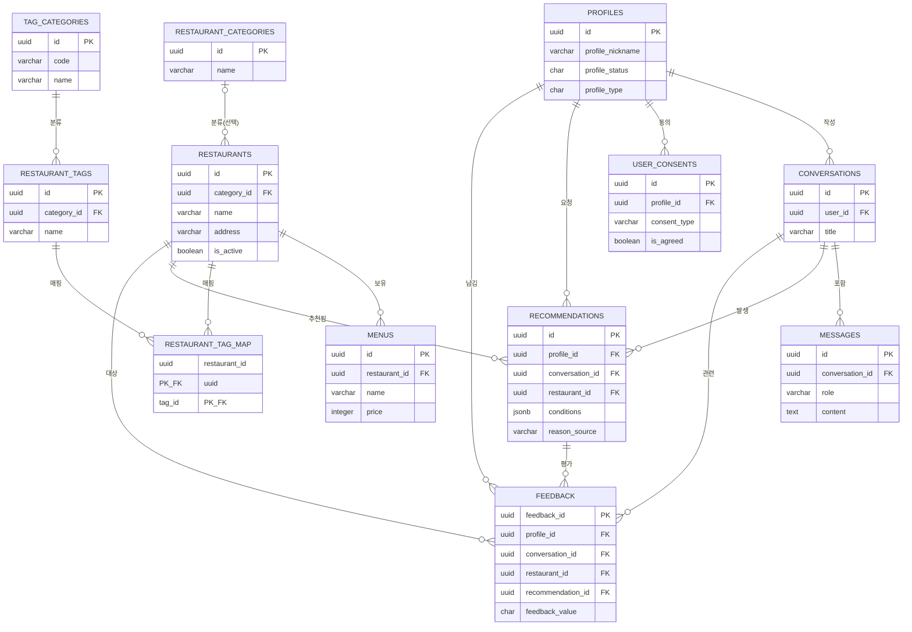
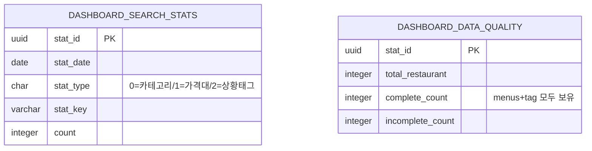
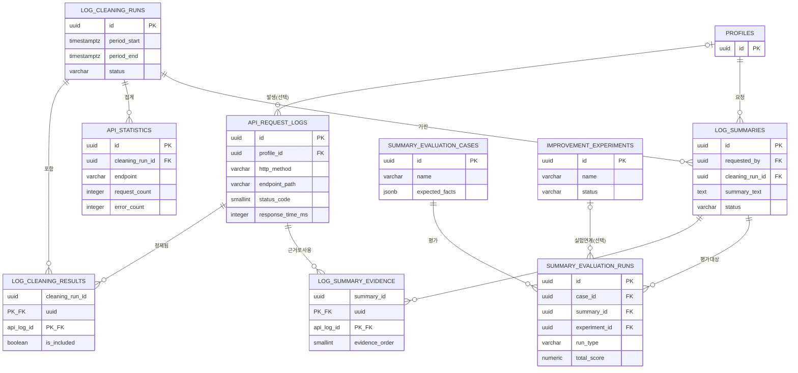

# 신대방 맛집 챗봇 — 논리 ERD

물리 스키마(SQL DDL) 23개 테이블 기준으로 작성. 카디널리티 표기는 아래 범례를 따른다.

**범례**: `||` 정확히 1, `|o` 0 또는 1(선택), `o{` 0개 이상, `}|` 1개 이상

---

## 1. 서비스 도메인 (11개 테이블)

사용자·대화·추천·평가 흐름의 핵심 엔티티.

**비고**: `RESTAURANT_TAG_MAP`은 RESTAURANTS–RESTAURANT_TAGS 간 N:M 관계를 해소하는 연결 엔티티(복합 PK). `feedback_value`는 1=불만족/2=보통/3=만족으로 확정됨.

---

## 2. 대시보드 도메인 (2개 테이블)

다른 테이블에서 배치 집계된 결과만 담는 독립 테이블 — 외부 FK 없음.

**비고**: `dashboard_search_stats`는 `restaurants`, `menus`, `restaurant_tag_map` 등에서 집계 배치로 채워지나, FK 관계가 아닌 파생 데이터이므로 관계선 없음(원천 테이블은 위 서비스 도메인 참조).

---

## 3. 로그분석 파이프라인 도메인 (9개 테이블 + PROFILES 참조)

M1(로그수집)~M7(개선실험) 대응 구간.

**비고**: `LOG_CLEANING_RESULTS`, `LOG_SUMMARY_EVIDENCE`는 각각 (정제실행×원본로그), (요약×원본로그) N:M 연결 엔티티. `PROFILES`는 서비스 도메인 엔티티를 여기서는 참조용으로만 축약 표기.

---

## 남은 3NF 방어 논리 메모

`RECOMMENDATIONS.conditions`, `LOG_SUMMARIES.filters`, `SUMMARY_EVALUATION_CASES.expected_facts`는 JSONB 컬럼이다. 조건/필터 구조가 가변적이라 실무적으로 비정규화 채택 — 최종 정의서에 "의도적 비정규화, 사유: 가변 조건 구조" 명시 필요.
