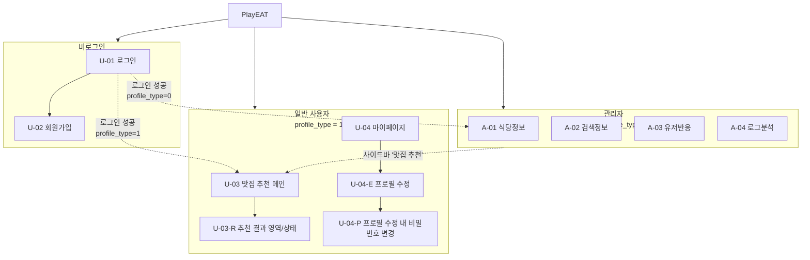
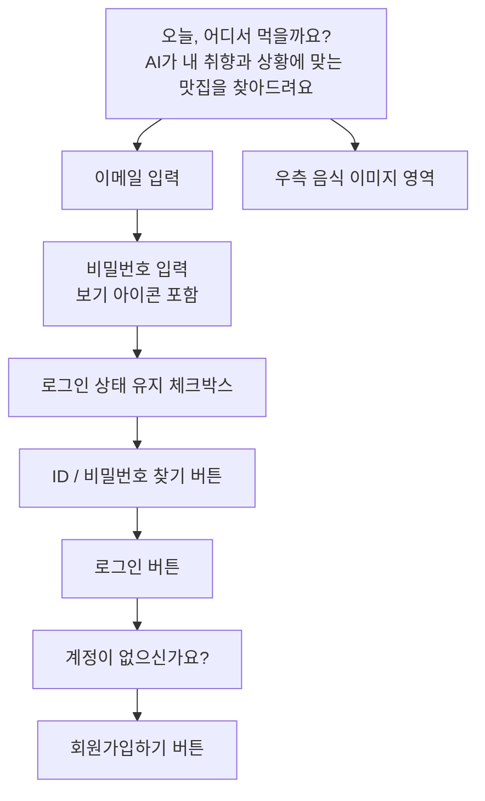
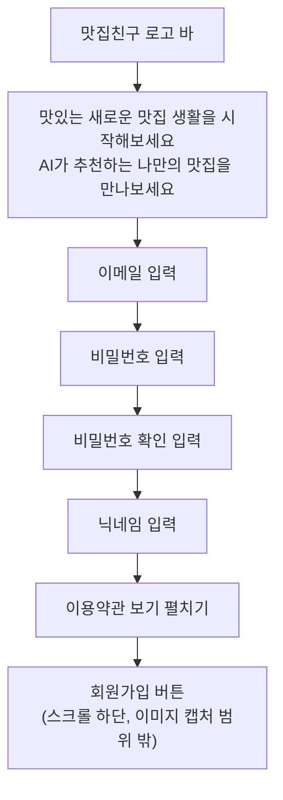
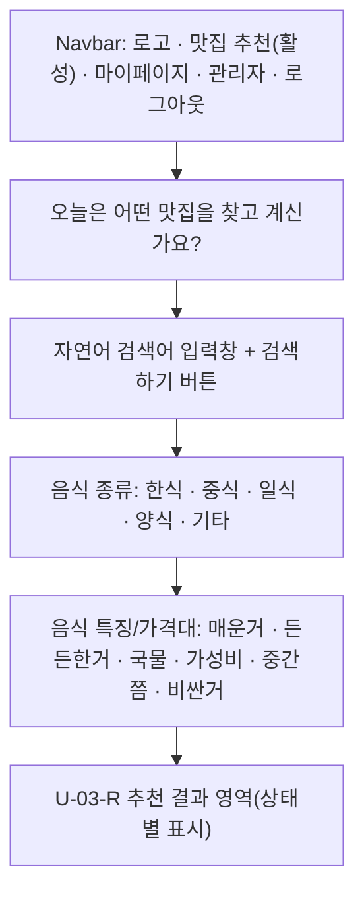
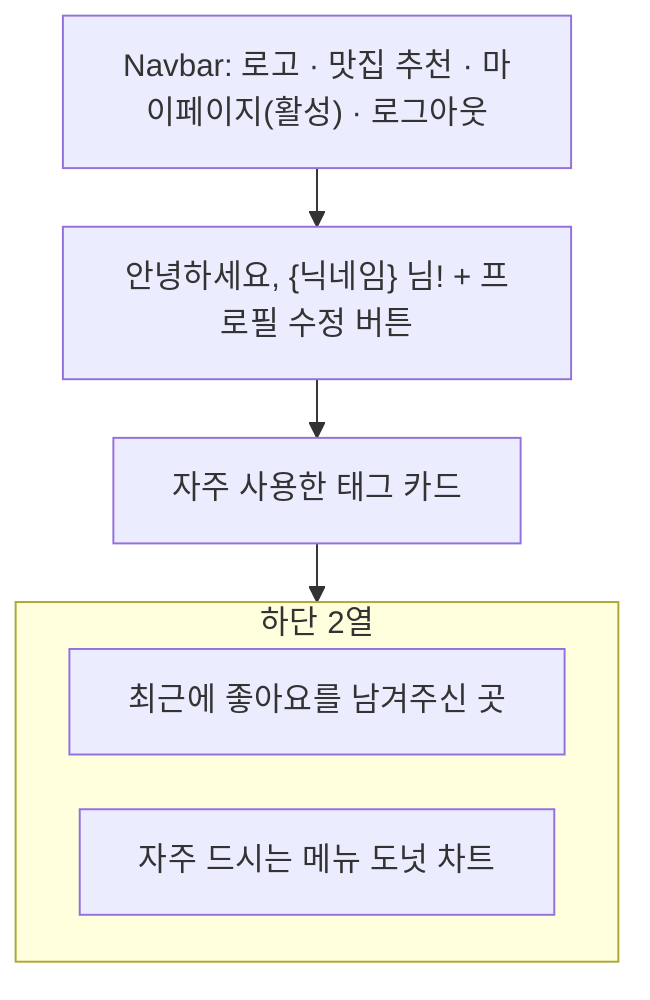
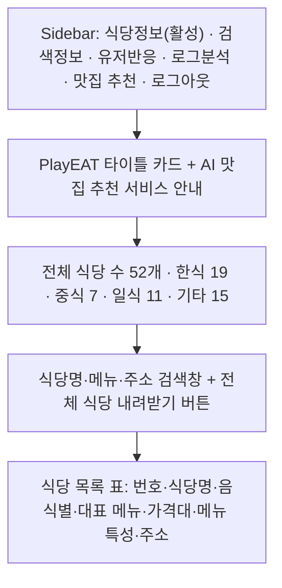
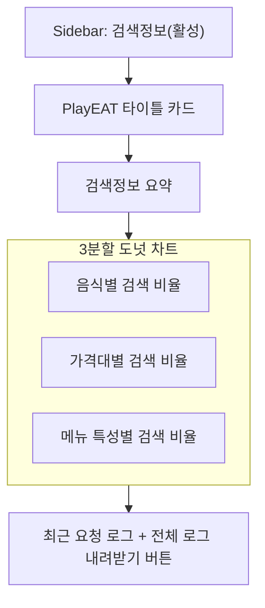
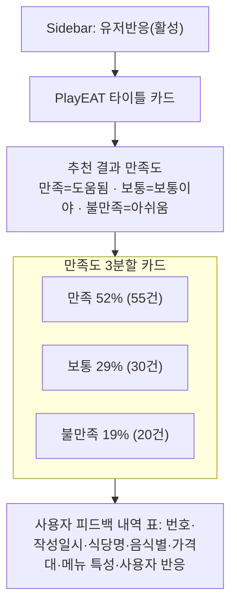
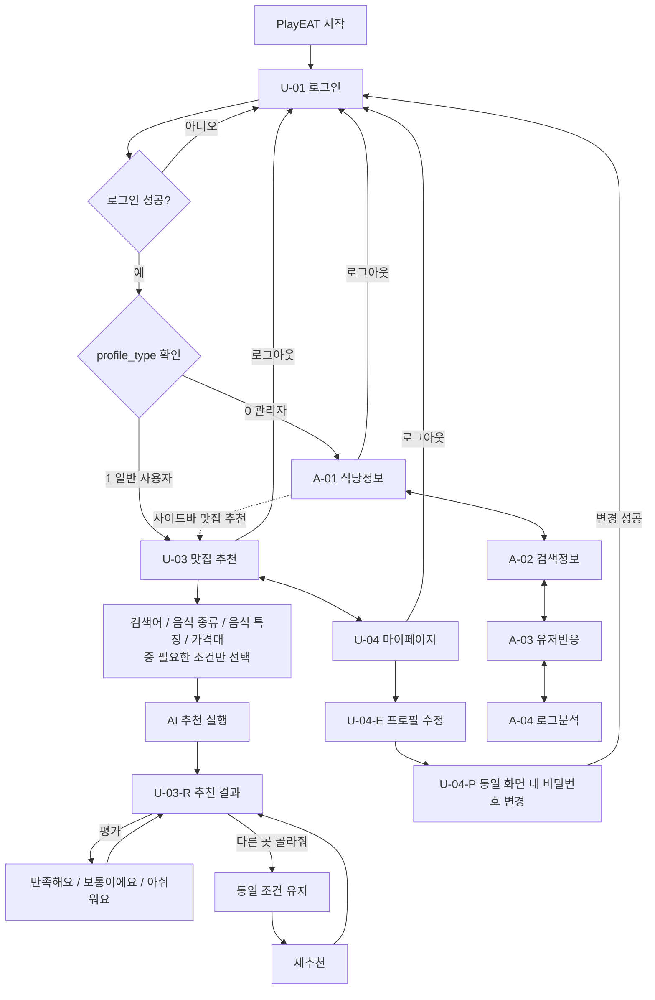

# PlayEAT 화면설계서

## 1. 문서 개요

| 항목 | 내용 |
| --- | --- |
| 프로젝트명 | PlayEAT — 신대방 점심 맛집 추천 및 AI 서비스 로그 분석 대시보드 |
| 서비스 목적 | 신대방 인근 확정 52개 식당 데이터를 기반으로 사용자의 선택 조건·자연어 입력을 분석해 점심 식당을 추천하고, 서비스 운영 로그를 정제·통계·LLM 요약으로 분석하는 서비스 |
| 일반 사용자 | 이메일 회원가입·로그인, 맛집 추천 조건 입력, AI 추천 결과 확인·평가·재추천, 마이페이지 확인·수정 |
| 관리자 | `profiles.profile_type = '0'` 계정. 식당정보·검색정보·유저반응·로그분석 4개 화면 이용 |
| 프론트엔드 | Streamlit 사용자·관리자 화면 |
| 백엔드 | FastAPI, `/api/v1` prefix, Bearer Token 인증 |
| 데이터베이스 | Supabase PostgreSQL, 3개 도메인(서비스/대시보드/로그분석) 총 23개 테이블 |
| 인증 | 이메일 + 비밀번호(Supabase Auth). **카카오 로그인은 이번 화면설계 범위에서 제외** |
| AI | Google Gemini API (자연어 조건 추출, 추천 이유 생성) |
| 외부 API | Kakao Local API (식당 기본 정보 수집, 화면 자체 연동 아님) |
| 문서 범위 | 정보구조, 접근 권한, 공통 디자인, 화면별 상세 설계(요소·액션·상태·API·데이터), 화면-API/DB 연결, 핵심 사용자 흐름, 상태·예외 설계, 체크리스트 |

---

## 2. 서비스 사용자와 핵심 목적

### 2.1 일반 사용자

- 이메일과 비밀번호로 회원가입 및 로그인한다.
- 자연어 검색어, 음식 종류, 음식 특징, 가격대 중 원하는 조건만 선택해 맛집을 추천받는다. (모든 조건은 선택사항)
- AI 추천 결과(식당·메뉴·가격·태그·추천 이유)를 확인한다.
- 추천 결과를 ‘만족해요 / 보통이에요 / 아쉬워요 (다른 곳 골라줘)’ 버튼으로 평가하고 재추천한다.
- 같은 조건으로 다른 식당을 재추천받는다.
- 마이페이지에서 프로필과 개인 이용 통계(자주 사용한 태그, 최근 좋아요 남긴 곳, 자주 드시는 메뉴 비율)를 확인한다.
- 프로필(닉네임)을 수정하고 비밀번호를 변경한다.

**제외 범위:** 회원탈퇴 기능은 이번 화면설계 및 구현 범위에서 제외한다.

### 2.2 관리자

현재 구현된 4개 화면을 기준으로 다음 행동을 수행한다.

- 식당정보: 전체 식당 수·음식별 식당 수를 확인하고 식당명·메뉴·주소로 검색한다.
- 검색정보: 음식별·가격대별·메뉴 특성별 검색 비율과 최근 요청 로그를 확인한다.
- 유저반응: 추천 결과 만족도(만족/보통/불만족)와 사용자 피드백 내역을 확인한다.
- 로그분석: 통계분석 및 요약, 요약품질평가, 최근 요청 로그를 탭으로 확인한다.
- 사이드바의 "맛집 추천" 메뉴로 일반 사용자용 추천 화면에도 접근할 수 있다.

---

## 3. 전체 정보구조 IA

---

## 4. 접근 권한

| 화면 ID | 화면 | 비로그인 | 일반 사용자 | 관리자 |
| --- | --- | :---: | :---: | :---: |
| U-01 | 로그인 | O | - | - |
| U-02 | 회원가입 | O | - | - |
| U-03 | 맛집 추천 메인 | X | O | O |
| U-03-R | 추천 결과 영역(상태) | X | O | O |
| U-04 | 마이페이지 | X | O | X |
| U-04-E | 프로필 수정 | X | O | X |
| U-04-P | 비밀번호 변경 | X | O | X |
| A-01 | 식당정보 | X | X | O |
| A-02 | 검색정보 | X | X | O |
| A-03 | 유저반응 | X | X | O |
| A-04 | 로그분석 | X | X | O |

---

## 5. 공통 Navigation

### 5.1 비로그인

- 로그인
- 회원가입

### 5.2 일반 사용자 (상단 Navbar, 이미지 4 기준)

- 맛집 추천
- 마이페이지
- 로그아웃

### 5.3 관리자 (좌측 Sidebar, 이미지 5~8 기준)

- 식당정보
- 검색정보
- 유저반응
- 로그분석
- 맛집 추천
- 로그아웃

---

## 6. 공통 디자인 시스템

수치의 근거는 제공된 `design (1).md`이며 제출 폴더에는 [design.md](./design.md)로 포함한다. 아래 값은 가이드의 확정값·공통 기준·권장 기본값을 구분해 기록한 것이며, 모든 캡처가 이 수치를 적용했음을 의미하지 않는다. 실제 화면 배치와 기능은 캡처 및 사용자 확인을 기준으로 유지한다.

### 6.1 색상

| 항목 | 값 | 구분 |
| --- | --- | --- |
| Primary | `#FF7A00` | 확정 |
| Secondary | `#FFB368` | 확정 |
| Background | `#FFF9F4` | 확정 |
| Text | `#333333` | 확정 |
| Surface | `#FFFFFF` | 권장 기본값 |
| Muted | `#666666` | 권장 기본값 |
| Border | `#DDDDDD` | 권장 기본값 |
| Danger / Success | `#C62828` / `#2E7D32` | 권장 기본값 |
| Warning / Info | `#E08A00` / `#2F6FED` | 권장 기본값 |

Secondary 버튼은 Secondary 색상 배경이 아니라 Surface 배경과 Border 테두리를 사용한다.

### 6.2 글꼴·크기

| 역할 | 크기·굵기 | 권장 줄 높이 |
| --- | --- | --- |
| 글꼴 | Pretendard, 대체: -apple-system, BlinkMacSystemFont, Segoe UI, sans-serif | - |
| 페이지 제목 | 40px / 700 | 1.3 |
| 섹션 제목 | 24px / 700 | 1.4 |
| 카드 제목 | 20px, 강조형 22px / 700 | 1.4 |
| 본문 | 16px / 400 | 1.6 |
| 입력 / 버튼 | 16px / 400·600 | 1.5 |
| 설명·날짜·오류 안내 | 14px / 400 | 1.5 |

### 6.3 레이아웃·컴포넌트

| 항목 | 가이드 기준 | 구분 |
| --- | --- | --- |
| 바깥 컨테이너 | 최대 1320px, 가운데 정렬, 좌우 44px | 공통 기준 |
| 페이지 너비 | 로그인 1200px, 회원가입 600px, 추천 1320px, 마이페이지·프로필·비밀번호 변경 1000px, 관리자 1320px | 기본 토큰 |
| 페이지 여백 | 위 28px, 아래 35px, Navbar와 본문 32px | 공통 기준 |
| Navbar | 최소 높이 90px, radius 18px, 내부 패딩 24px | 공통 기준 |
| 로고 | 아이콘 높이 32px, 텍스트 22px / 700 | 공통 기준 |
| 메뉴 활성 표시 | Primary + 밑줄 2px, offset 8px | 가이드 기준; 캡처에는 주황 배경 버튼도 보임 |
| 관리자 Sidebar | 폭 약 250px, 항목 높이 48px, radius 10px, 아이콘 20px | 가이드 기준 |
| 버튼 | 높이 52px, 좌우 패딩 24px, radius 10px, 16px / 600 | 공통 기준 |
| 단일 행 입력 | 높이 52px, 16px / 400 | 공통 기준 |
| 입력 외형 | Surface 배경, Border 테두리, radius 10px, 좌우 패딩 16px | 권장 기본값 |
| 카드 | radius 20px | 공통 기준 |
| 카드 테두리·패딩 | 1px Border, 24px | 권장 기본값 |
| 공통 그림자 | `0 4px 16px rgb(51 51 51 / 6%)` | 공통 토큰, 필요한 카드에 적용 |
| 간격 | 작은 간격 12~16px, 중간 20~24px, 큰 간격 32px | 공통 기준 |
| 아이콘·클릭 영역 | 아이콘 16/20/24px, 클릭 영역 최소 44px | 공통 기준 |
| 모바일 | 768px 이하 좌우 16px, 제목 32px, 카드 패딩 16px | 권장 기본값 |

가이드와 캡처가 다른 부분(예: pill 형태 버튼, 흰색 저장 버튼, 로그인 헤더 유무)은 실제 캡처를 임의로 수정해 설명하지 않는다. 가이드의 삭제·탈퇴·추가 필터 예시는 기능 구현 근거로 사용하지 않는다.

---

## 7. 사용자 화면 목록

| ID | 화면 | 유형 | 사용자 목적 | 핵심 기능 | 주요 API/데이터 |
| --- | --- | --- | --- | --- | --- |
| U-01 | 로그인 | 입력 | 이메일·비밀번호로 서비스 진입 | 로그인, 로그인 상태 유지, ID/비밀번호 찾기, 회원가입 이동 | `POST /auth/login` · `profiles` |
| U-02 | 회원가입 | 입력 | 신규 계정 생성 | 이메일·비밀번호·닉네임 입력, 이용약관 동의 | `POST /auth/signups` · `profiles`, `user_consents` |
| U-03 | 맛집 추천 | 메인·입력 | 조건 입력 및 추천 실행 | 자연어 검색, 음식 종류/특징/가격대 선택(전부 선택사항) | `chat/options`, `restaurants/search`, `conversations/{id}/chat` |
| U-03-R | 추천 결과(U-03 내부 상태) | 결과 영역 | 추천 근거 확인, 평가, 재추천 | 결과 표시, 3단계 평가, 다른 곳 골라줘 | `recommendations/{id}/feedback`, `conversations/{id}/regenerate` |
| U-04 | 마이페이지 | 메인 | 프로필·개인 이용 통계 확인 | 자주 사용한 태그, 최근 좋아요 식당, 자주 드시는 메뉴 비율 | `users/me`, `users/me/tags`, `users/me/likes`, `users/me/categories` |
| U-04-E | 프로필 수정 | 설정·입력 | 닉네임 수정 | 닉네임 변경·저장 | `PATCH /users/me` · `profiles` |
| U-04-P | 비밀번호 변경 | 설정·완료 상태 | 비밀번호 변경 및 재로그인 | 동일 프로필 수정 화면에서 변경 입력·처리, 성공 후 U-01 재로그인 | `PATCH /auth/password` |

---

## 8. 사용자 화면 상세 설계

### U-01 로그인

#### 사용자 목적

이메일과 비밀번호로 인증하여 서비스에 진입한다. 로그인 성공 후 `profile_type` 값에 따라 일반 사용자 메인 또는 관리자 메인으로 이동한다.

#### 실제 화면

*그림 U-01 로그인 기본 상태*

#### 화면 구성

#### 화면 요소

| 영역 | UI 요소 | 표시/입력 데이터 | 기능 | 비고 |
| --- | --- | --- | --- | --- |
| 좌측 상단 | 타이틀 텍스트 | "오늘, 어디서 먹을까요?" | 서비스 소개 | "어디서" Orange 강조 |
| 좌측 상단 | 보조 설명 | "AI가 내 취향과 상황에 맞는 맛집을 찾아드려요." | 서비스 설명 | - |
| 입력 영역 | 이메일 입력창 | 이메일 문자열 | 로그인 아이디 입력 | placeholder "이메일을 입력하세요" |
| 입력 영역 | 비밀번호 입력창 | 비밀번호 문자열 | 로그인 비밀번호 입력 | 보기(eye) 아이콘으로 마스킹 토글 |
| 입력 영역 | 로그인 상태 유지 체크박스 | boolean | 세션 유지 여부 | 로그인 상태 유지 선택 |
| 입력 영역 | ID/비밀번호 찾기 버튼 | - | 계정 찾기 이동 | 계정 찾기 버튼 |
| 입력 영역 | 로그인 버튼 | - | 로그인 요청 실행 | Primary 버튼 |
| 하단 | 회원가입하기 버튼 | - | U-02로 이동 | Secondary 버튼 |
| 우측 | 음식 이미지 | 정적 이미지 | 화면 분위기 연출 | 기능 없음 |

#### 사용자 액션 및 시스템 반응

| 사용자 액션 | 시스템 반응 | API/상태 변화 | 사용자 피드백 |
| --- | --- | --- | --- |
| 이메일 입력 | 입력값 저장 | 클라이언트 상태 갱신 | 입력값 표시 |
| 비밀번호 입력 | 입력값 저장(마스킹) | 클라이언트 상태 갱신 | 마스킹된 입력값 표시 |
| 비밀번호 보기 아이콘 클릭 | 마스킹 토글 | 클라이언트 상태 변경 | 평문/마스킹 전환 |
| 로그인 상태 유지 체크 | 옵션 값 저장 | 클라이언트 상태 갱신 | 체크 표시 |
| 로그인 버튼 클릭 | `POST /api/v1/auth/login` 요청 | 성공 시 Access Token 발급, `profile_type` 확인 | Loading → 성공 시 U-03(일반) 또는 A-01(관리자) 이동, 실패 시 오류 표시 |
| 회원가입하기 클릭 | 화면 전환 | - | U-02 표시 |
| ID/비밀번호 찾기 클릭 | 계정 찾기 기능 진입 | - | 계정 찾기 안내 |

#### 화면 상태

- Default
- Loading (로그인 처리 중)
- Authentication Error (이메일/비밀번호 불일치)
- Validation Error (형식 오류)
- Server Error

#### 주요 API

| Method | Endpoint | 비고 |
| --- | --- | --- |
| POST | `/api/v1/auth/login` | `LoginRequest`(email, password), 관리자(`profile_type='0'`)와 일반 사용자를 구분해 처리 |

#### 주요 데이터

- `profiles.profile_type` (관리자/일반 사용자 구분)
- Supabase Auth의 이메일 인증 정보 (애플리케이션 DB에는 저장하지 않음)

---

### U-02 회원가입

#### 사용자 목적

이메일·비밀번호·닉네임을 입력하고 이용약관에 동의하여 신규 계정을 생성한다.

#### 실제 화면

#### 화면 구성

#### 화면 요소

| 영역 | UI 요소 | 표시/입력 데이터 | 기능 | 비고 |
| --- | --- | --- | --- | --- |
| 상단 | 로고 바 | "맛집친구" 아이콘+텍스트 | 브랜드 표시 | - |
| 제목 | 타이틀 | "맛있는 새로운 맛집 생활을 시작해보세요" | 안내 문구 | "맛있는" Orange 강조 |
| 입력 | 이메일 입력창 | 이메일 문자열 | 계정 이메일 입력 | - |
| 입력 | 비밀번호 입력창 | 비밀번호 문자열(8자 이상) | 계정 비밀번호 입력 | 보기 아이콘 포함 |
| 입력 | 비밀번호 확인 입력창 | 비밀번호 문자열 | 비밀번호 일치 확인 | 서버에는 저장하지 않음(화면 검증) |
| 입력 | 닉네임 입력창 | 문자열(1~45자) | 서비스 표시 닉네임 입력 | 중복 금지 |
| 약관 | 이용약관 보기 | 펼침/접힘 토글 | 약관 원문 확인 | 회원가입 하단에 동의 항목이 존재함을 사용자 확인. 항목별 정확한 문구와 전체/개별 동의 배치는 상단 캡처에 표시되지 않음 |
| 하단 | 회원가입 버튼 | - | 가입 요청 실행 | 캡처 범위 밖. 기존 설계로만 유지하며 실제 버튼 배치·문구는 미검증 |

#### 사용자 액션 및 시스템 반응

| 사용자 액션 | 시스템 반응 | API/상태 변화 | 사용자 피드백 |
| --- | --- | --- | --- |
| 이메일 입력 | 값 저장, 형식 검증 | 클라이언트 검증 | 오류 시 즉시 표시 |
| 비밀번호/비밀번호 확인 입력 | 값 저장, 일치 여부 검증 | 클라이언트 검증 | 불일치 시 오류 표시 |
| 닉네임 입력 | 값 저장 | 클라이언트 검증(공백 제거 후 1~45자) | 오류 시 즉시 표시 |
| 이용약관 보기 클릭 | 약관 펼침/접힘 | - | 약관 본문 표시 |
| 약관 동의 체크 | 동의 상태 저장 | 클라이언트 상태 | 미동의 시 제출 차단 |
| 회원가입 버튼 클릭 | `POST /api/v1/auth/signups` 요청 | 성공 시 `profiles`, `user_consents` 저장 | Loading → 상태별 결과 표시(아래 상태 참고) |

#### 화면 상태 (U-02 내부 상태로 통합 설계)

| 상태 | 화면 반응 |
| --- | --- |
| Default | 이메일·비밀번호·비밀번호 확인·닉네임·이용약관 보기 표시. 하단 동의 항목 존재는 사용자 확인 |
| Validation Error | 이메일 형식·비밀번호 8자 미만·비밀번호 불일치·닉네임 길이 초과 시 해당 입력 아래 오류 표시, 입력값 유지 |
| Loading | 제출 버튼 비활성화, 중복 제출 차단 |
| **회원가입 성공** | 완료 안내와 로그인 이동 버튼 표시 (U-01로 이동) — 실제 구현에서 별도 화면으로 확인되면 그때 U-02와 분리 |
| **회원가입 실패(Conflict)** | 이메일 또는 닉네임 중복 안내 |
| Server Error | 가입 미완료 안내, 재시도 유도, 내부 오류 미노출 |

#### 주요 API

| Method | Endpoint | 비고 |
| --- | --- | --- |
| POST | `/api/v1/auth/signups` | `SignUpRequest`(email, password, nickname, terms_agreed, privacy_agreed) → `201` 성공 시 `SignUpResponse` 반환 |

#### 주요 데이터

- `profiles` (profile_nickname, profile_created_at 등)
- `user_consents` (consent_type, consent_version, is_agreed, agreed_at)

---

### U-03 맛집 추천 메인 (+ U-03-R 결과 영역)

#### 사용자 목적

로그인한 사용자가 원하는 조건(전부 선택사항)만 선택하거나 자연어로 입력해 AI 식당 추천을 받고, 결과를 평가하거나 다른 식당을 재추천받는다.

#### 실제 화면

*그림 U-03-1. 맛집 추천 기본 상태*

*그림 U-03-2. 한식·중간쯤 선택 상태*

동일 화면의 기본/조건 선택 상태다. 선택한 한식과 중간쯤 버튼은 주황색 배경과 흰 글자로 강조된다. 기본 캡처에는 관리자 메뉴가 있고 조건 선택 캡처에는 없다. 노출 조건은 캡처만으로 확정할 수 없다. 추천 결과와 재추천은 아래 U-03-R에서 설명한다.

#### 화면 구성

#### 화면 요소

| 영역 | UI 요소 | 표시/입력 데이터 | 기능 | 비고 |
| --- | --- | --- | --- | --- |
| 상단 | Navbar | 로고, 태그라인, 메뉴 버튼 | 화면 이동 | 5장 Navigation 참고 |
| 제목 | 타이틀 | "오늘은 어떤 맛집을 찾고 계신가요?" | 안내 문구 | "맛집" Orange 강조 |
| 입력 | 자연어 검색창 | 문자열 | 자연어 조건 입력 | 선택사항. placeholder "지역, 음식, 분위기 등을 입력해보세요" |
| 입력 | 검색하기 버튼 | - | 추천 실행 | Primary 버튼 |
| 선택 | 음식 종류 버튼 그룹 | 한식/중식/일식/양식/기타 | 음식 카테고리 선택 | 선택사항. `restaurant_categories` 기준 |
| 선택 | 음식 특징/가격대 버튼 그룹 | 매운거/든든한거/국물/가성비/중간쯤/비싼거 | 태그·가격대 선택 | 선택사항. 선택한 조건을 강조 표시 |
| 결과 | U-03-R 결과 영역 | 아래 9장 참고 | 추천 결과 표시·평가·재추천 | 메인 화면 내부 상태로 렌더링 |

#### 사용자 액션 및 시스템 반응

| 사용자 액션 | 시스템 반응 | API/상태 변화 | 사용자 피드백 |
| --- | --- | --- | --- |
| 자연어 검색어 입력 | 입력값 저장 | 클라이언트 상태 | 입력값 표시 |
| 음식 종류 버튼 선택 | 선택 카테고리를 주황색으로 강조(한식 선택 상태 확인, 선택 개수 제한은 미검증) | 클라이언트 상태 | 선택 버튼 강조 |
| 음식 특징/가격대 버튼 선택 | 선택 태그 목록 갱신 | 클라이언트 상태 | 선택 버튼 강조 |
| 검색하기 클릭 | 조건 유효성 확인 후 추천 요청 | `GET /restaurants/search` 또는 `POST /conversations/{id}/chat` 호출 | Loading 표시, 이후 Result/Empty/Error 전환 |
| 태그 재선택/해제 | 선택 상태 토글 | 클라이언트 상태 | 선택 표시 갱신 |
| (결과 표시 후) 평가 클릭 | 평가값 저장 | `POST /recommendations/{id}/feedback` | Feedback Saved 상태 표시 |
| (결과 표시 후) 다른 곳 골라줘 클릭 | 동일 조건으로 재검색 | `POST /conversations/{id}/regenerate` | Regenerating → 새 결과 표시 |
| 마이페이지/관리자/로그아웃 클릭 | 화면 이동 또는 세션 종료 | - | 대상 화면 표시 또는 U-01 이동 |

#### 화면 상태

- Default (조건 입력 대기)
- Loading (자연어 분석/검색 중 — 세부는 9장 참고)
- Result (U-03-R, 추천 결과 표시)
- Empty (조건에 맞는 식당 없음)
- Feedback Saved (평가 저장 완료)
- Regenerating (다른 곳 골라줘 처리 중)
- Error (추천 처리 실패)

#### 주요 API

| Method | Endpoint | 비고 |
| --- | --- | --- |
| GET | `/api/v1/chat/options` | 음식 종류/메뉴 특성/가격대 선택지 조회 |
| GET | `/api/v1/restaurant-categories` | 음식 종류 목록 |
| GET | `/api/v1/tag-categories`, `/api/v1/restaurant-tags` | 음식 특징/가격대 태그 목록 |
| GET | `/api/v1/restaurants/search` | 선택 조건만으로 검색(자연어 없이 category/menu_types/price_level 모두 선택) |
| POST | `/api/v1/conversations` | 대화방 생성 |
| POST | `/api/v1/conversations/{conversation_id}/chat` | 자연어 포함 추천 요청. 기존 API 정의의 `ChatRequest.content` 필수값 제약을 따름 |

#### 주요 데이터

- `restaurant_categories`, `restaurants`, `menus`, `tag_categories`, `restaurant_tags`, `restaurant_tag_map`
- `conversations`, `messages`
- `recommendations`

---

### U-03-R 추천 결과 영역 (U-03 내부 상태)

#### 사용자 목적

추천 대화와 식당 정보를 확인하고 만족도를 평가하거나 다른 식당을 추천받는다. 독립 페이지가 아닌 U-03의 결과 영역이다.

#### 실제 화면

*그림 U-03-R-1. 검색 결과 — 품미*

*그림 U-03-R-2. 다른 식당 재추천 완료 — 청티엔*

두 이미지는 같은 결과 영역의 최초 결과와 재추천 후 상태다. 상·하단 연속 캡처가 아니며 별도 화면 ID로 나누지 않는다.

#### 화면 구성

추천 대화 → 사용자 닉네임을 포함한 추천 식당 제목 → 좌측 식당/음식 사진과 우측 식당 정보 → 만족도 질문 → 피드백 버튼 3개 순서로 표시된다. 재추천 완료 시 질문과 버튼 사이에 성공 안내가 추가된다.

#### 화면 요소

| 영역 | UI 요소 | 실제 표시 내용 | 기능·근거 |
| --- | --- | --- | --- |
| 대화 | PlayEAT 추천 대화 | 사용자 입력 ‘짜장면’, 식당·대표 메뉴·가격·조건을 설명하는 응답 | 추천 이유는 대화 말풍선에 표시 |
| 제목 | 개인화 안내 | ‘동작주민’님을 위한 오늘의 추천 식당 | 닉네임은 예시 |
| 결과 | 사진 | 최초 결과는 식당 외관, 재추천은 음식 사진 | 사진 데이터 필드와 대체 이미지 정책은 캡처로 확인되지 않음 |
| 결과 | 식당명·주소·메뉴·가격 | 품미 / 볶음밥 8500원 → 청티엔 / 새우볶음밥 9000원 | 추천에 따라 결과 정보 변경 |
| 결과 | 태그 | 품미: 중식·든든한거 / 청티엔: 중식·든든한거·국물있음 | 캡처의 표시 문구를 그대로 기록. 모든 태그가 입력 조건과 일치한다고 단정하지 않음 |
| 결과 | 카카오맵 보기 | 외부 링크 | 지도 연결 액션 |
| 결과 하단 | 빈 점선 테두리 영역 | 두 캡처 모두 내용 없음 | 용도는 확인되지 않아 입력창·추가 기능으로 정의하지 않음 |
| 평가 | 이 추천이 마음에 드셨나요? | 만족해요 / 보통이에요 / 아쉬워요 (다른 곳 골라줘) | 세 버튼으로 표시. 별도의 재추천 버튼은 없음 |
| 재추천 완료 | 초록 계열 안내 영역 | 다른 식당을 추천했습니다. | 결과 교체 후 완료 상태 |

#### 사용자 액션 및 시스템 반응

| 사용자 액션 | 시스템 반응 | 기존 API 연결 | 확인 범위 |
| --- | --- | --- | --- |
| 만족해요 / 보통이에요 선택 | 추천 평가 요청 | `POST /api/v1/recommendations/{recommendation_id}/feedback` | 버튼 확인. 저장 후 문구는 캡처 없음 |
| 아쉬워요 (다른 곳 골라줘) 선택 | 다른 식당 결과로 갱신하고 완료 안내 표시 | `POST /api/v1/conversations/{conversation_id}/regenerate`; 불만족 저장 연결은 기존 feedback 설계 참고 | 결과 교체와 안내 확인. 평가 저장과 재추천의 호출 순서는 미검증 |
| 카카오맵 보기 선택 | 연결된 외부 지도 열기 | 외부 URL | 링크 확인. 새 탭 여부는 미검증 |

#### 화면 상태

- Result: 대화·사진·식당 정보·평가 버튼 표시.
- Regenerated: 식당과 설명·사진·태그가 갱신되고 ‘다른 식당을 추천했습니다.’ 표시.
- Loading, Empty, Feedback Saved, Regenerating, Error: 기존 처리 설계 유지. 해당 상태의 실제 캡처는 제공되지 않았다.

#### 주요 API

`POST /api/v1/conversations/{conversation_id}/chat`, `POST /api/v1/recommendations/{recommendation_id}/feedback`, `POST /api/v1/conversations/{conversation_id}/regenerate`

#### 주요 데이터

`conversations`, `messages`, `recommendations`, `feedback`, `restaurants`, `menus`, `restaurant_tags`. 기존 평가값 매핑은 1=불만족, 2=보통, 3=만족이다.

---

### U-04 마이페이지

#### 사용자 목적

로그인한 사용자가 자신의 프로필과 확정된 개인 이용 통계(자주 사용한 태그, 최근 좋아요 남긴 곳, 자주 드시는 메뉴 비율)를 확인한다.

#### 실제 화면

*그림 U-04 마이페이지*

#### 화면 구성

#### 화면 요소

| 영역 | UI 요소 | 표시/입력 데이터 | 기능 | 비고 |
| --- | --- | --- | --- | --- |
| 상단 | Navbar | 로고, 메뉴 버튼(관리자 버튼 없음) | 화면 이동 | 5장 참고 |
| 인사 영역 | 인사 문구 | "안녕하세요, {닉네임} 님!" | 사용자 환영 | `profiles.profile_nickname` |
| 인사 영역 | 프로필 수정 버튼 | - | U-04-E 이동 | Secondary 버튼 |
| 태그 카드 | 자주 사용한 태그 목록 | 최대 5개 태그 pill | `MYPAGE-STAT-001` 지표 | 추천 이력 없으면 Empty |
| 좌측 카드 | 최근에 좋아요를 남겨주신 곳 | 식당명, 주소(핀 아이콘) | `MYPAGE-STAT-002` 지표 | 긍정 평가(`feedback_value='3'`) 없으면 Empty |
| 우측 카드 | 자주 드시는 메뉴 도넛 차트 | 카테고리별 비율(%), 범례 | `MYPAGE-STAT-003` 지표 | 분모 0이면 차트 미표시 |

#### 사용자 액션 및 시스템 반응

| 사용자 액션 | 시스템 반응 | API/상태 변화 | 사용자 피드백 |
| --- | --- | --- | --- |
| 화면 진입 | 프로필·통계 조회 | `GET /users/me`, `GET /users/me/tags`, `GET /users/me/likes`, `GET /users/me/categories` | Loading → Success/Empty/Partial |
| 프로필 수정 클릭 | 화면 전환 | - | U-04-E 표시 |
| 새로고침(브라우저 재실행) | 데이터 재조회 | 동일 API 재호출 | Loading 후 갱신 |

#### 화면 상태

- Loading
- Success
- Partial Error (프로필은 표시되나 일부 통계 조회 실패)
- Empty (추천/긍정 평가 이력 없음, 지표별 표시)
- Error (프로필 자체 조회 실패)

#### 주요 API

| Method | Endpoint | 비고 |
| --- | --- | --- |
| GET | `/api/v1/users/me` | 이메일·닉네임 조회 |
| GET | `/api/v1/users/me/tags` | 자주 사용한 태그 상위 5개 |
| GET | `/api/v1/users/me/likes` | 긍정 평가 식당 최신 3개(서로 다른 식당) |
| GET | `/api/v1/users/me/categories` | 긍정 평가 식당의 카테고리별 비율 |

#### 주요 데이터

`profiles`, `recommendations`(조건 태그 집계), `feedback`(feedback_value='3'), `restaurants`, `restaurant_categories`

---

### U-04-E 프로필 수정

#### 사용자 목적

닉네임을 수정하고 비밀번호 변경 기능으로 진입한다.

#### 실제 화면

*그림 U-04-E. 프로필 수정*

*그림 U-04-E-2. 동일 프로필 수정 화면의 닉네임 저장 완료 상태*

저장하기 버튼 아래에 초록 계열 ‘닉네임이 저장되었습니다.’ 안내가 표시된다. 별도 완료 페이지로 이동하지 않고 프로필 수정 화면을 유지한다.

#### 화면 구성

상단 Navbar → ‘프로필 수정’ 제목과 안내 → ‘기본 정보’ 카드 → 닉네임·이메일·비밀번호 안내 → 취소·저장하기 버튼.

#### 화면 요소

| 영역 | UI 요소 | 표시/입력 데이터 | 기능·비고 |
| --- | --- | --- | --- |
| 상단 | Navbar | 맛집 추천·마이페이지·로그아웃 | 공통 이동 메뉴 |
| 제목 | 프로필 수정 | 내 정보를 수정하고, 더 나은 맛집 경험을 만들어보세요. | 안내 |
| 기본 정보 | 닉네임 필수 입력 | 동작주민, 글자 수 4/45 | 기존 값과 글자 수 표시. 1~45자 검증은 기존 설계 |
| 기본 정보 | 이메일 | 123@abc.com | ‘이메일은 변경할 수 없습니다.’ 표시, 수정 불가 |
| 기본 정보 | 비밀번호 관리 안내 | 안전한 비밀번호 관리와 주기적 변경 안내 | 비밀번호 값 자체는 표시하지 않음 |
| 기본 정보 | 비밀번호 변경 버튼 | - | 동일 프로필 수정 화면 안에서 U-04-P 변경 기능 진입(사용자 확인) |
| 하단 | 취소 / 저장하기 | 흰 배경·테두리 버튼 | 취소와 닉네임 변경 저장 |

#### 사용자 액션 및 시스템 반응

| 사용자 액션 | 시스템 반응 | API/상태 변화 | 근거 |
| --- | --- | --- | --- |
| 닉네임 입력 | 수정값과 글자 수 표시 | 클라이언트 입력 상태 | 입력과 카운터 확인 |
| 저장하기 선택 | 닉네임 변경 요청 | `PATCH /api/v1/users/me` | 저장 후 같은 화면에 ‘닉네임이 저장되었습니다.’ 표시 확인 |
| 취소 선택 | 변경 취소, U-04 복귀 | 기존 이동 설계 | 버튼 확인, 전환 후 캡처 없음 |
| 비밀번호 변경 선택 | U-04-P 진입 | 비밀번호 변경 흐름 | 진입 버튼 및 성공 후 로그인 캡처 확인. 사용자 확인에 따라 같은 화면 안에서 변경 입력·처리 |

#### 화면 상태

Default와 Success는 캡처로 확인. Success에서는 같은 화면의 저장하기 아래 ‘닉네임이 저장되었습니다.’를 표시한다. Validation Error, Loading, Conflict(닉네임 중복), Server Error는 기존 상태 설계로 유지한다.

#### 주요 API

`PATCH /api/v1/users/me` (`NicknameUpdateRequest`)

#### 주요 데이터

`profiles.profile_nickname`. 이메일은 읽기 전용 표시 정보다.

---

### U-04-P 비밀번호 변경

#### 사용자 목적

U-04-E의 비밀번호 변경 버튼에서 변경 흐름에 진입하고, 변경 성공 후 다시 로그인한다.

#### 실제 화면

*그림 U-04-P-1. 프로필 수정 화면의 비밀번호 변경 진입 버튼*

사용자 확인에 따라 비밀번호 변경 입력·처리는 이 프로필 수정 화면 안에서 수행한다. U-04-P는 기존 ID를 유지한 하위 기능/상태이며 독립 페이지로 정의하지 않는다. 새 캡처에는 변경 버튼이 보이고 현재·새 비밀번호 입력란이 펼쳐진 상태는 보이지 않으므로 모달·인라인 등 구체적인 표시 방식은 단정하지 않는다.

*그림 U-04-P-2. 비밀번호 변경 성공 후 U-01 로그인 상태*

위 로그인 캡처는 비밀번호 변경 완료 결과다. 로그인 화면 상단에 ‘비밀번호가 변경되었습니다. 다시 로그인해 주세요.’라는 초록 계열 성공 안내가 표시된 상태다. 별도 성공 페이지 ID를 만들지 않고 U-04-P의 완료 결과이자 U-01의 재로그인 상태로 연결한다.

#### 화면 구성

U-04-E 비밀번호 변경 버튼 → 같은 프로필 수정 화면에서 변경 입력·처리(사용자 확인) → U-01 로그인 화면 및 성공 안내 → 이메일·변경한 비밀번호로 재로그인.

#### 화면 요소

| 구분 | 요소 | 정의 | 근거 |
| --- | --- | --- | --- |
| 실제 확인 | 성공 안내 | 비밀번호가 변경되었습니다. 다시 로그인해 주세요. | 화면 최상단 초록 테두리 안내 |
| 실제 확인 | 로그인 폼 | 이메일·비밀번호·보기 아이콘·로그인 상태 유지·ID / 비밀번호 찾기·로그인·회원가입하기 | U-01과 동일한 구성 |
| 기존 설계 | 현재 비밀번호·새 비밀번호·새 비밀번호 확인·변경 버튼 | 기존 입력·검증 설계 유지 | 동일 화면 내 입력은 사용자 확인. 필드별 문구·배치는 기존 설계로 유지 |

#### 사용자 액션 및 시스템 반응

| 사용자 액션 | 시스템 반응 | API/상태 변화 | 확인 범위 |
| --- | --- | --- | --- |
| 변경 정보 입력 및 제출 | 비밀번호 변경 요청 | `PATCH /api/v1/auth/password` | 동일 화면 내 변경 입력·처리는 사용자 확인. API와 검증은 기존 설계 |
| 변경 성공 | 로그인 폼 및 재로그인 안내 표시 | U-01 완료 상태 | 실제 캡처 확인. 전체 기기 세션 종료 여부는 캡처로 판단할 수 없음 |
| 로그인 선택 | 변경한 비밀번호로 인증 요청 | `POST /api/v1/auth/login` | 기존 로그인 설계 |

#### 화면 상태

Success(로그인 화면에 변경 완료·재로그인 안내)는 실제 확인. Default, Validation Error, Loading, Authentication Error, Server Error는 기존 설계이며 입력 위치는 같은 프로필 수정 화면으로 사용자 확인되었으며 펼쳐진 입력란과 오류 상태의 캡처는 없다.

#### 주요 API

`PATCH /api/v1/auth/password` (`PasswordChangeRequest`), `POST /api/v1/auth/login`

#### 주요 데이터

Supabase Auth 비밀번호(기존 설계상 애플리케이션 DB에는 저장하지 않음).

---

## 9. 맛집 추천 상태 상세 설계 (U-03 / U-03-R)

### Default

검색어(선택)와 음식 종류·음식 특징/가격대(모두 선택) 입력을 대기하는 상태. 아무 조건도 선택하지 않고 검색하기를 눌러도 실행할 수 있다.

### Loading

다음은 기존 처리 설계이며 로딩 화면 캡처는 제공되지 않았다.

- **자연어 분석**: 자연어 검색어가 입력된 경우 Gemini가 조건을 추출하는 내부 처리 단계.
- **식당 검색**: 조건에 맞는 식당을 DB에서 조회하는 내부 처리 단계.
- 두 단계 모두 검색하기 버튼이 비활성화되고 중복 실행이 차단된다.

### Result

추천 실행 후 최종 결과를 표시하는 상태(U-03-R). 표시 항목은 이번에 제공된 검색 결과·재추천 캡처를 기준으로 한다.

- 추천 대화(사용자 입력·추천 설명), 개인화 제목, 사진, 식당명, 주소, 대표 메뉴·가격, 태그, 카카오맵 보기, 평가 버튼 3개

### Regenerated (실제 재추천 완료)

추천 식당과 사진·정보·대화 응답이 변경되고 ‘다른 식당을 추천했습니다.’ 안내가 표시된다. 평가 버튼 3개는 유지된다. U-03-R 내부 상태로 관리한다.

### Empty

조건에 맞는 식당 후보가 없는 상태. 어떤 조건이 충족되지 않았는지 안내하고 조건 수정 또는 재검색을 유도한다. 조건을 시스템이 임의로 완화하지 않는다.

### Feedback Saved

평가(화면 문구: 만족해요/보통이에요/아쉬워요) 저장이 완료된 상태로 기존 설계에 정의되어 있다. 저장 완료 문구의 실제 캡처는 없다. 현재 결과를 유지하거나 새 추천을 이어서 요청할 수 있다.

### Regenerating

"다른 곳 골라줘" 처리 중 상태. 현재 선택한 조건은 그대로 유지하고, 같은 대화에서 이미 추천한 식당은 제외한 뒤 다음 후보를 찾는다. 거절 이유를 입력받는 UI는 만들지 않는다.

### Error

- **DB 조회 실패**: 일시적 조회 실패 안내와 재시도 제공.
- **AI/외부 API 실패(Gemini 타임아웃 등)**: 자연어 분석 실패 안내와 재시도 제공.

---

## 10. 관리자 화면 목록

| ID | 화면 | 목적 | 핵심 기능 | 주요 API/데이터 |
| --- | --- | --- | --- | --- |
| A-01 | 식당정보 | 등록된 식당 데이터 현황 확인 | 전체/카테고리별 식당 수, 식당 검색, 목록 표, 다운로드 | `GET /restaurants` · `restaurants`, `menus` |
| A-02 | 검색정보 | 사용자 검색 조건 통계 확인 | 음식별/가격대별/메뉴 특성별 검색 비율, 최근 요청 로그 | `GET /admin/search-stats` · `dashboard_search_stats` |
| A-03 | 유저반응 | 추천 결과 만족도 확인 | 만족/보통/불만족 비율, 사용자 피드백 내역 표 | `GET /admin/feedback` · `feedback` |
| A-04 | 로그분석 | API 운영 로그 분석 | 통계분석 및 요약 탭, 요약품질평가 탭, 최근 요청 로그 탭 | `GET /admin/api-logs`, `GET /admin/api-statistics/*` · `api_request_logs`, `api_statistics` |

---

## 11. 관리자 화면 상세 설계

### A-01 식당정보

#### 실제 화면

*그림 A-01 식당정보*

#### 화면 구성

#### 화면 요소

| 영역 | UI 요소 | 표시/입력 데이터 | 기능 | 비고 |
| --- | --- | --- | --- | --- |
| 상단 요약 | 전체 식당 수 카드 | 52개(총합) | 데이터 현황 요약 | 촬영 시점 기준 |
| 상단 요약 | 카테고리별 식당 수(한식/중식/일식/기타) | 19/7/11/15 | 카테고리별 현황 | 상단 요약에 양식 항목은 표시되지 않음. 목록에는 양식 식당이 보이며 집계 분류 방식은 미검증 |
| 검색 | 검색창 | 식당명/메뉴/주소 문자열 | 목록 필터링 | `GET /restaurants/search` 대응 추정 |
| 검색 | 전체 식당 내려받기 버튼 | - | 목록 다운로드 | 사용자 다운로드 액션 |
| 목록 | 체크박스 열 | boolean | 행 선택 | 행 선택 체크박스 |
| 목록 | 식당 목록 표 | 번호, 식당명, 음식별, 대표 메뉴, 가격대, 메뉴 특성, 주소 | 데이터 조회 | 가격대 열은 캡처 상 "-"만 확인됨 |

#### 사용자 액션 및 시스템 반응

| 사용자 액션 | 시스템 반응 | API/상태 변화 | 사용자 피드백 |
| --- | --- | --- | --- |
| 화면 진입 | 식당 목록·요약 통계 조회 | `GET /restaurants`(페이지 단위) | Loading → 표 표시 |
| 검색어 입력 | 조건에 맞는 식당으로 필터링 | `GET /restaurants/search` 추정 | 결과 갱신 |
| 전체 식당 내려받기 클릭 | 다운로드 시도 | 다운로드 액션 | 파일 내려받기 |
| 체크박스 선택 | 선택 상태 저장 | 클라이언트 상태 | 선택 표시 |
| 표 스크롤 | 표 내부 가로 스크롤 | - | 잘린 주소 열 확인 가능 |

#### 화면 상태

Default(Loading 후 목록 표시), Empty(검색 결과 없음), Error(조회 실패)

#### 주요 API

| Method | Endpoint | 비고 |
| --- | --- | --- |
| GET | `/api/v1/restaurants` | 식당 목록 페이지 조회 |
| GET | `/api/v1/restaurants/search` | 조건 검색 |
| GET | `/api/v1/restaurant-categories` | 카테고리별 집계 기준 |
| DELETE | `/api/v1/admin/restaurants/{restaurant_id}` | 기존 API 참고용이며 캡처에 삭제 버튼이 없어 구현 화면 액션으로 정의하지 않음 |

#### 주요 데이터

`restaurants`, `restaurant_categories`, `menus`, `restaurant_tags`, `restaurant_tag_map`

---

### A-02 검색정보

#### 실제 화면

*그림 A-02 검색정보*

#### 화면 구성

#### 화면 요소

| 영역 | UI 요소 | 표시/입력 데이터 | 기능 | 비고 |
| --- | --- | --- | --- | --- |
| 카드1 | 음식별 검색 비율 도넛 차트 | 기타/양식/일식/중식/한식 비율(%) | 검색 통계 확인 | 최댓값 문구("최댓값은 한식 177건이며 전체 463건의 38%") 함께 표시 |
| 카드2 | 가격대별 검색 비율 도넛 차트 | 상/중/하 비율(%) | 검색 통계 확인 | - |
| 카드3 | 메뉴 특성별 검색 비율 도넛 차트 | 국물/든든한거/매운거 비율(%) | 검색 통계 확인 | - |
| 하단 | 최근 요청 로그 안내문 | "원본 API 로그의 시각·엔드포인트를 표시합니다. 음식·가격·반응 컬럼은 해당 필드가 없으면 비웁니다." | 로그 표 설명 | 표 자체는 캡처 범위 밖 |
| 하단 | 전체 로그 내려받기 버튼 | - | 로그 다운로드 | 사용자 다운로드 액션 |

#### 사용자 액션 및 시스템 반응

| 사용자 액션 | 시스템 반응 | API/상태 변화 | 사용자 피드백 |
| --- | --- | --- | --- |
| 화면 진입 | 검색 통계·최근 로그 조회 | `GET /admin/search-stats` | Loading → 차트·표 표시 |
| 전체 로그 내려받기 클릭 | 다운로드 시도 | 다운로드 액션 | 파일 내려받기 |

#### 화면 상태

Default, Empty(검색 데이터 없음), Error(조회 실패)

#### 주요 API

`GET /api/v1/admin/search-stats`

#### 주요 데이터

`dashboard_search_stats` (stat_type: 0=음식카테고리, 1=가격대, 2=상황태그), `api_request_logs`(최근 요청 로그 표 사용 시)

---

### A-03 유저반응

#### 실제 화면

*그림 A-03 유저반응*

#### 화면 구성

#### 화면 요소

| 영역 | UI 요소 | 표시/입력 데이터 | 기능 | 비고 |
| --- | --- | --- | --- | --- |
| KPI | 만족 카드 | 52%, 55건 | `feedback_value='3'` 비율 | 초록 계열 강조 |
| KPI | 보통 카드 | 29%, 30건 | `feedback_value='2'` 비율 | 주황 계열 강조 |
| KPI | 불만족 카드 | 19%, 20건 | `feedback_value='1'` 비율 | 빨강 계열 강조 |
| 표 | 사용자 피드백 내역 | 번호, 작성일시, 식당명, 음식별, 가격대, 메뉴 특성, 사용자 반응 | 개별 평가 내역 확인 | 상단 "표시 100건" 문구 확인. 최대 표시 제한은 캡처로 확정 불가 |

#### 사용자 액션 및 시스템 반응

| 사용자 액션 | 시스템 반응 | API/상태 변화 | 사용자 피드백 |
| --- | --- | --- | --- |
| 화면 진입 | 만족도 집계·피드백 목록 조회 | `GET /admin/feedback` | Loading → KPI·표 표시 |
| 피드백 내역 확인 | 표시된 표에서 내역 확인 | `GET /admin/feedback`(기존 연결) | 페이지 이동 UI 및 추가 호출은 캡처로 확인되지 않음 |

#### 화면 상태

Default, Empty(피드백 없음), Error(조회 실패)

#### 주요 API

`GET /api/v1/admin/feedback`

#### 주요 데이터

`feedback`(feedback_value: 1=불만족, 2=보통, 3=만족), `restaurants`, `recommendations`

---

### A-04 로그분석

#### 사용자 목적

기간·필터를 적용해 API 운영 통계를 확인하고, 로그 요약 실행·품질평가·개선실험 및 최근 요청 로그를 같은 화면의 탭에서 이용한다.

#### 실제 화면

*그림 A-04-1. 통계분석 및 요약 — 조회 조건과 통계 상단*

*그림 A-04-2. 요약품질평가 — 요약 실행 Error*

*그림 A-04-3. 최근요청로그 — 첫 번째 제공 캡처*

*그림 A-04-4. 최근요청로그 — 갱신된 데이터와 표 하단 안내*

네 이미지는 A-04 내부 탭 및 촬영 시점별 상태다. 최근요청로그 두 캡처는 같은 탭의 서로 다른 조회 시점이며 연속 상·하단 이미지로 단정하지 않는다.

#### 화면 구성

좌측 관리자 Sidebar → PlayEAT 헤더 → 통계분석 및 요약 / 요약품질평가 / 최근요청로그 탭 → 공통 설명·적용 기간·마지막 갱신 시각 → 선택 탭 내용.

#### 화면 요소

| 탭/영역 | UI 요소 | 실제 표시 내용 및 동작 정의 |
| --- | --- | --- |
| 공통 | 세 탭 | 선택 탭의 테두리·문구를 주황색으로 강조. 별도 화면으로 분리하지 않음 |
| 공통 | 안내 | 기간·필터, 사용량·지연·에러, LLM 요약을 확인하고 같은 요약 실행 다음 품질평가, 그다음 개선실험을 수행한다는 설명 |
| 공통 | 조회 정보 | 적용 기간(UTC) 및 마지막 갱신 시각 |
| 통계분석 및 요약 | 조회 조건 | 조회 기간, 엔드포인트, HTTP Method, 상태 코드. 세 선택 필드의 캡처 값은 ‘전체’ |
| 통계분석 및 요약 | 적용 / 초기화 / 새로고침 | 조회 조건 적용, 조건 초기화, 데이터 재조회 액션 |
| 통계분석 및 요약 | KPI 카드 | 총 요청 수 930, 평균 응답시간 249 ms, p95 응답시간 3092 ms, 에러율 9.6%. 촬영 시점의 예시 |
| 통계분석 및 요약 | 지표 설명 | p95: ‘요청 100건 중 95건이 이 시간 이하’. 에러율: 총 요청 930건 중 에러 89건 |
| 통계분석 및 요약 | 사용량 / 평균 응답시간 차트 영역 | 캡처 하단에서 영역 제목·일부 설명·막대가 확인됨. 전체 차트와 더 아래 LLM 요약 본문은 캡처 범위 밖 |
| 통계분석 및 요약 | 엔드포인트 표시 규칙 | 값이 큰 상위 7개 비교, 공통 접두 `/api/v1/admin` 생략, Method와 나머지 경로 표시라는 안내 |
| 요약품질평가 | 요약 실행 / 품질평가 / 개선실험 | 한 번에 한 결과만 전체 너비로 표시한다는 안내. 세 사용자 액션이며 별도 페이지가 아님 |
| 요약품질평가 | 요약 결과 카드 | `Error`, ‘로그 요약을 실행하지 못했습니다. 잠시 후 다시 조회해 주세요.’, `request_id` 표시 |
| 최근요청로그 | 목록 정보 | ‘전체 20건, 기본 정렬 occurred_at DESC’. 20건은 해당 조회 시점의 표시값 |
| 최근요청로그 | 새로고침 / 전체 로그 내려받기 | 목록 재조회 및 다운로드 액션 |
| 최근요청로그 | 표 | 행 선택 체크박스, 발생 시각, Method, 엔드포인트, 상태, 응답시간(ms), 사용자 식별, 에러 코드 |
| 최근요청로그 | 표 스크롤·안내 | 세로 스크롤과 ‘로그 행이나 요약 근거를 선택하면 상세를 표시합니다.’ 문구 확인. 선택 후 상세 배치는 미제공 |

#### 사용자 액션 및 시스템 반응

| 사용자 액션 | 시스템 반응 | 기존 API/연결 범위 | 근거 |
| --- | --- | --- | --- |
| 탭 선택 | 같은 A-04 안에서 해당 내용 표시 | 탭별 조회 API는 아래 표 참고 | 세 탭 캡처 확인 |
| 기간·엔드포인트·Method·상태 코드 설정 후 적용 | 통계와 LLM 요약을 같은 조건으로 조회 | 기존 통계/요약 API. 정확한 요청 파라미터는 미검증 | 화면 안내 및 필터 확인 |
| 초기화 선택 | 조회 조건 초기화 | 클라이언트 조건 상태 | 버튼 확인. 초기화 후 기본 기간은 미제공 |
| 새로고침 선택 | 현재 조회 내용 재조회 | 해당 조회 API | 버튼과 갱신 시각 확인 |
| 요약 실행 선택 | 요약 처리 결과 표시 | 실행용 API 연결은 기존 문서에 명확한 정의 없음 | 제공 캡처는 요약 실행 실패 Error 상태 |
| 품질평가 / 개선실험 선택 | 선택한 결과를 전체 너비에 표시하도록 안내 | 기존 결과 조회 API 유지, 실행 요청 연결은 미검증 | 버튼 확인. 성공 결과·점수·실험 비교 화면은 미제공 |
| 전체 로그 내려받기 선택 | 로그 파일 다운로드 요청 | 전용 API 여부·파일 형식은 미검증 | 버튼 확인. 별도 다운로드 화면 없음 |
| 로그 행 또는 요약 근거 선택 | 상세 표시 | 로그 상세 API는 기존 설계 유지 | 화면 안내 확인. 상세 패널·모달 배치는 단정하지 않음 |

#### 화면 상태

- 통계 조회 결과: 필터·KPI·차트 상단 표시.
- 요약 실행 Error: 요약품질평가 탭과 실행 버튼을 유지하면서 요약 결과 영역에 실패 안내와 request_id 표시. 품질평가 점수 산출 실패라고 바꾸어 해석하지 않는다.
- 최근 로그 표시: 최신순 표, 스크롤, 재조회·다운로드 액션.
- Loading, Empty 및 다른 조회 오류는 기존 설계로 유지하며 실제 캡처는 미제공이다. 요약 성공·품질평가 성공·개선실험 성공을 실제 확인된 상태로 작성하지 않는다.

#### 주요 API

다음은 기존 문서의 API 연결을 유지한 것이다. 로그 표에 나타난 경로는 요청 기록의 증거이며 버튼과 해당 요청의 직접 연결을 증명하지는 않는다.

| Method | Endpoint | 연결 목적·근거 |
| --- | --- | --- |
| GET | `/api/v1/admin/api-logs` | 최근 요청 로그 조회, 실제 로그 표에서도 경로 확인 |
| GET | `/api/v1/admin/api-logs/{api_log_id}` | 로그 상세 기존 설계; 상세 표시 안내 확인 |
| GET | `/api/v1/admin/api-statistics/usage` | 사용량 통계; 로그 표에서 경로 확인 |
| GET | `/api/v1/admin/api-statistics/latency` | 응답시간 통계; 로그 표에서 경로 확인 |
| GET | `/api/v1/admin/api-statistics/errors` | 에러 통계; 로그 표에서 경로 확인 |
| GET | `/api/v1/admin/log-summaries/{summary_id}` | 기존 요약 결과 조회 설계. 실행 API와 구분 |
| GET | `/api/v1/admin/summary-evaluation-runs/{run_id}` | 기존 품질평가 결과 조회 설계 |
| GET | `/api/v1/admin/improvement-experiments/{experiment_id}` | 기존 개선실험 결과 조회 설계 |

#### 주요 데이터

`api_request_logs`, `log_cleaning_runs`, `api_statistics`, `log_summaries`, `log_summary_evidence`, `summary_evaluation_cases`, `summary_evaluation_runs`, `improvement_experiments` — 기존 DB 연결 유지. 오류 카드의 request_id에 대응하는 DB 컬럼은 이번 캡처만으로 확정하지 않는다.

---

## 12. 화면-API 연결 요약

기존 설계의 연결 표를 유지한다. 실제 API 호출·DB 접근은 이번에 검증하지 않았으며, 캡처에 보이는 UI와 분리하여 읽는다. 다운로드는 사용자 액션이며 아래 Endpoint 열의 다운로드 문구는 API 경로가 아니다.

| 화면 ID | 화면 | Method | Endpoint | 요청 목적 |
| --- | --- | :---: | --- | --- |
| U-01 | 로그인 | POST | `/api/v1/auth/login` | 이메일 로그인, profile_type 확인 |
| U-02 | 회원가입 | POST | `/api/v1/auth/signups` | 계정 생성 |
| U-03 | 맛집 추천 | GET | `/api/v1/chat/options` | 선택지(카테고리/특성/가격대) 조회 |
| U-03 | 맛집 추천 | GET | `/api/v1/restaurant-categories` | 음식 종류 목록 |
| U-03 | 맛집 추천 | GET | `/api/v1/tag-categories`, `/api/v1/restaurant-tags` | 음식 특징/가격대 태그 목록 |
| U-03 | 맛집 추천 | GET | `/api/v1/restaurants/search` | 선택 조건만으로 검색 |
| U-03 | 맛집 추천 | POST | `/api/v1/conversations` | 대화방 생성 |
| U-03/U-03-R | 맛집 추천 | POST | `/api/v1/conversations/{conversation_id}/chat` | 자연어 포함 추천 실행 |
| U-03-R | 추천 결과 | POST | `/api/v1/recommendations/{recommendation_id}/feedback` | 추천 평가 저장 |
| U-03-R | 추천 결과 | POST | `/api/v1/conversations/{conversation_id}/regenerate` | 다른 곳 골라줘 |
| U-04 | 마이페이지 | GET | `/api/v1/users/me` | 프로필 조회 |
| U-04 | 마이페이지 | GET | `/api/v1/users/me/tags` | 자주 사용한 태그 |
| U-04 | 마이페이지 | GET | `/api/v1/users/me/likes` | 최근 좋아요 식당 |
| U-04 | 마이페이지 | GET | `/api/v1/users/me/categories` | 선호 카테고리 비율 |
| U-04-E | 프로필 수정 | PATCH | `/api/v1/users/me` | 닉네임 수정 |
| U-04-P | 비밀번호 변경 | PATCH | `/api/v1/auth/password` | 비밀번호 변경 |
| A-01 | 식당정보 | GET | `/api/v1/restaurants` | 식당 목록 조회 |
| A-01 | 식당정보 | GET | `/api/v1/restaurants/search` | 식당 검색 |
| A-01 | 식당정보 | DELETE | `/api/v1/admin/restaurants/{restaurant_id}` | 기존 API 참고용. 실제 UI 액션으로 포함하지 않음 |
| A-01 | 식당정보 | - | 전체 식당 내려받기 | 파일 내려받기 |
| A-02 | 검색정보 | GET | `/api/v1/admin/search-stats` | 검색 비율 통계 조회 |
| A-02 | 검색정보 | - | 전체 로그 내려받기 | 파일 내려받기 |
| A-03 | 유저반응 | GET | `/api/v1/admin/feedback` | 만족도·피드백 내역 조회 |
| A-04 | 로그분석 | GET | `/api/v1/admin/api-logs` | 최근 요청 로그 조회 |
| A-04 | 로그분석 | GET | `/api/v1/admin/api-logs/{api_log_id}` | 로그 상세 조회(화면에 선택 시 상세 표시 안내 확인; API 연결은 기존 설계) |
| A-04 | 로그분석 | GET | `/api/v1/admin/api-statistics/usage` | 사용량 통계 |
| A-04 | 로그분석 | GET | `/api/v1/admin/api-statistics/latency` | 응답시간 통계 |
| A-04 | 로그분석 | GET | `/api/v1/admin/api-statistics/errors` | 에러율 통계 |
| A-04 | 로그분석 | GET | `/api/v1/admin/log-summaries/{summary_id}` | LLM 로그 요약 조회 |
| A-04 | 로그분석 | GET | `/api/v1/admin/summary-evaluation-runs/{run_id}` | 요약 품질평가 결과 |
| A-04 | 로그분석 | GET | `/api/v1/admin/improvement-experiments/{experiment_id}` | 개선 실험 결과 |
| A-04 | 로그분석 | - | 전체 로그 내려받기 | 파일 내려받기 |

---

## 13. 화면-DB 연결 요약

기존 DB 설계의 연결을 보존한 표다. 화면에 수치·필드가 표시된 사실만으로 실제 조회 테이블이나 집계식을 검증한 것으로 보지 않는다.

| 화면 ID | 화면 | 테이블 | 주요 컬럼/데이터 | 사용 목적 |
| --- | --- | --- | --- | --- |
| U-01 | 로그인 | `profiles` | `profile_type`, `profile_status` | 관리자/일반 사용자 구분, 로그인 후 이동 결정 |
| U-02 | 회원가입 | `profiles`, `user_consents` | `profile_nickname`, `profile_created_at`, `consent_type`, `consent_version`, `is_agreed` | 신규 계정·약관 동의 저장 |
| U-03 | 맛집 추천 | `restaurant_categories`, `restaurants`, `menus`, `tag_categories`, `restaurant_tags`, `restaurant_tag_map` | `name`, `price`, `is_active` | 조건 선택지 및 후보 조회 |
| U-03 | 맛집 추천 | `conversations`, `messages` | `title`, `role`, `content` | 대화방·메시지 저장 |
| U-03-R | 추천 결과 | `recommendations` | `conditions`, `reason_text`, `reason_source` | 추천 결과·근거 저장 |
| U-03-R | 추천 결과 | `feedback` | `feedback_value` | 평가 저장 |
| U-04 | 마이페이지 | `profiles` | `profile_nickname`, `profile_created_at` | 프로필 표시 |
| U-04 | 마이페이지 | `recommendations` | `conditions`(jsonb 태그 집계) | 자주 사용한 태그 |
| U-04 | 마이페이지 | `feedback`, `restaurants`, `restaurant_categories` | `feedback_value='3'` | 최근 좋아요 식당, 선호 카테고리 비율 |
| U-04-E | 프로필 수정 | `profiles` | `profile_nickname` | 닉네임 수정 |
| U-04-P | 비밀번호 변경 | (Supabase Auth, 애플리케이션 DB 테이블 없음) | - | 비밀번호 변경 |
| A-01 | 식당정보 | `restaurants`, `restaurant_categories`, `menus`, `restaurant_tag_map`, `restaurant_tags` | `name`, `category_id`, `price`, `address` | 식당 목록·검색·현황 |
| A-02 | 검색정보 | `dashboard_search_stats` | `stat_type`(0/1/2), `stat_key`, `count` | 음식별/가격대별/메뉴 특성별 검색 비율 |
| A-02 | 검색정보 | `api_request_logs` | `occurred_at`, `endpoint_path` | 최근 요청 로그(사용 시) |
| A-03 | 유저반응 | `feedback` | `feedback_value`, `created_at` | 만족도 집계, 피드백 내역 |
| A-03 | 유저반응 | `restaurants` | `name` | 피드백 내역의 식당명 표시 |
| A-04 | 로그분석 | `api_request_logs` | `occurred_at`, `http_method`, `endpoint_path`, `status_code`, `response_time_ms`, `error_code` | 최근 요청 로그 |
| A-04 | 로그분석 | `log_cleaning_runs`, `api_statistics` | `status`, `request_count`, `error_count`, `avg_response_time_ms`, `p95_response_time_ms` | 통계분석 및 요약 탭 |
| A-04 | 로그분석 | `log_summaries`, `log_summary_evidence` | `summary_text`, `claim_text` | LLM 요약과 근거 |
| A-04 | 로그분석 | `summary_evaluation_cases`, `summary_evaluation_runs`, `improvement_experiments` | `factuality_score`, `completeness_score`, `total_score` | 요약품질평가 탭 |

---

## 14. 핵심 사용자 흐름

---

## 15. 상태 및 예외 설계

아래는 기존 상태·예외 설계다. 실제 캡처로 확인된 상태는 추천 결과·재추천 완료·비밀번호 변경 성공 후 로그인·A-04 통계/로그 표시·요약 실행 Error이며, 나머지 처리 문구와 동작은 실행 검증 대상이다.

| 상태 | 발생 상황 | UI 표시 | 사용자 다음 행동 | 적용 화면 |
| --- | --- | --- | --- | --- |
| 재추천 완료(실제 확인) | 다른 식당 추천 완료 | 다른 식당을 추천했습니다. / 결과 교체 | 결과 확인·평가 | U-03-R 내부 상태 |
| 닉네임 저장 성공(실제 확인) | 닉네임 저장 완료 | 닉네임이 저장되었습니다. | 같은 화면에서 확인·계속 이용 | U-04-E 내부 상태 |
| 비밀번호 변경 성공(실제 확인) | 변경 처리 완료 | 비밀번호가 변경되었습니다. 다시 로그인해 주세요. / 로그인 폼 | 다시 로그인 | U-04-P → U-01 |
| 요약 실행 Error(실제 확인) | 로그 요약 실행 실패 | Error / 로그 요약을 실행하지 못했습니다. 잠시 후 다시 조회해 주세요. / request_id | 잠시 후 다시 조회 | A-04 요약품질평가 탭 |
| 로그인 실패 | 이메일/비밀번호 불일치 | Authentication Error 문구 | 입력 수정 후 재시도 | U-01 |
| 로그인 Loading | 로그인 요청 처리 중 | 버튼 비활성화, 진행 표시 | 대기 | U-01 |
| 세션 만료 | 보호 API 401 수신 | 인증 상태 제거, 안내 문구 | U-01로 이동 | 전체 로그인 필요 화면 |
| 회원가입 Validation Error | 이메일 형식/비밀번호 8자 미만/닉네임 길이 초과 등 | 항목별 오류 표시, 입력값 유지 | 입력 수정 | U-02 |
| 이메일/닉네임 중복 | 회원가입 시 중복 값 | Conflict 안내 | 값 변경 후 재시도 | U-02 |
| 회원가입 Loading | 가입 요청 처리 중 | 제출 버튼 비활성화 | 대기 | U-02 |
| 회원가입 Success | 가입 완료 | 완료 카드, 로그인 이동 버튼 | U-01로 이동 | U-02(내부 상태) |
| 회원가입 Server Error | 서버 처리 실패 | 재시도 안내, 내부 오류 미노출 | 재시도 | U-02 |
| 추천 Loading | 자연어 분석/검색 처리 중 | 진행 표시, 중복 실행 차단 | 대기 | U-03 |
| 추천 결과 없음 | 조건에 맞는 식당 없음 | Empty 안내, 충족 못한 조건 표시 | 조건 수정 | U-03/U-03-R |
| 추천 오류 | DB 조회 실패 또는 Gemini 실패 | 실패 단계 안내, 재시도 버튼 | 재시도 | U-03/U-03-R |
| 피드백 저장 성공 | 평가 저장 완료 | Feedback Saved 표시 | 현재 결과 유지 또는 재추천 | U-03-R |
| 피드백 저장 실패 | 평가 저장 요청 실패 | 오류 안내 | 재시도 | U-03-R |
| 재추천 Loading | 다른 곳 골라줘 처리 중 | Regenerating 표시, 중복 실행 차단 | 대기 | U-03-R |
| 마이페이지 Loading | 프로필/통계 조회 중 | 카드 크기 유지, 로딩 표시 | 대기 | U-04 |
| 마이페이지 Empty | 추천/긍정 평가 이력 없음 | 지표별 Empty 안내 | 맛집 추천 이용 유도 | U-04 |
| 마이페이지 Partial Error | 프로필은 표시, 일부 통계 실패 | 실패 영역만 오류·재시도 | 해당 영역 재시도 | U-04 |
| 관리자 데이터 Loading | 관리자 화면 데이터 조회 중 | 로딩 표시 | 대기 | A-01~A-04 |
| 관리자 Empty | 조회 결과 없음 | Empty 안내 | 조건 변경(검색 등) | A-01~A-04 |
| 관리자 API Error | 통계/로그 조회 실패 | 오류 안내, 재시도 | 재시도 | A-01~A-04 |
| 401 | 비로그인 상태로 보호 API 호출 | 로그인 필요 안내 | 로그인으로 이동 | 전체 보호 화면 |
| 403 | 일반 사용자가 관리자 API 호출 | 권한 없음 안내 | 허용된 메인 화면으로 이동 | A-01~A-04 |
| 404 | 존재하지 않는 리소스 요청 | 찾을 수 없음 안내 | 이전/메인 화면 이동 | 상세 조회 화면 |
| 409 | 이메일/닉네임 중복, 상태 충돌 | 충돌 안내 | 입력 수정 후 재시도 | U-02, U-04-E |
| 422 | 입력 형식/필수값 오류 | 해당 입력 오류 표시 | 값 수정 | 입력 화면 전체 |
| 429 | 요청 한도 초과 | 재시도 가능 시점 안내 | 잠시 후 재시도 | 전체 |
| 500 | 서버 내부 처리 실패 | 재시도/메인 이동 안내 | 재시도 | 전체 |
| 외부 AI/API 장애 | Gemini/Kakao 일시 장애 | 502/503/504 안내, 재시도 유도 | 잠시 후 재시도 | U-03/U-03-R |

---

## 16. 사용자 액션 종합 점검

| 액션 | 존재 여부 | 적용 화면 |
| --- | :---: | --- |
| Click | O | 전체 화면(버튼, 태그, 메뉴) |
| Input | O | U-01, U-02, U-03(검색어), U-04-E. U-04-P는 사용자 확인에 따라 동일 프로필 수정 화면에서 입력 |
| Select | O | U-03(조건 버튼), A-01/A-04(행 체크박스), A-04(조회 조건) |
| Hover | 해당 없음 | 실제 UI/요구사항에서 확인되지 않음 |
| Scroll | O | A-01(표 가로 스크롤), A-04(로그 표) |
| Search | O | U-03(맛집 검색), A-01(식당 검색) |
| Filter | O | A-04 통계분석 및 요약: 기간·엔드포인트·HTTP Method·상태 코드 선택 후 적용 |
| Reset | O | A-04 조회 조건 초기화 버튼 |
| Refresh | O | A-04(새로고침 버튼) |
| Download | O | A-01/A-02/A-04(내려받기 버튼, 대응 API는 12장 참고) |
| Navigation | O | 전체 화면(Navbar/Sidebar) |
| Logout | O | U-03, U-04, A-01~A-04(로그아웃 버튼) |
| Retry | 안내 확인 | A-04 요약 Error에서 잠시 후 다시 조회 안내. 별도 재시도 버튼은 보이지 않음 |

